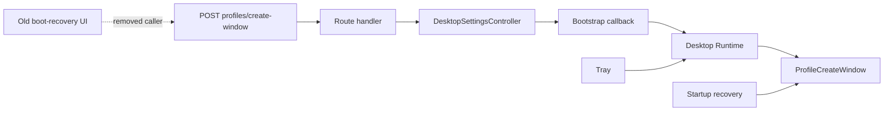
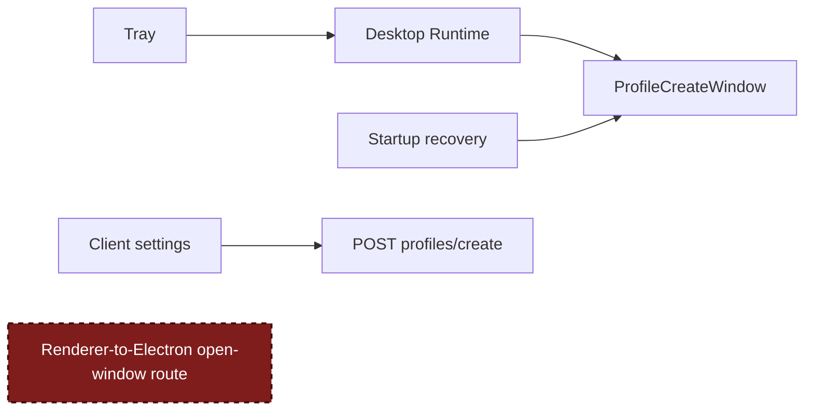

# Agent Note: Retire the obsolete Profile creator route

Status: proposed

English | [中文](2026-09-04-obsolete-profile-creator-route.zh.md)

## Problem

`POST /api/desktop/profiles/create-window` was added for the old boot-recovery page. It let Renderer code ask the Electron Host to open `ProfileCreateWindow`:

The boot-recovery page later changed to a single "Open Recovery Mode" action. Its Profile creator call was removed, but the route and every pass-through behind it remained.

Current Profile entry points do not use this chain:

- the tray calls `DesktopRuntime.openProfileCreateWindow()` directly;
- startup recovery constructs `ProfileCreateWindow` directly;
- Client settings creates Profile data through `POST /api/desktop/profiles/create`.

The desktop settings HTTP interface is private. `create-window` is not exposed by the Client settings module and has no documented external contract.

## Decision

Remove the `create-window` route and the implementation used only to carry that request:

- the path constant and request/response types;
- the route handler;
- `DesktopSettingsController.openProfileCreator()`;
- the bootstrap `openProfileCreator` callback;
- route registration and route-specific tests.

Stable and Beta must make the same change.

Keep `ProfileCreateWindow`, the tray and startup-recovery entry points, and `POST /api/desktop/profiles/create`.

After the change, window ownership stays in Electron and Profile data creation keeps its existing interface:

## Deletion test

The route handler, controller method, and bootstrap callback do not hide policy or reusable behavior. Each layer forwards the same operation to the next one. Deleting the chain makes its complexity disappear; no caller needs a replacement and no implementation moves elsewhere.

The useful modules remain in place. `ProfileCreateWindow` still owns the native creation flow, while the Desktop Runtime remains the interface used by native callers that need to open it.

## Unchanged behavior

- Tray users can still open the native Profile creator.
- Startup recovery can still open the native Profile creator.
- Client settings can still create Profile data.
- Profile validation, persistence, selection, and restart behavior do not change.
- The pinned upstream checkout remains unmodified.

## Compatibility

A repository-external caller that hard-codes the private `create-window` path will receive `404` after this change. The path has never been a supported public interface, so no compatibility adapter or deprecation period is added.

## Verification plan

- Confirm that neither desktop package contains the old path or its route-specific symbols.
- Run the affected route, boot-recovery, and plugin tests in Stable and Beta.
- Run root typecheck and build.
- Run the architecture and bilingual-document checks.

## Consequences

Renderer code no longer has an HTTP command for opening this native window. Future native Profile entry points must call the Electron-owned Profile interface instead of restoring a private Renderer-to-Electron pass-through.
