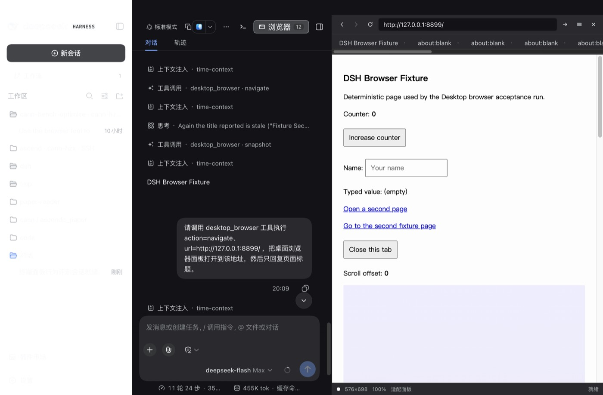
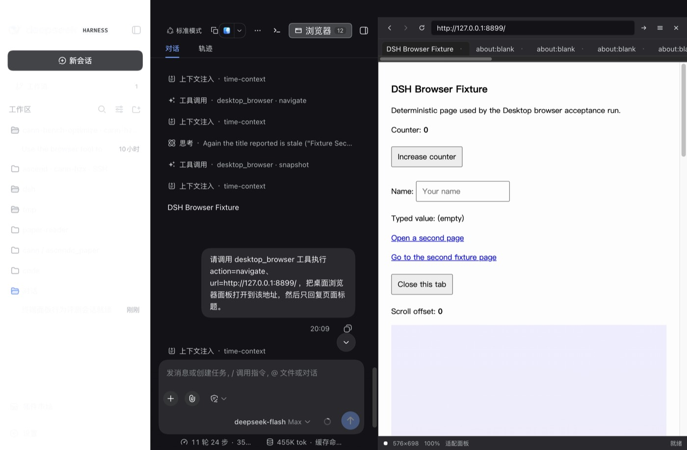
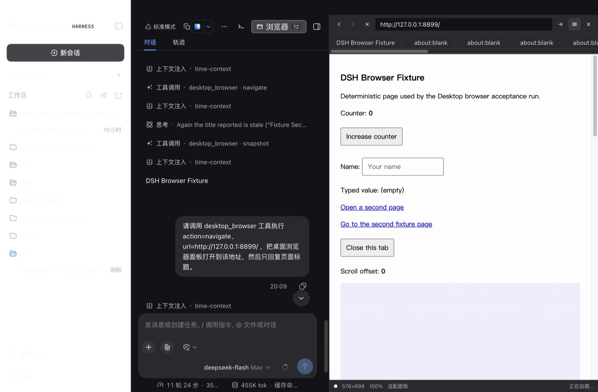
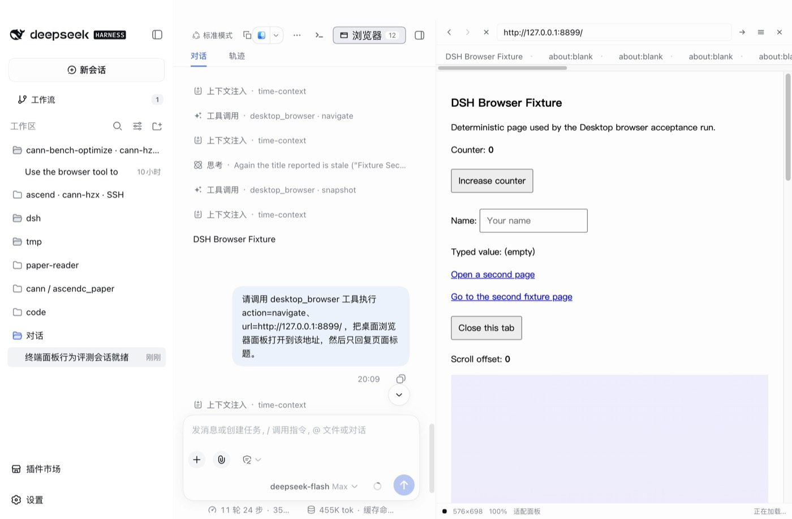
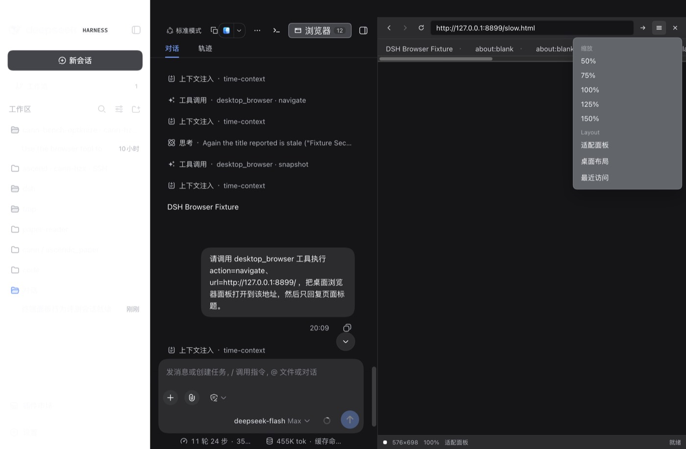

# 桌面浏览器面板验收证据

## 结论

- 结果：通过。100 条断言组成的 50 个验收用例全部通过（50/50），过程中发现的 4 处真实缺陷已修复并复测。
- 范围：`dsh-plugin-desktop` 的桌面浏览器右侧栏面板、Agent `desktop_browser` 工具、Host `desktopBrowser` service 与面板私有通道；未修改 `deepseek-harness` 子模块。
- 验收对象：工作区内的开发构建（`dsh-plugin-desktop` 源码 + `node_modules/electron` 43），不是已发布的安装包。
- 面板形态：浏览器以**右侧栏列**形式停靠，与会话并列，不再占用独立窗口。

## 图像摘要

> 本机未授予屏幕录制权限（TCC），无法取得包含原生子视图的整窗合成截图。因此每张图由两块**同一时刻**的真实像素合成：应用渲染进程截图（工具栏、标签条、地址栏、状态行）与 guest 页自身调试目标的截图，后者按 Host 上报的视图矩形缩放贴合。阴影、圆角与窗口装饰不参与合成，画面的其余部分未作任何修饰。

### 右侧栏中的浏览器（深色）



会话列从 1000px 收窄到 424px，右侧栏占 576px；面板顶部对齐标题栏下方（y=32），状态行报告 `576×698 100% 适配面板 就绪`。会话列里可见 Agent 的 `desktop_browser` 工具调用记录。

### 多标签



标签条按会话保存，活动标签的页面占据视口，其余标签的视图被隐藏而不是销毁。

### 加载中可以中止



页面在 4 秒延迟页面上加载时，工具条把「重新加载」换成「停止」，状态行显示 `正在加载…`。

### 浅色主题



面板全部取色来自设计令牌，跟随应用主题切换，几何与标签状态在切换前后保持一致。

### 工具菜单遮挡页面



菜单展开时 Host 撤回原生页面视图，菜单关闭后恢复；此状态下页面像素不属于可见画面，因此该图只有面板外观。

## 功能范围

- 会话头部新增 **浏览器** 控件，显示该会话的打开标签数；点击后浏览器停靠在右侧栏，再次点击或按面板的关闭控件即释放该列并恢复会话宽度。
- 面板包含标签条（新建、切换、关闭，单会话上限 12 个）、后退、前进、重新加载/停止、地址栏、50%–150% 缩放预设、两种逻辑布局（适配面板 / 桌面 1280px）与当前标签访问历史。
- 状态行报告逻辑视口尺寸、实际缩放、布局与最近一次 Host 交换结果。
- Agent 通过 `desktop_browser` 工具操作同一份页面：navigate、snapshot、screenshot、click、fill、press、scroll、console、evaluate、tabs、close、panel。
- 其他插件通过 Host service `ctx.desktopBrowser` 使用同一存储与通道，并可订阅状态事件。

## 测试系统

| 项目 | 值 |
| --- | --- |
| 日期 | 2026-09-15（Asia/Shanghai） |
| 主机 | macOS（darwin），Apple Silicon，窗口 1280×840 CSS，DPR 2 |
| 应用 | 工作区开发构建：`node_modules/electron/dist/Electron.app/Contents/MacOS/Electron lib/main.js --remote-debugging-port=9333` |
| 桌面模式 | `advanced`（`~/.dsh-desktop/settings.yaml`） |
| 浏览器内核 | Electron 43 的 Chromium，guest 由主进程 `WebContentsView` 承载 |
| 测试页 | 本地 fixture 服务 `127.0.0.1:8899`（含 4 秒延迟页 `/slow.html`） |
| 驱动 | `.tooling/acceptance/run.mjs` + `cdp.mjs`，直接使用 DevTools 协议与真实指针/键盘事件，未使用任何浏览器自动化框架 |
| 观测口径 | Host 状态经面板私有通道读取；面板与页面断言分别取自渲染进程和 guest 页自身的调试目标；渲染进程错误经 `window.onerror` 钩子收集 |

## 用例与结果

共 50 个用例，全部通过。

### 状态与前置检查

| 用例 | 项目 | 结果 | 关键观测 |
| --- | --- | --- | --- |
| S1 | 安装观测钩子并发现面板 Session | ✅ 通过 | `{"found": true, "sessionId": "session-49190a7e-8f95-4346-a275-3e3231756d74", "requests": 2}` |
| S0 | 用例开始前恢复干净状态 | ✅ 通过 | `{"closedTabs": 0, "panelOpen": false}` |
| S2 | 面板默认关闭且头部控件存在 | ✅ 通过 | `{"toggle": true, "pressed": "false", "panel": false}` |

### 存活性探针

| 用例 | 项目 | 结果 | 关键观测 |
| --- | --- | --- | --- |
| P0 | 安装渲染进程错误记录器 | ✅ 通过 | `{"installed": 0}` |
| P1 | 面板打开后 12 秒内的存活性 | ✅ 通过 | `{"samples": [{}, {}, {}, {}, {}, {}, {}, {}, {}, {}, {}, {}], "errors": []}` |
| P2 | 页面级用例从空白标签页开始 | ✅ 通过 | `{"closed": 12, "remaining": 0}` |

### 布局、右侧栏形态与主题

| 用例 | 项目 | 结果 | 关键观测 |
| --- | --- | --- | --- |
| A1 | 点击头部控件后浏览器以右侧栏形式出现 | ✅ 通过 | `{"before": {"conversation": 1000, "rightbar": 0}, "after": {"pressed": "true", "conversation": 424, "rightbar": 576, "insideRightbar": true, "panelLeft": 704, "rightbarLeft": 704}, "shot": "A1-right-column.png 2560x16…` |
| A2 | 右侧栏几何：位于标题栏下方且不与会话重叠 | ✅ 通过 | `{"top": 32, "left": 704, "right": 1281, "bottom": 840, "width": 577, "height": 808, "captionBottom": 32, "conversationRight": 704, "overlapsConversation": false, "belowCaption": true, "viewport": {"width": 1280, "heig…` |
| A3 | 右侧栏样式：列表面、左分隔线、设计令牌 | ✅ 通过 | `{"position": "relative", "width": "576px", "height": "808px", "radius": "0px", "background": "rgb(35, 35, 36)", "shadow": "none", "borderLeft": "1px rgba(255, 255, 255, 0.06)", "toolbarDisplay": "flex", "statusFontSiz…` |
| A8 | 占位矩形与面板 stage 元素一致，且被 Host 接受 | ✅ 通过 | `{"delta": 0, "bounds": {"x": 705, "y": 104, "width": 576, "height": 710}, "viewport": {"width": 576, "height": 710}, "visible": true}` |
| A14 | 状态行报告逻辑视口、缩放、布局与连接状态 | ✅ 通过 | `{"viewport": "576×710", "zoom": "100%", "layout": "适配面板", "phase": "就绪"}` |
| A15 | 关闭浏览器后会话恢复宽度 | ✅ 通过 | `{"open": {"conversation": 424, "rightbar": 576}, "closed": {"conversation": 1000, "rightbar": 0}, "shot": "A15-column-released.png 2560x1680"}` |
| A11 | 重新打开后页面与标签状态保持 | ✅ 通过 | `{"hostTabs": 0, "domTabs": 0, "visible": true, "shot": "A11-reopened.png 2560x1680"}` |
| A5 | 深色主题下面板使用深色令牌 | ✅ 通过 | `{"dark": true, "scheme": true, "colorScheme": "dark", "panel": "rgb(35, 35, 36)", "toolbar": "rgb(44, 44, 46)", "label": "rgb(249, 250, 251)", "conversation": "rgb(21, 21, 23)", "column": 576, "luminance": 0.14, "shot…` |
| A4 | 浅色主题下面板使用浅色令牌 | ✅ 通过 | `{"dark": false, "scheme": false, "colorScheme": "light", "panel": "rgb(255, 255, 255)", "toolbar": "rgb(255, 255, 255)", "label": "rgb(15, 17, 21)", "conversation": "rgb(255, 255, 255)", "column": 576, "luminance": 1,…` |
| A6 | 主题切换后面板与页面状态保持 | ✅ 通过 | `{"light": {"dark": false, "scheme": false, "colorScheme": "light", "panel": "rgb(255, 255, 255)", "toolbar": "rgb(255, 255, 255)", "label": "rgb(15, 17, 21)", "conversation": "rgb(255, 255, 255)", "column": 576}, "bac…` |
| A12 | 无标签时的空状态 | ✅ 通过 | `{"present": true, "text": "还没有打开页面在上方输入网址，或让 agent 打开一个页面。", "tabs": 0}` |
| A9 | 工具菜单遮挡时页面视图撤回，关闭后恢复 | ✅ 通过 | `{"whileMenuOpen": false, "afterClose": true}` |

### 标签、导航、视口与页面内交互

| 用例 | 项目 | 结果 | 关键观测 |
| --- | --- | --- | --- |
| B1 | 点击“新建标签”创建第一个标签 | ✅ 通过 | `{"id": "tab-1", "tabs": 1}` |
| B8 | 地址栏输入并回车后页面加载（真实按键） | ✅ 通过 | `{"url": "http://127.0.0.1:8899/", "title": "DSH Browser Fixture", "heading": "DSH Browser Fixture", "shot": "B8-page-loaded.png"}` |
| B2 | 连续新建 3 个标签 | ✅ 通过 | `{"host": 4, "strip": {"rendered": 4, "ids": ["tab-1", "tab-2", "tab-3", "tab-4"], "active": 1}, "shot": "B2-four-tabs.png"}` |
| B4 | 点击切换标签并只显示活动标签 | ✅ 通过 | `{"activeId": "tab-1", "visible": true, "viewport": {"width": 576, "height": 709}}` |
| B5 | 关闭活动标签后自动激活相邻标签 | ✅ 通过 | `{"activeId": "tab-2", "ids": ["tab-2", "tab-3", "tab-4"]}` |
| B6 | 关闭非活动标签不影响活动标签 | ✅ 通过 | `{"victim": "tab-3", "activeId": "tab-2", "remaining": ["tab-2", "tab-4"]}` |
| B3 | 标签数量上限返回 BROWSER_TAB_LIMIT | ✅ 通过 | `{"error": "BROWSER_TAB_LIMIT", "tabs": 12}` |
| B3b | 界面在达到上限后仍可用 | ✅ 通过 | `{"tabs": 12, "panel": true, "shot": "B3-tab-limit.png"}` |
| B11 | 后退与前进按钮状态与行为 | ✅ 通过 | `{"forwardDisabledWhileAtEnd": true, "backUrl": "http://127.0.0.1:8899/", "forwardUrl": "http://127.0.0.1:8899/second.html", "canGoBack": true}` |
| B12 | 加载中的页面显示停止控件并可中止加载 | ✅ 通过 | `{"phase": "正在加载…", "stopClicked": true, "afterStop": {"loading": false, "url": "http://127.0.0.1:8899/slow.html"}, "reloadPresent": true, "disabled": false}` |
| B15 | 历史下拉列出访问过的页面 | ✅ 通过 | `{"count": 5, "first": "Fixture Second Page", "visibleWhileOverlay": false}` |
| B9 | 地址栏拒绝脚本地址与空地址 | ✅ 通过 | `{"beforeUrl": "http://127.0.0.1:8899/slow.html", "javascriptUrl": "http://127.0.0.1:8899/slow.html", "afterEmpty": "http://127.0.0.1:8899/slow.html"}` |
| B21 | 不存在的域名不使面板崩溃 | ✅ 通过 | `{"url": "http://127.0.0.1:8899/slow.html", "loading": false, "title": "Fixture Slow Page", "panelAlive": true}` |
| B13 | 缩放 75% 改变逻辑视口 | ✅ 通过 | `{"before": {"width": 576, "height": 698}, "after": {"width": 768, "height": 931}, "label": "75%"}` |
| B14 | 桌面布局使用 1280 逻辑宽度 | ✅ 通过 | `{"viewport": {"width": 1280, "height": 1551}, "layout": "desktop", "label": "桌面布局"}` |
| B13b | 恢复 100% 与适配布局 | ✅ 通过 | `{"viewport": {"width": 576, "height": 698}, "layout": "fit", "bounds": {"x": 705, "y": 116, "width": 576, "height": 698}}` |
| B16 | 页面内真实点击改变页面状态 | ✅ 通过 | `{"before": "0", "after": "1", "twice": "2", "shot": "B16-page-click.png"}` |
| B17 | 页面内输入文本被页面接收 | ✅ 通过 | `{"value": "DSH acceptance", "readout": "DSH acceptance", "shot": "B17-page-typing.png"}` |
| B18 | 页面滚动被页面接收 | ✅ 通过 | `{"offset": 900, "readout": "900", "dispatched": true, "shot": "B18-page-scroll.png"}` |
| B19 | 页面 target=_blank 链接成为同会话新标签 | ✅ 通过 | `{"tabs": 2, "url": "http://127.0.0.1:8899/blank.html"}` |
| B20 | 页面 window.close() 移除标签 | ✅ 通过 | `{"tabs": 1, "closedUrl": "http://127.0.0.1:8899/blank.html", "activeId": "tab-15", "clickError": null}` |

### Agent 接口与通道边界

| 用例 | 项目 | 结果 | 关键观测 |
| --- | --- | --- | --- |
| C1 | Agent 的 desktop_browser 工具驱动面板导航 | ✅ 通过 | `{"url": "http://127.0.0.1:8899/", "title": "DSH Browser Fixture", "tabsBefore": 1, "tabsAfter": 1}` |
| C2 | Agent 把页面内容带回会话 | ✅ 通过 | `{"tail": "DSH Browser Fixture", "paragraphs": "11 -> 12"}` |
| C16 | 通道拒绝超大请求体并报告错误码 | ✅ 通过 | `{"status": 400, "body": "{\"error\":\"BROWSER_INPUT_TOO_LARGE\",\"detail\":\"BROWSER_INPUT_TOO_LARGE\"}"}` |
| C4 | 通道拒绝未知动作与未知标签 | ✅ 通过 | `{"unknownAction": "BROWSER_INVALID_ACTION", "unknownTab": "BROWSER_UNKNOWN_TAB", "tabs": 12}` |
| C17 | 陌生会话标识不能创建视图 | ✅ 通过 | `{"status": 404, "body": "{\"error\":\"BROWSER_UNKNOWN_SESSION\",\"detail\":\"BROWSER_UNKNOWN_SESSION\"}", "targetsBefore": 13, "targetsAfter": 13, "tabs": 12}` |

### 鲁棒性与资源回收

| 用例 | 项目 | 结果 | 关键观测 |
| --- | --- | --- | --- |
| D3 | 连续快速点击新建标签五次 | ✅ 通过 | `{"created": 5, "tabs": 6, "ids": ["tab-15", "tab-17", "tab-18", "tab-19", "tab-20", "tab-21"]}` |
| D4 | 快速开关标签十次不泄漏视图 | ✅ 通过 | `{"cycles": 10, "tabs": 6, "guestsBefore": 6, "guestsAfter": 6}` |
| D12 | 重复打开同一地址不产生额外标签 | ✅ 通过 | `{"tabs": 6}` |
| D7 | 超长地址与超长输入被安全处理 | ✅ 通过 | `{"error": null, "urlLength": 3020, "tabs": 6, "panelAlive": true}` |
| D6 | 达到标签上限后关闭一个即可继续新建 | ✅ 通过 | `{"limit": "BROWSER_TAB_LIMIT", "tabsAfterClose": 12}` |

### 用例前置

| 用例 | 项目 | 结果 | 关键观测 |
| --- | --- | --- | --- |
| T0 | 标签用例前清空标签 | ✅ 通过 | `{"closedTabs": 0}` |

## 过程中发现并修复的缺陷

| 现象 | 根因 | 修复 |
| --- | --- | --- |
| 打开新标签后整个面板通道卡死，导航永不返回 | 新建的 guest 视图还没有文档时，`Page.enable` 永不应答，占住了 store 队列，摆放下一个动作排在它后面形成死锁 | 视图创建后先提交 `about:blank` 再发协议命令，并在发命令前完成摆放；每个协议往返都有 8 秒预算并按 `BROWSER_CDP_STALL` 失败 |
| 两个会话各有一个 `tab-1` 时互相顶掉视图 | 原生视图 id 只用了会话内标签号 | 视图 id 加会话命名空间（`desktop-browser:<session>:<tab>`），会话内对外的标签 id 不变 |
| 会话数达上限被拒绝后再操作，面板报「标签已关闭」且关不掉 | 新标签在打开前就被置为活动，失败回滚时没有恢复先前的活动标签 | 回滚分支恢复先前活动标签，`closeTab` 与后续动作重新指向真实页面 |
| 任意会话标识都能经通道创建原生视图 | 通道动作对不存在的会话也按需建 store | 动作只接受 Host 仍认识的会话，否则返回 404 `BROWSER_UNKNOWN_SESSION`；Host 无会话服务时保持旧行为 |

## 未覆盖与已知限制

- **整窗截图**：本机 TCC 未授权屏幕录制，`screencapture` 与 ScreenCaptureKit 均被拒绝，因此没有真实的窗口合成截图；图像摘要中说明的合成方式是对该限制的替代，而非等价物。
- **通过界面删除会话**：`session/disposed` 的释放路径已由单元测试覆盖（视图关闭、owner 释放、状态清空、异常事件容错），但没有做成端到端用例：运行时无法在不破坏被测会话的前提下从界面删除该会话。
- **安装包**：`/Applications/DSH Desktop.app`（2.0.10）不包含本次改动，全部结论仅适用于工作区开发构建。
- **Agent 用例耗时**：`C1`/`C2` 由真实模型驱动，单次约 1–4 分钟，受模型负载影响；该项设置 300 秒预算。
- **既有失败**：`tests/windows-nsis-ab.spec.ts` 有 1 个既有失败，在 `upstream/master` 与本分支基线上同样失败，与本次改动无关；`tests/host-process-integration.spec.ts` 的 2 个用例在受限沙箱下因无法写 `~/.dsh/.credentials.yaml.lock` 失败，放开权限后通过。

## 复现方式

```bash
# 构建并启动开发版桌面端
corepack yarn workspace dsh-plugin-desktop build
dsh-plugin-desktop/node_modules/electron/dist/Electron.app/Contents/MacOS/Electron \
  dsh-plugin-desktop/lib/main.js --remote-debugging-port=9333

# 测试页与验收驱动
node .tooling/acceptance/fixture-server.mjs &
node .tooling/acceptance/run.mjs            # 全部 50 个用例
node .tooling/acceptance/run.mjs layout nav # 只跑指定分组
```
