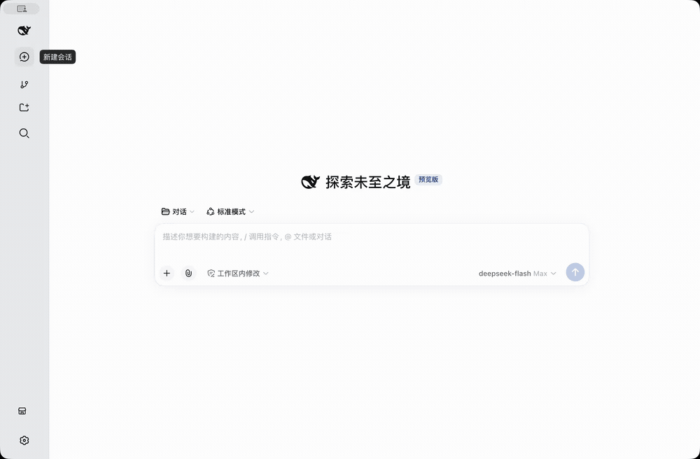
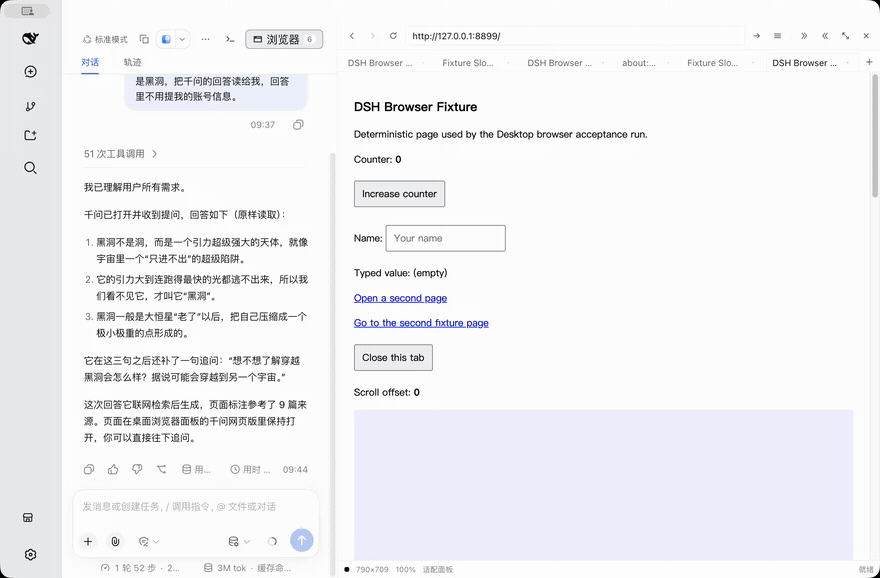
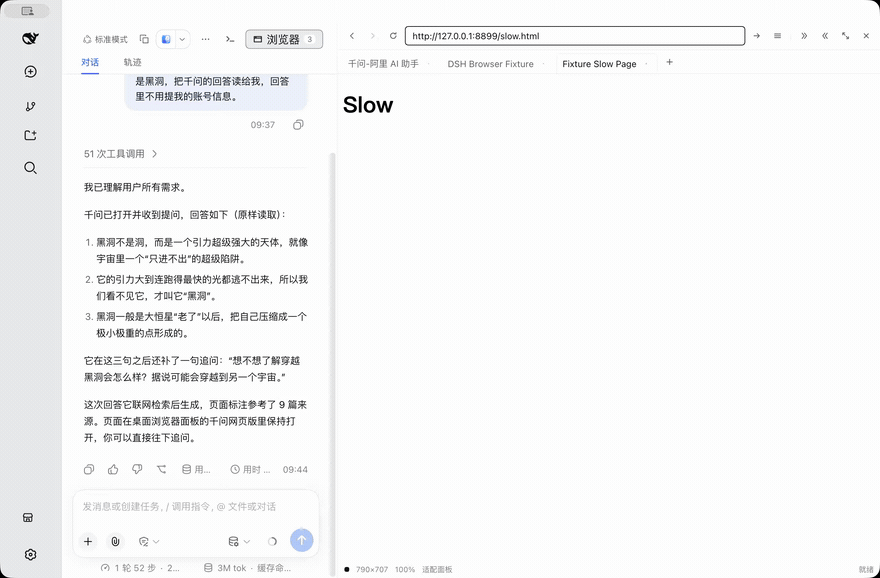
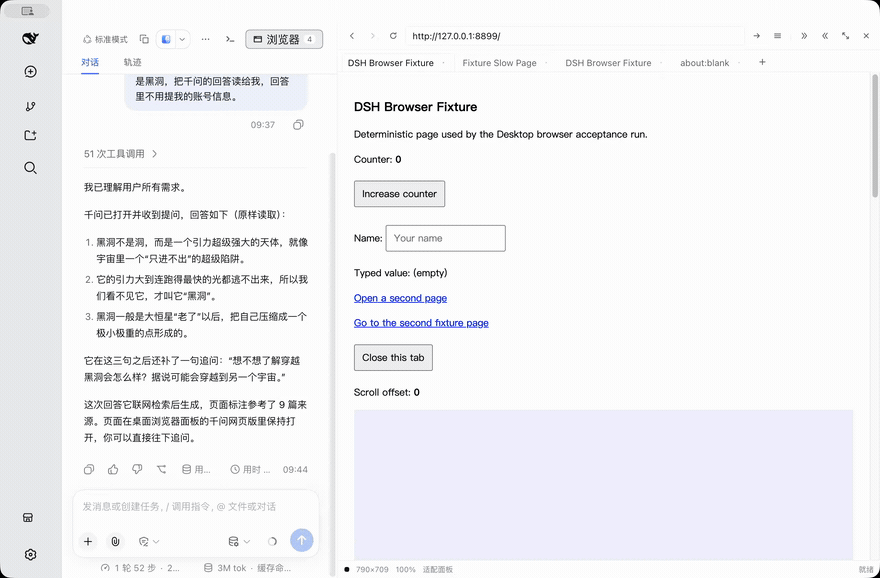
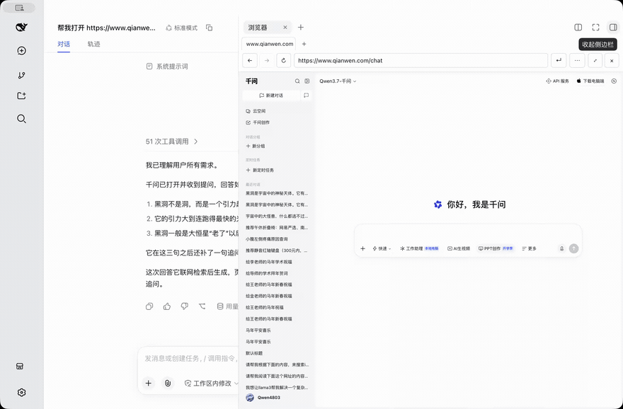
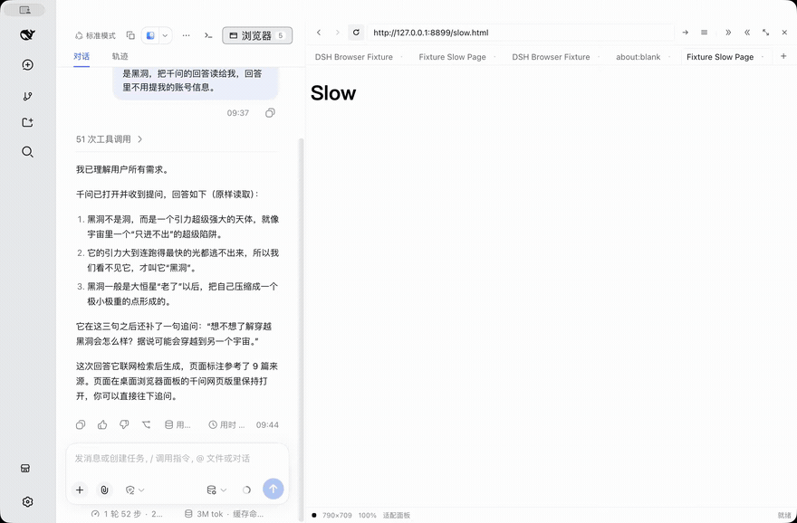
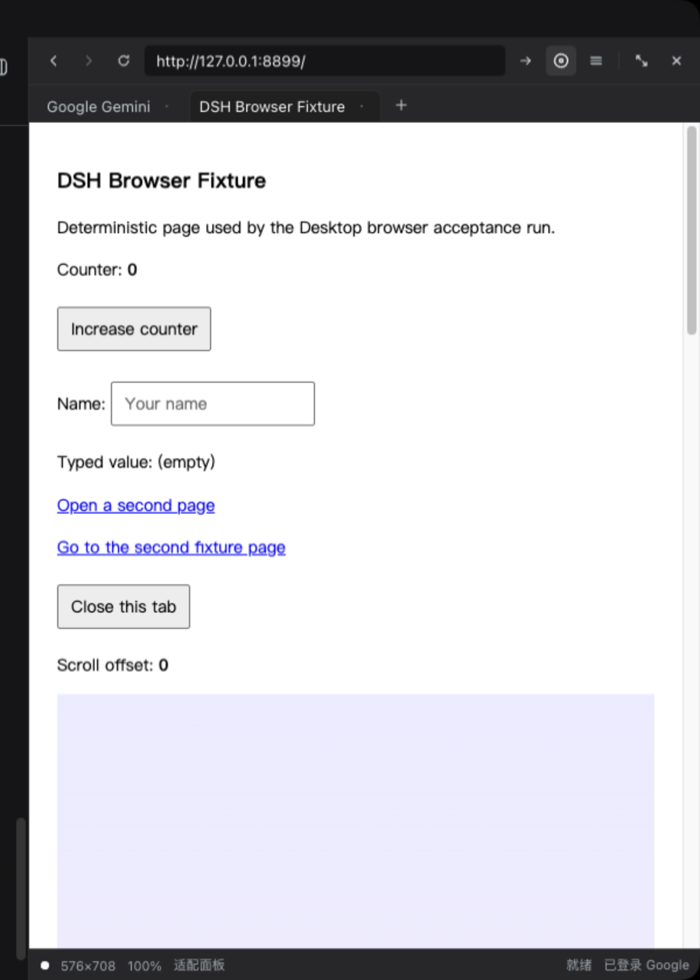
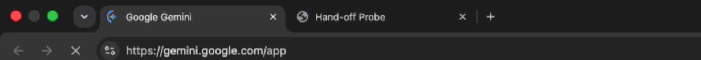
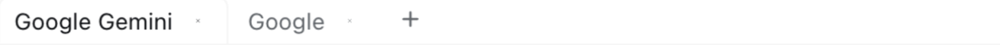

# 桌面浏览器面板验收证据

## 结论

- 结果：通过。第一轮 64 个用例、第二轮 12 个、第三轮 14 个、第四轮 8 个、第五轮 7 个、第六轮 6 个全部通过（含既有功能未受影响的 11 项回归），共发现并修复 30 处真实缺陷，每处都有一项以上用例复测。
- 范围：`dsh-plugin-desktop` 的桌面浏览器右侧栏面板、Agent `desktop_browser` 工具、Host `desktopBrowser` service 与面板私有通道；未修改 `deepseek-harness` 子模块。
- 验收对象：工作区内的开发构建（`dsh-plugin-desktop` 源码 + `node_modules/electron` 43），不是已发布的安装包。
- 面板形态：浏览器以**右侧栏列**形式停靠，与会话并列，不占用独立窗口；这一列可以在保留左侧边栏的前提下展开到整个会话区，宽度由会话列的分隔手柄直接拖拽。
- Agent 联动：Agent 的每个页面 action 都会展开该会话的面板，用户始终能看到 Agent 正在操作的页面；`panel` action 仍可显式打开或隐藏。
- 图像隐私：证据图为窗口真实像素，录制前收起左侧边栏，画面中不出现工作区名、会话名或账号；会话区显示的是本次演示自身的问答内容。

## 图像摘要

以下动图是**窗口的真实合成像素**：由 Electron 自身的窗口捕获录成 20 fps 视频，再由 ffmpeg 转成 GIF，包含会话、面板外观与原生浏览器页面视图。本机的命令行截屏工具 `screencapture` 仍被系统拒绝，因此不走系统截屏链路；该方式不包含鼠标指针，所以每个操作前会先把即将使用的控件用环形高亮标出一段时间，窗口也必须处于屏幕上（最小化或隐藏时取不到内容）。录屏前收起左侧边栏，画面中因此不出现工作区名、会话名与账号；会话区可见的内容就是本次演示自身的问答。

### Agent 在真实站点上完成一次问答



真实模型经 `desktop_browser` 工具打开千问、在富文本编辑器里提出问题、读取三句回答并回报给用户；右侧栏全程可见，问句、回答与来源数同时出现在页面和会话里。

### 右侧栏中的浏览器（深色）



会话列让出右侧栏，面板顶部对齐标题栏下方；地址栏、标签条与状态行（逻辑视口 / 缩放 / 布局 / 交换状态）都在列内，页面由主进程的原生视图绘制。动图依次演示打开面板、拖拽会话列与右列之间的分隔手柄改变列宽、**占满会话区（保留左侧边栏）**、还原与关闭，关闭后该列交还官方右侧边栏。

### 多标签与地址输入



标签条按会话保存，活动标签的页面占据视口，其余标签的视图被隐藏而不是销毁。动图演示新建标签、在地址栏输入本地测试页地址、页面加载与标签间切换；左侧边栏此时收起到图标栏，展开时它保持原位不被覆盖。

### 加载中可以中止



页面在 4 秒延迟页面上加载时，工具条把「重新加载」换成「停止」，状态行显示 `正在加载…`；点击停止后页面停在可交互状态。

### 浅色主题



面板取色全部来自设计令牌，跟随应用主题切换，几何与标签状态在切换前后保持一致。

### 工具菜单遮挡页面



菜单展开时 Host 撤回原生页面视图，菜单关闭后恢复，因此该状态下页面区域是面板自身的底色。

### Google 账号状态与交给 Chrome 的控件



工具栏右侧的圆形控件把侧边栏的标签交给用户自己的 Chrome；状态行右端报告 Google 登录阶段，此图为导入完成后的「已登录 Google」。

### 交接后的 Chrome 标签



面板中的两个标签（Gemini 与验收探针页）成为用户日常 Chrome 配置里同一个新窗口的两个标签。

### 面板中的 Google 标签与已登录状态




上图为面板标签条里的两个 Google 页面，下图为同一窗口底部状态行的右端：导入完成后它报告「已登录 Google」。两图取自同一次窗口像素，只保留不含账号信息的部分。

## 功能范围

- 会话头部新增 **浏览器** 图标控件：悬停时以 `浏览器` 提示其用途，按下态反映面板开关，标签数量变化时位置与宽度保持不变；点击后浏览器停靠在右侧栏，再次点击或按面板的关闭控件即释放该列并恢复会话宽度。
- 面板包含标签条（新建、切换、关闭，单会话上限 12 个）、后退、前进、重新加载/停止、地址栏、50%–150% 缩放预设、两种逻辑布局（适配面板 / 桌面 1280px）与当前标签访问历史。
- 状态行报告逻辑视口尺寸、实际缩放、布局与最近一次 Host 交换结果。
- Agent 通过 `desktop_browser` 工具操作同一份页面：navigate、snapshot、screenshot、click、fill、press、scroll、console、evaluate、tabs、close、panel。
- 列控制：**占满会话区（保留左侧边栏）** 把会话列与右侧栏一起交给页面，左侧边栏、标题栏行与窗口控件保持原位；列宽通过会话列与右侧栏之间的 frame 分隔手柄拖拽，上下限沿用 frame 自身约束。
- 地址输入：不带 scheme 的地址按浏览器习惯补全，裸域名与 `域名:端口` 走 https，`localhost` / `127.0.0.1` / `[::1]` / `*.localhost` 走 http；具名 scheme 不做改写，仍由导航策略判定。
- 加载失败：失败地址保留在标签与地址栏中，页面区域显示面板自身的报错（原因、重试、关闭），不回退到空白页或上一个页面；被导航策略拒绝的地址同样保留当前页面并由面板说明原因。
- 浏览器身份：guest 视图与其请求以所运行的 Chromium 版本对外呈现为原生 Chrome（User-Agent、`navigator.userAgentData`、`sec-ch-ua*`），不暴露桌面应用标识；profile 为应用级共享持久分区，cookie 与登录态跨会话保留。
- Agent 的每个页面 action 都会展开该会话的面板，用户能看到 Agent 正在操作的页面；`panel` action 仍可显式打开或隐藏。
- 其他插件通过 Host service `ctx.desktopBrowser` 使用同一存储与通道，并可订阅状态事件。

## 测试系统

| 项目 | 值 |
| --- | --- |
| 日期 | 2026-09-15（Asia/Shanghai） |
| 主机 | macOS 26.5.1（darwin），Apple Silicon，窗口 1280×840 CSS，DPR 2（窗口捕获含系统阴影，图像约 2993×1964 设备像素） |
| 应用 | 工作区开发构建：`node_modules/electron/dist/Electron.app/Contents/MacOS/Electron lib/main.js --remote-debugging-port=9333` |
| 桌面模式 | `advanced`（`~/.dsh-desktop/settings.yaml`） |
| 浏览器内核 | Electron 43 的 Chromium，guest 由主进程 `WebContentsView` 承载 |
| 测试页 | 本地 fixture 服务 `127.0.0.1:8899`（含 4 秒延迟页 `/slow.html`） |
| 驱动 | 验收脚本在与本仓库并列的工作区维护，不随后者提交：`run.mjs` + `cdp.mjs`，直接使用 DevTools 协议与真实指针/键盘事件，未使用任何浏览器自动化框架 |
| 截图 | `window-capture.mjs`，经 Electron 的窗口捕获取得合成窗口像素；动图由 `window-record.mjs` 以 20 fps 录制同一来源，再经 ffmpeg 转 GIF |
| 观测口径 | Host 状态经面板私有通道读取；面板与页面断言分别取自渲染进程和 guest 页自身的调试目标；渲染进程错误经 `window.onerror` 钩子收集 |

## 用例与结果

共 64 个用例，全部通过。

### 状态与前置检查

| 用例 | 项目 | 结果 | 关键观测 |
| --- | --- | --- | --- |
| S1 | 安装观测钩子并发现面板 Session | ✅ 通过 | `{"found":true,"sessionId":"session-…","requests":4}` |
| S0 | 用例开始前恢复干净状态 | ✅ 通过 | `{"closedTabs":0,"panelOpen":false}` |
| S2 | 面板默认关闭且头部控件存在 | ✅ 通过 | `{"toggle":true,"pressed":"false","panel":false}` |

### 存活性探针

| 用例 | 项目 | 结果 | 关键观测 |
| --- | --- | --- | --- |
| P0 | 安装渲染进程错误记录器 | ✅ 通过 | `{"installed":0}` |
| P1 | 面板打开后 12 秒内的存活性 | ✅ 通过 | `{"samples":[{},{},{},{},{},{},{},{},{},{},{},{}],"errors":[]}` |

### 布局、右侧栏形态与主题

| 用例 | 项目 | 结果 | 关键观测 |
| --- | --- | --- | --- |
| A1 | 点击头部控件后浏览器以右侧栏形式出现 | ✅ 通过 | `{"before":{"conversation":1000,"rightbar":0},"after":{"pressed":"true","conversation":700,"rightbar":300,"insideRightbar":true,"panelLeft":980,"rightbarLeft":980},"shot":"A1-right-column.png 2560x1680"}` |
| A2 | 右侧栏几何：位于标题栏下方且不与会话重叠 | ✅ 通过 | `{"top":32,"left":980,"right":1281,"bottom":840,"width":301,"height":808,"captionBottom":32,"conversationRight":980,"overlapsConversation":false,"belowCaption":true,"viewport":{"width":1280,"height":840}}` |
| A3 | 右侧栏样式：列表面、左分隔线、设计令牌 | ✅ 通过 | `{"position":"relative","width":"300px","height":"808px","radius":"0px","background":"rgb(35, 35, 36)","shadow":"none","borderLeft":"1px rgba(255, 255, 255, 0.06)","toolbarDisplay":"flex","statusFontSize":"11px","addressHeight":"26px","colum` |
| A3b | 最小列宽下工具栏不裁剪且地址栏仍可输入 | ✅ 通过 | `{"clipped":0,"rows":2,"toolbarWidth":300,"scrollWidth":300,"addressWidth":164,"columnWidth":300}` |
| A8 | 占位矩形与面板 stage 元素一致，且被 Host 接受 | ✅ 通过 | `{"delta":0,"bounds":{"x":981,"y":134,"width":300,"height":680},"viewport":{"width":300,"height":680},"visible":true}` |
| A14 | 状态行报告逻辑视口、缩放、布局与连接状态 | ✅ 通过 | `{"viewport":"300×680","zoom":"100%","layout":"适配面板","phase":"就绪"}` |
| A15 | 关闭浏览器后会话恢复宽度 | ✅ 通过 | `{"open":{"conversation":700,"rightbar":300},"closed":{"conversation":1000,"rightbar":0},"shot":"A15-column-released.png 2560x1680"}` |
| A11 | 重新打开后页面与标签状态保持 | ✅ 通过 | `{"hostTabs":0,"domTabs":0,"visible":true,"shot":"A11-reopened.png 2560x1680"}` |
| A5 | 深色主题下面板使用深色令牌 | ✅ 通过 | `{"dark":true,"scheme":true,"colorScheme":"dark","panel":"rgb(35, 35, 36)","toolbar":"rgb(44, 44, 46)","label":"rgb(249, 250, 251)","conversation":"rgb(21, 21, 23)","column":300,"luminance":0.14,"shot":"A5-theme-dark.png 2560x1680"}` |
| A4 | 浅色主题下面板使用浅色令牌 | ✅ 通过 | `{"dark":false,"scheme":false,"colorScheme":"light","panel":"rgb(255, 255, 255)","toolbar":"rgb(255, 255, 255)","label":"rgb(15, 17, 21)","conversation":"rgb(255, 255, 255)","column":300,"luminance":1,"shot":"A4-theme-light.png 2560x1680"}` |
| A6 | 主题切换后面板与页面状态保持 | ✅ 通过 | `{"light":{"dark":false,"scheme":false,"colorScheme":"light","panel":"rgb(255, 255, 255)","toolbar":"rgb(255, 255, 255)","label":"rgb(15, 17, 21)","conversation":"rgb(255, 255, 255)","column":300},"backTo":{"dark":true,"panel":"rgb(35, 35, 3` |

### 用例前置

| 用例 | 项目 | 结果 | 关键观测 |
| --- | --- | --- | --- |
| T0 | 标签用例前清空标签 | ✅ 通过 | `{"closedTabs":0}` |

### 标签、导航、视口与页面内交互

| 用例 | 项目 | 结果 | 关键观测 |
| --- | --- | --- | --- |
| A12 | 无标签时的空状态 | ✅ 通过 | `{"present":true,"text":"还没有打开页面在上方输入网址，或让 agent 打开一个页面。","tabs":0}` |
| B1 | 点击“新建标签”创建第一个标签 | ✅ 通过 | `{"id":"tab-1","tabs":1}` |
| B8 | 地址栏输入并回车后页面加载（真实按键） | ✅ 通过 | `{"url":"http://127.0.0.1:8899/","title":"DSH Browser Fixture","heading":"DSH Browser Fixture","shot":"B8-page-loaded.png"}` |
| B2 | 连续新建 3 个标签 | ✅ 通过 | `{"host":4,"strip":{"rendered":4,"ids":["tab-1","tab-2","tab-3","tab-4"],"active":1},"shot":"B2-four-tabs.png"}` |
| B4 | 点击切换标签并只显示活动标签 | ✅ 通过 | `{"activeId":"tab-1","visible":true,"viewport":{"width":300,"height":668}}` |
| B5 | 关闭活动标签后自动激活相邻标签 | ✅ 通过 | `{"activeId":"tab-2","ids":["tab-2","tab-3","tab-4"]}` |
| B6 | 关闭非活动标签不影响活动标签 | ✅ 通过 | `{"victim":"tab-3","activeId":"tab-2","remaining":["tab-2","tab-4"]}` |
| B3 | 标签数量上限返回 BROWSER_TAB_LIMIT | ✅ 通过 | `{"error":"BROWSER_TAB_LIMIT","tabs":12}` |
| B3b | 界面在达到上限后仍可用 | ✅ 通过 | `{"tabs":12,"panel":true,"shot":"B3-tab-limit.png"}` |
| B3c | 窄列多标签时新建标签控件仍在可视区并命中自身 | ✅ 通过 | `{"tabs":12,"column":300,"inside":true,"reachable":true,"scrolled":0,"stripWidth":300}` |
| B11 | 后退与前进按钮状态与行为 | ✅ 通过 | `{"forwardDisabledWhileAtEnd":true,"backUrl":"http://127.0.0.1:8899/","forwardUrl":"http://127.0.0.1:8899/second.html","canGoBack":true}` |
| B12 | 加载中的页面显示停止控件并可中止加载 | ✅ 通过 | `{"phase":"正在加载…","stopClicked":true,"afterStop":{"loading":false,"url":"http://127.0.0.1:8899/slow.html"},"reloadPresent":true,"disabled":false}` |
| B15 | 历史下拉列出访问过的页面 | ✅ 通过 | `{"count":5,"first":"Fixture Second Page","visibleWhileOverlay":false}` |
| B9 | 地址栏拒绝脚本地址与空地址 | ✅ 通过 | `{"beforeUrl":"http://127.0.0.1:8899/slow.html","javascriptUrl":"http://127.0.0.1:8899/slow.html","afterEmpty":"http://127.0.0.1:8899/slow.html"}` |
| B21 | 不存在的域名不使面板崩溃 | ✅ 通过 | `{"url":"http://127.0.0.1:8899/slow.html","loading":true,"title":"Fixture Slow Page","panelAlive":true}` |
| A9 | 工具菜单遮挡时页面视图撤回，关闭后恢复 | ✅ 通过 | `{"whileMenuOpen":false,"afterClose":true}` |
| B13 | 缩放 75% 改变逻辑视口 | ✅ 通过 | `{"before":{"width":300,"height":668},"after":{"width":400,"height":891},"label":"75%"}` |
| B14 | 桌面布局使用 1280 逻辑宽度 | ✅ 通过 | `{"viewport":{"width":1280,"height":2850},"layout":"desktop","label":"桌面布局"}` |
| B13b | 恢复 100% 与适配布局 | ✅ 通过 | `{"viewport":{"width":300,"height":668},"layout":"fit","bounds":{"x":981,"y":146,"width":300,"height":668}}` |

### 页面级交互与页面自身行为

| 用例 | 项目 | 结果 | 关键观测 |
| --- | --- | --- | --- |
| P2 | 页面级用例从空白标签页开始 | ✅ 通过 | `{"closed":12,"remaining":0}` |
| B16 | 页面内真实点击改变页面状态 | ✅ 通过 | `{"before":"0","after":"1","twice":"2","shot":"B16-page-click.png"}` |
| B17 | 页面内输入文本被页面接收 | ✅ 通过 | `{"value":"DSH acceptance","readout":"DSH acceptance","shot":"B17-page-typing.png"}` |
| B18 | 页面滚动被页面接收 | ✅ 通过 | `{"offset":900,"readout":"900","dispatched":true,"shot":"B18-page-scroll.png"}` |
| B19 | 页面 target=_blank 链接成为同会话新标签 | ✅ 通过 | `{"tabs":2,"url":"http://127.0.0.1:8899/blank.html"}` |
| B20 | 页面 window.close() 移除标签 | ✅ 通过 | `{"tabs":1,"closedUrl":"http://127.0.0.1:8899/blank.html","activeId":"tab-15","clickError":null}` |

### Agent 接口与面板联动

| 用例 | 项目 | 结果 | 关键观测 |
| --- | --- | --- | --- |
| C1 | Agent 的 desktop_browser 工具驱动面板导航 | ✅ 通过 | `{"url":"http://127.0.0.1:8899/","title":"DSH Browser Fixture","tabsBefore":1,"tabsAfter":1}` |
| C2 | Agent 把页面内容带回会话 | ✅ 通过 | `{"tail":"页面仍在加载中（标题可能还是旧页残留），我先取一次快照确认稳定后的标题。","paragraphs":"19 -> 20"}` |
| C18 | Agent 的页面操作自动展开右侧浏览器面板 | ✅ 通过 | `{"toggle":"true","rightbarWidth":300,"columns":"280px 700px 300px"}` |

### 鲁棒性、边界与资源回收

| 用例 | 项目 | 结果 | 关键观测 |
| --- | --- | --- | --- |
| D3 | 连续快速点击新建标签五次 | ✅ 通过 | `{"created":5,"tabs":6,"ids":["tab-15","tab-17","tab-18","tab-19","tab-20","tab-21"]}` |
| D4 | 快速开关标签十次不泄漏视图 | ✅ 通过 | `{"cycles":10,"tabs":6,"guestsBefore":6,"guestsAfter":6}` |
| D12 | 重复打开同一地址不产生额外标签 | ✅ 通过 | `{"tabs":6}` |
| D7 | 超长地址与超长输入被安全处理 | ✅ 通过 | `{"error":null,"urlLength":3020,"tabs":6,"panelAlive":true}` |
| C16 | 通道拒绝超大请求体并报告错误码 | ✅ 通过 | `{"status":400,"body":"{\"error\":\"BROWSER_INPUT_TOO_LARGE\",\"detail\":\"BROWSER_INPUT_TOO_LARGE\"}"}` |
| D6 | 达到标签上限后关闭一个即可继续新建 | ✅ 通过 | `{"limit":"BROWSER_TAB_LIMIT","tabsAfterClose":12}` |
| C4 | 通道拒绝未知动作与未知标签 | ✅ 通过 | `{"unknownAction":"BROWSER_INVALID_ACTION","unknownTab":"BROWSER_UNKNOWN_TAB","tabs":12}` |
| C17 | 陌生会话标识不能创建视图 | ✅ 通过 | `{"status":404,"body":"{\"error\":\"BROWSER_UNKNOWN_SESSION\",\"detail\":\"BROWSER_UNKNOWN_SESSION\"}","targetsBefore":13,"targetsAfter":13,"tabs":12}` |

### 列宽、展开与会话区

| 用例 | 项目 | 结果 | 关键观测 |
| --- | --- | --- | --- |
| W1 | 拖拽分隔手柄加宽右侧栏且页面跟进 | ✅ 通过 | `{"before":301,"after":560,"columns":"280px 440px 560px"}` |
| W2 | 拖到下限后列宽停在该 frame 的最小值 | ✅ 通过 | `{"width":301,"again":301,"conversation":700,"columns":"280px 700px 300px"}` |
| W3 | 全屏按钮让页面占满窗口，还原后交还会话列 | ✅ 通过 | `{"full":{"x":280,"y":32,"width":1000,"height":840},"sidebar":280,"viewport":1280,"restored":301,"conversation":700}` |
| W5 | 展开时左侧边栏保持宽度且仍可操作 | ✅ 通过 | `{"sidebar":280,"panel":1000,"covered":false}` |
| W4 | 全屏状态在关闭并重开后保持 | ✅ 通过 | `{"closed":"280px 1000px 0px","reopened":1000}` |

### 其他功能的回归校验

| 用例 | 项目 | 结果 | 关键观测 |
| --- | --- | --- | --- |
| R1 | 关闭浏览器时官方右侧边栏独立可用 | ✅ 通过 | `{"rightbarWidth":300,"columns":"280px 700px 300px","text":"开始文件浏览器实时串流的 Chromium 页面，带指针与聚焦提示"}` |
| R2 | 浏览器在官方右侧边栏打开时接管该列且不重影 | ✅ 通过 | `{"columns":"280px 700px 300px","rightbarWidth":300,"browserToggle":"true"}` |
| R3 | 关闭浏览器后官方右侧边栏重新可用 | ✅ 通过 | `{"rightbarWidth":300,"columns":"280px 700px 300px","text":"开始文件浏览器实时串流的 Chromium 页面，带指针与聚焦提示"}` |
| R4 | 终端停靠面板仍可打开、开终端并接受输入 | ✅ 通过 | `{"where":"SSH · …","dockHeight":321,"top":519,"prompt":"…"}` |
| R5 | 主题切换同时作用于官方界面与浏览器面板 | ✅ 通过 | `{"lightPanel":"rgb(255, 255, 255)","darkPanel":"rgb(35, 35, 36)","frame":"rgba(0, 0, 0, 0)","scheme":"light"}` |

### 多会话占用该列

| 用例 | 项目 | 结果 | 关键观测 |
| --- | --- | --- | --- |
| X1 | 切换会话后另一个会话仍能占用该列 | ✅ 通过 | `{"first":{"panel":true},"second":{"panel":true,"rightbarWidth":300},"errors":{"rightbar":0,"total":0}}` |

## 第二轮：真实站点、共享 profile 与列归属

第二轮针对第一轮之后发现的真实使用问题复测：地址栏与空面板的输入行为、面向内容可编辑富文本的填入、真实登录站点上的端到端问答、浏览器存储的共享与持久化，以及共享右侧列的归属。

### 测试系统（第二轮）

| 项目 | 值 |
| --- | --- |
| 日期 | 2026-09-16（Asia/Shanghai） |
| 主机与应用 | 与第一轮同一台机器、同一条启动命令，构建包含本轮全部修复 |
| 真实站点 | 千问 `https://www.qianwen.com/chat`：需要登录、输入框是页面框架托管的富文本编辑器 |
| 本地测试页 | fixture 服务 `127.0.0.1:8899`（4 秒延迟页 `/slow.html`） |
| Agent 驱动 | 真实模型经 `desktop_browser` 工具完成「打开千问 → 提问 → 读回答案」，不使用脚本直接调用通道 |
| 动图 | 窗口捕获 20 fps 录成 WebM，再经 ffmpeg 两遍调色板转 GIF；窗口捕获不含鼠标指针，因此操作前用环形高亮标出即将使用的控件 |
| 输入管线探针 | 直接对 guest 页执行「聚焦 → 全选 → `Input.insertText`」，验证页面是否保留写入的文本 |
| 隐私 | 动图录制前收起左侧边栏，提示词要求回答中不出现账号信息；画面不含工作区名、会话名与账号，会话内容即本次演示的问答 |

### 用例与结果（第二轮）

| 用例 | 项目 | 结果 | 关键观测 |
| --- | --- | --- | --- |
| Y1 | 地址栏草稿在状态轮询期间保留，回车后开始导航 | ✅ 通过 | `{"typed":"http://127.0.0.1:8899/slow.html","afterPolls":2,"address":"http://127.0.0.1:8899/slow.html","activeTab":"…/second.html"}`，回车后 `{"phase":"正在加载…"}`；修复前草稿会在一轮轮询内被活动标签地址覆盖 |
| Y2 | 空面板提交地址时建立第一个标签 | ✅ 通过 | 单元测试 `opens the first tab when the Session has none`；旧实现返回 `BROWSER_NO_TAB` |
| Y3 | 富文本编辑器可被 Agent 填入 | ✅ 通过 | `{"matches":1,"visible":1,"placeholder":"向千问提问"}`，`{"typed":"用三句话给小学生解释什么是黑洞","kept":"用三句话给小学生解释什么是黑洞"}` |
| Y4 | 选择器命中多个节点时优先可见元素 | ✅ 通过 | 单元测试 `prefers the visible node when a selector matches several` |
| Y5 | 千问端到端：打开、提问、读回三句回答 | ✅ 通过 | 动图 `desktop-browser-agent-qianwen.gif`：面板全程可见，问句、回答与「9 篇来源」同时出现在页面与会话中 |
| Y6 | 登录态跨会话共享 | ✅ 通过 | 登录发生在一个会话，随后新建会话的 Agent 直接提问成功，未再要求登录 |
| Y7 | 登录态跨重启保留 | ✅ 通过 | 重启应用后仍为登录态：`loginButton:false`、cookie 14 个字段、页面显示账号 |
| Y8 | 后台会话的面板不再占住共享列 | ✅ 通过 | 修复前 `{"panel":false,"columns":"90px 488px 702px"}`（无面板却留列）；修复后同场景 `280px 1000px 0px` |
| Y9 | 关闭面板后官方右侧边栏回收该列 | ✅ 通过 | `{"columns":"280px 1000px 0px","emptyHints":1,"rightbarWidth":300}` |
| Y10 | 截图以真实图片交给 Agent | ✅ 通过 | 通道的 base64 数据先解码再存为附件，Agent 会话内的截图可正常显示与阅读 |
| Y11 | 浏览器指纹探针（第三轮已对齐，见 Z10/Z11） | ✅ 通过 | 第三轮改为原生 Chrome 身份：UA `…Chrome/150.0.0.0 Safari/537.36`、`userAgentData.brands` 含 `Google Chrome/150`、`platform=macOS`、`webdriver=false`；`navigator.languages` 仍为 `["zh-CN","zh-Hans-CN"]`、WebGL 报 `ANGLE (Apple, M2 Pro)`、plugins 5 / mimeTypes 2 |
| Y12 | 录制链路兼容缺少 duration 的录屏 | ✅ 通过 | 时长回退到「帧数 ÷ 帧率」，GIF 生成不再报 `Error writing trailer` |

### 第二轮发现并修复的缺陷

| 现象 | 根因 | 修复 |
| --- | --- | --- |
| 在空面板地址栏输入链接，刚敲进去就变回 `about:blank` | 每 900 ms 的状态轮询都用活动标签地址覆盖地址栏草稿 | 地址栏区分「用户正在编辑的草稿」与「页面地址」：只在切换标签或页面自身跳转时回写，用户输入期间不回写 |
| 空面板里提交地址报 `BROWSER_NO_TAB` | 面板没有活动标签时客户端仍发 `navigate` | 无标签时改发 `tabs op new`，由 Host 建立第一个标签 |
| 截图无法作为图片附件交给 Agent | 通道返回 base64 数据，未解码就交给附件接口（`Unsupported or malformed image data`） | 先解码为字节再保存为图片附件 |
| 定位失败只说“找不到元素”，Agent 只能猜选择器 | 报错只回显表达式，没有可用线索 | 失败信息附带可见角色名清单；滚动重试后仍不可见时报 `BROWSER_ELEMENT_NOT_VISIBLE` |
| 新建标签后偶发 `BROWSER_CDP_STALL` | 单个协议往返预算 8 秒，创建视图后的首批命令经常超时 | 预算提高到 20 秒，只读方法在可重试错误上重试一次 |
| 向千问的富文本编辑器填入后，页面立刻把文字清空 | 旧实现给 contenteditable 赋 `textContent=''`，页面框架状态与 DOM 脱节，其后的真实按键被丢弃 | 富文本改为聚焦后全选、再走真实输入管线，写入后回读校验；页面仍拒收时先做一次可信点击再输一遍，最终以 `BROWSER_FILL_REJECTED` 明确失败 |
| `div[contenteditable="true"]:visible` 这类选择器定位到没有可见盒子的节点 | 选择器定位用 `querySelector` 取首个匹配，而 `:visible` 并不是 CSS | 选择器定位与角色/名字定位共用同一套可见性偏好：去掉 `:visible` 后缀、容忍非法选择器、多匹配优先可见节点 |
| 每个会话一个浏览器存储分区，登录态无法复用 | 视图按会话派生 `partition` | 改为全应用共享持久分区 `persist:dsh-desktop-browser-profile`（设计变更，见「未覆盖与已知限制」） |
| 切到没有面板的会话后，右侧留着一列宽度却什么都不渲染 | 右侧列由整窗口共享，任何已打开面板的会话都会持续声明占用，而交还只由当前显示的会话执行 | 面板增加「是否在屏」归属：只有在屏会话的面板可以占列与摆放视图，离屏立即交还该列并撤下视图 |

## 第三轮：页内报错、图标控件与浏览器身份

### 测试系统（第三轮）

| 项目 | 值 |
| --- | --- |
| 日期 | 2026-09-16（Asia/Shanghai） |
| 主机 | macOS 26.5.1（darwin），Apple Silicon，窗口 1280×840 CSS，DPR 2 |
| 应用 | 工作区开发构建：`node_modules/electron/dist/Electron.app/Contents/MacOS/Electron lib/main.js --remote-debugging-port=9333` |
| 桌面模式 | `advanced`（`~/.dsh-desktop/settings.yaml`） |
| 浏览器内核 | Electron 43 的 Chromium，guest 由主进程 `WebContentsView` 承载 |
| 测试页 | 本地 fixture 服务 `127.0.0.1:8899`（含 4 秒延迟页 `/slow.html` 与 `/whoami.json` 请求头回显） |
| 驱动 | 同第一轮（`run.mjs` + `cdp.mjs`，DevTools 协议与真实指针/键盘事件）；本节用例为 `Z1`–`Z14` |
| 观测口径 | 面板断言取自渲染进程 DOM，页面身份与请求头取自 guest 页面与其自身发出的请求 |

### 用例与结果（第三轮）

| 编号 | 用例 | 结果 | 观测 |
| --- | --- | --- | --- |
| Z1 | 头部控件是带悬浮提示的纯图标 | ✅ 通过 | `{"text":"","glyphs":1,"title":"浏览器","aria":"浏览器","pressed":"false","width":28,"openedWidth":28}`：无文字、单个图标，悬停提示为「浏览器」，打开前后宽度不变 |
| Z2 | 工具栏动作集合固定且只保留一个列控件 | ✅ 通过 | `{"actions":["toggle","back","forward","reload","address-open","tools","fullscreen","close","new-tab"]}` |
| Z3 | 不带 scheme 的地址按浏览器习惯补全 | ✅ 通过 | `{"https":"https://example.com:8443/docs?q=1#top","loopback":"http://localhost:8899/","fixture":"http://127.0.0.1:8899/"}` |
| Z4 | 具名 scheme 不改写并由导航策略拒绝 | ✅ 通过 | `{"page":"http://127.0.0.1:8899/","field":"file:///etc/passwd","strip":"BROWSER_HTTP_URL_REQUIRED: only http and https pages can be opened"}`：页面停在原地址，被拒的文本留在地址栏供修改 |
| Z5 | 打不开的页面保留链接而不是回到空白页 | ✅ 通过 | `{"tab":"https://nope.example.invalid/","field":"https://nope.example.invalid/"}` |
| Z6 | 页内报错给出地址、原因、重试与关闭 | ✅ 通过 | `{"title":"这个页面没有打开","address":"https://nope.example.invalid/","reason":"-100: ERR_CONNECTION_CLOSED","actions":["重试","关闭"]}`；同时 guest 视图让位（`visible:false`），报错不被原生页面遮住 |
| Z7 | 关闭报错后不再自行出现 | ✅ 通过 | `{"dismissed":true,"field":"https://nope.example.invalid/"}`：轮询继续报告同一次失败，提示不再自行弹出 |
| Z8 | 重试按钮重新加载同一地址 | ✅ 通过 | `{"url":"https://nope.example.invalid/","loading":false}`：重试是同一次失败的新尝试，提示可以再次出现 |
| Z9 | 页面内导航被策略拒绝时保留当前文档 | ✅ 通过 | `{"title":"DSH Browser Fixture","reason":"BROWSER_VIEW_NAVIGATION_DENIED: mailto:someone@example.com is outside the guest navigation policy"}`：页面仍在原文档 |
| Z10 | guest 以原生 Chrome 身份上报版本 | ✅ 通过 | `{"userAgent":"Mozilla/5.0 (Macintosh; Intel Mac OS X 10_15_7) AppleWebKit/537.36 (KHTML, like Gecko) Chrome/150.0.0.0 Safari/537.36","brands":[{"brand":"Not)A;Brand","version":"8"},{"brand":"Chromium","version":"150"},{"brand":"Google Chrome","version":"150"}],"platform":"macOS","mobile":false,"webdriver":false}` |
| Z11 | 请求头与页面身份一致 | ✅ 通过 | `{"chUa":"\"Not)A;Brand\";v=\"8\", \"Chromium\";v=\"150\", \"Google Chrome\";v=\"150\"","platform":"\"macOS\"","language":"zh-CN,zh;q=0.9,en;q=0.8"}`：`user-agent` 无 Electron/DSHDesktop 标记，`sec-ch-ua*` 与页面内 `userAgentData` 一致 |
| Z12 | 同一 profile 的存储在一个面板的标签间共享 | ✅ 通过 | `{"marker":"kept","cookieVisible":true}`：一个标签写入的 `localStorage` 与 cookie 在另一个标签可见 |
| Z13 | 失败后输入可用地址即恢复 | ✅ 通过 | `{"url":"http://127.0.0.1:8899/","title":"DSH Browser Fixture","field":"http://127.0.0.1:8899/"}`：报错随新页面消失 |
| Z14 | 报错只属于失败的标签 | ✅ 通过 | 失败标签显示自己的地址与原因，切到正常标签后页面区不再有提示，切回失败标签提示恢复 |

### 第三轮发现并修复的缺陷

| 现象 | 根因 | 修复 |
| --- | --- | --- |
| 加载失败后页面区看不到面板自己的报错 | 面板用量子化的遮挡状态让 guest 视图让位，但该副作用只在工具菜单变化时重跑，失败状态变化不会触发 | 遮挡副作用跟随失败状态重新求值，失败时 guest 让位、报错绘制在页面区（`Z6`） |
| 关闭过一次报错后，重新输入同一个地址不再提示 | 「已关闭」只记住文本，重试与刷新没有清掉它 | 每一次导航请求都视为新的尝试并清除该记录；记录同时绑定标签，其他标签不受影响（`Z8`、`Z14`） |
| 切到另一个标签后，报错显示的是别的标签的地址 | 地址栏在失败期间不再跟随活动标签 | 失败地址写入标签自身，地址栏照常跟随活动标签（`Z14`） |
| 打不开的地址只留在地址栏，标签本身回到空白页 | 失败事件没有把目标地址写回标签状态 | 页面层把失败地址记为标签当前地址，状态行与报错都基于它（`Z5`） |
| 被策略拒绝的页面内导航会把文档换成空白页 | 拒绝分支先导航到 `about:blank` 再报错 | 拒绝时保持当前文档，只报告原因（`Z9`） |

### 第三轮的系统观察

- 官方右侧边栏打开时，它是绘制在会话列内、覆盖在会话头部之上的面板，因此头部右侧的工具（含浏览器图标）此时被它遮住；收起该侧边栏后图标可点，浏览器面板打开时接管该列（`R1`–`R5`、`Z1`）。这是既有界面结构，本轮只把它作为操作顺序记录下来。

## 第四轮：Google 账号与交给 Chrome

### 测试系统（第四轮）

| 项目 | 值 |
| --- | --- |
| 日期 | 2026-09-17（Asia/Shanghai） |
| 主机 | macOS 26.5.1（darwin），Apple Silicon，窗口 1280×840 CSS，DPR 2 |
| 应用 | 已安装构建 `/Applications/DSH Desktop.app` 2.0.10（ad-hoc 签名，以 `--remote-debugging-port=9333` 启动） |
| 桌面模式 | `advanced`（`~/.dsh-desktop/settings.yaml`） |
| 浏览器内核 | Electron 43 的 Chromium，guest 由主进程 `WebContentsView` 承载，共享 profile `persist:dsh-desktop-browser-profile` |
| 系统 Chrome | `/Applications/Google Chrome.app` 152；登录使用隔离配置 `userData/chrome-google-login`，交接使用用户日常配置 |
| 测试页 | 本地探针服务 `127.0.0.1:8912`（逐条记录请求时间、UA、Accept-Language 与 Cookie）与既有 fixture `127.0.0.1:8899` |
| 驱动 | `cdp-eval.mjs` / `cdp-click.mjs` 经 DevTools 协议驱动渲染进程并调用面板私有通道；`window-capture.mjs` 取窗口像素 |
| 观测口径 | 登录阶段取自面板状态通道；Chrome 是否真的打开页面取自探针服务记录的请求；cookie 归属取自两个 profile 的 Cookies 库 |
| 手势口径 | guest 页面注入的 `pointerdown`/`keydown` 监听把用户输入经 CDP binding 报告给主进程；只有一分钟内的用户输入才让页面有权请求 Chrome |

### 用例与结果（第四轮）

| 编号 | 用例 | 结果 | 观测 |
| --- | --- | --- | --- |
| G1 | 页面自行走到 Google 账号地址时不打开 Chrome | ✅ 通过 | 清空 guest 分区的 Google cookie 后状态为 `{"phase":"idle"}`；打开标签 `https://gemini.google.com/app` 并等待 30 秒，`phase` 保持 `idle`，没有 Chrome 进程出现 |
| G2 | 登录完成后 cookie 导入共享 profile 并进入已登录态 | ✅ 通过 | `{"phase":"signed-in","imported":16,"importedAt":1789575112129}`；guest 的 Cookies 库中 SID、SSID、`__Secure-1PSID`、`__Secure-3PSID` 等 16 行在同一时刻重建 |
| G3 | 用户点击页面上的登录控件后自行打开 Chrome | ✅ 通过 | 在未登录的 Gemini 页面上点击页面自身的登录控件，2 秒内出现 Chrome 进程，面板在 `phase: 'waiting'` 中等待，全程没有调用任何登录动作 |
| G4 | 已登录时不再自动打开 Chrome | ✅ 通过 | 已登录状态下点击同一控件：状态保持 `{"phase":"signed-in"}`，没有新增 Chrome 进程 |
| G5 | 侧边栏标签交给用户自己的 Chrome | ✅ 通过 | 面板中的两个标签（Gemini 与探针页）在点击后 4 秒内成为同一个 Chrome 新窗口的两个标签；探针日志新增 `Chrome/152.0.0.0` 的请求，并带用户日常配置的 `dsh-auth` cookie |
| G6 | 没有可打开的页面时拒绝交接 | ✅ 通过 | `BROWSER_NO_URLS: no tab has a page to open in Chrome yet`，原页面保持不变 |
| G7 | 工具栏动作集合只把登录入口移到工具菜单 | ✅ 通过 | `{"actions":["toggle","back","forward","reload","address-open","open-in-chrome","tools","fullscreen","close","new-tab"]}`；等待登录时菜单项显示「取消 Chrome 登录」 |
| G8 | 交接不改动面板与标签 | ✅ 通过 | 交接前后标签条、地址栏与状态行不变，交接后面板仍可继续导航 |

### 第四轮发现并修复的缺陷

| 现象 | 根因 | 修复 |
| --- | --- | --- |
| 点击登录后 Chrome 窗口一闪即退，面板只留下报错 | Chrome 152 的浏览器级调试端点已移除 `Network.*` 域，首个取 cookie 的命令返回 `'Network.getAllCookies' wasn't found`，异常沿 `finally` 触发清理并杀掉刚打开的 Chrome | 先发 `Storage.getCookies`，仅在方法不存在的错误上回退旧命令；实测该端点只有 `Storage.getCookies` 可用 |
| 用户没有操作时也会弹出 Chrome 窗口 | 触发只看地址，页面自己走到登录地址同样会开窗 | 触发绑定用户输入：guest 页面把 `pointerdown`/`keydown` 经 CDP binding 报给主进程，只有一分钟内的用户输入才让页面有权请求 Chrome |

### 第四轮的系统观察

- 手势判定在 guest 页面内完成：面板不拦截鼠标，页面只是把用户自己的输入报告出来，因此判定依据是真实发生过输入，而不是地址匹配。
- 导入完成后所有已打开的 Google 标签一起刷新，因此每个会话不必各自登录一次；登录入口仍在工具菜单，等待中显示「取消 Chrome 登录」。
- 交接刻意使用用户日常 Chrome 配置：页面带着用户已有的登录态打开，打开窗口不需要调试端口，也不读取该配置的 cookie。

## 第五轮：登录判定与输入归属

### 测试系统（第五轮）

| 项目 | 值 |
| --- | --- |
| 日期 | 2026-09-17（Asia/Shanghai） |
| 主机 | macOS 26.5.1（darwin），Apple Silicon，窗口 1280×840 CSS，DPR 2 |
| 应用 | 已安装构建 `/Applications/DSH Desktop.app` 2.0.10（ad-hoc 签名，以 `--remote-debugging-port=9333` 启动） |
| 桌面模式 | `advanced`（`~/.dsh-desktop/settings.yaml`） |
| 浏览器内核 | Electron 43 的 Chromium，guest 由主进程 `WebContentsView` 承载，共享 profile `persist:dsh-desktop-browser-profile` |
| 系统 Chrome | `/Applications/Google Chrome.app` 152；登录使用隔离配置 `userData/chrome-google-login`，交接使用用户日常配置 |
| 驱动 | `cdp-eval.mjs` 经 DevTools 协议驱动渲染进程并调用面板私有通道；`guest-eval.mjs` 在 guest 页面内取值；`window-capture.mjs` 取窗口像素 |
| 观测口径 | 登录阶段取自面板状态通道；导入结果取自 guest 的 Cookies 库与页面 DOM；Chrome 是否离开登录表单取自浏览器级 CDP 的 `Target.getTargets`；手势取自面板日志与页面内的注入标记 |

### 用例与结果（第五轮）

| 编号 | 用例 | 结果 | 观测 |
| --- | --- | --- | --- |
| H1 | 页面自行走到 Google 登录地址时不打开 Chrome | ✅ 通过 | 清空 guest 分区的 Google cookie 后打开 `https://gemini.google.com/app`，等待 15 秒 `phase` 保持 `{"phase":"idle"}`，没有 Chrome 进程出现 |
| H2 | Agent 点击登录控件后自行打开 Chrome | ✅ 通过 | 面板经 `Input.dispatchMouseEvent` 点击页面自身的登录控件，3 秒内出现 Chrome 进程，`phase` 从 `launching` 进入 `waiting` |
| H3 | 登录完成后导入共享 profile 并进入已登录态 | ✅ 通过 | `{"phase":"signed-in","imported":32,"importedAt":1789609955215}`；32 个 cookie 写入 guest，其中包含 `__Host-GAPS`、`__Host-1PLSID`、`__Host-3PLSID` |
| H4 | 面板页面确实处于登录态 | ✅ 通过 | 导入后重载 `https://gemini.google.com/app`，页面内登录控件数为 0，正文为应用界面 |
| H5 | Chrome 仍在登录表单上时不导入 | ✅ 通过 | 单元用例：cookie 已构成会话而 `Target.getTargets` 仍报登录表单时继续轮询，页面离开登录表单后才返回该会话 |
| H6 | 工具栏控件把面板所有标签交给日常 Chrome | ✅ 通过 | 面板中的 Gemini 与 Google 两个标签交给同一个 Chrome 进程的新窗口（`--new-window`，日常配置，不带调试端口） |
| H7 | 输入报告覆盖每个框架与后续文档 | ✅ 通过 | 两个标签页面内 `__dshDesktopBrowserGestureBound` 均为 true，派发 `pointerdown` 后计数为 1 |

### 第五轮发现并修复的缺陷

| 现象 | 根因 | 修复 |
| --- | --- | --- |
| 状态行报告「已登录 Google」，而页面仍是未登录 | 判定只看 cookie 名字，profile 里早已失效的会话同样满足名字条件 | 导入前要求 Chrome 自己离开 Google 的登录表单；只有真实完成一次登录才会导入，判定不再依赖 cookie 名字 |
| `__Host-GAPS`、`__Host-1PLSID`、`__Host-3PLSID` 导入时报 `EXCLUDE_INVALID_PREFIX` | 导入时带上了 `Domain` 属性，`__Host-` 前缀禁止该属性 | `__Host-` cookie 只带 URL 与 `path: '/'` 写入，三个 cookie 现在都能导入 |
| 用户点击登录控件没有打开窗口 | 输入报告只注入顶层文档，登录控件位于子框架时收不到输入 | 改用 `Page.addScriptToEvaluateOnNewDocument` 注入，覆盖每个框架与之后加载的每个文档；Agent 经面板派发的 `Input.*` 命令另行直接记为输入 |
| 等待阶段长时间不结束 | 曾用 `myaccount.google.com` 的 HTTP 请求做存活校验，Google 对该请求返回 429，而 Electron 的会话 `fetch` 也不回填最终地址，有效会话被误判为无效 | 改为读取 Chrome 自身的页面，不再依赖第三方请求；每个调试命令另有 15 秒预算，Chrome 不应答时下一次轮询继续判定 |

### 第五轮的系统观察

- 判定权交给 Chrome 自己：面板不解释 cookie 内容，只看 Chrome 是否已经离开 Google 的登录表单；登录成功与否由当事浏览器回答。
- 输入归属同时覆盖人和 Agent：页面内注入的监听报告真实的指针与键盘输入，Agent 经面板派发的 `Input.*` 命令直接记为输入，两者都在一分钟内有效。
- 交接与登录使用不同配置：交接打开用户日常配置且不启动调试端口，登录使用隔离配置并只在登录期间监听本机调试端口。
- 两个版本共用的源文件为 196 个（`check:desktop-variants`）。

## 第六轮：右列归属与打开文件

### 测试系统（第六轮）

| 项目 | 值 |
| --- | --- |
| 日期 | 2026-09-17（Asia/Shanghai） |
| 主机 | macOS 26.5.1（darwin），Apple Silicon，窗口 1280×840 CSS，DPR 2 |
| 应用 | 已安装构建 `/Applications/DSH Desktop.app` 2.0.10（以 `--remote-debugging-port=9333` 启动） |
| 桌面模式 | `advanced`（`~/.dsh-desktop/settings.yaml`），右侧边栏为官方 `ui-sidebar-right` |
| 观测口径 | 面板与侧边栏的表面取自渲染进程 DOM（`[data-dsh-desktop-browser="panel"]`、`[data-sidebar-right-panel]`、`[data-sidebar-right-open]`、`iframe[src^="blob:"]`）与 frame 的 `grid-template-columns`；点击使用 `cdp-click.mjs` 派发真实指针事件 |
| 驱动 | `cdp-eval.mjs`、`cdp-click.mjs` 经 DevTools 协议驱动渲染进程 |

### 用例与结果（第六轮）

| 编号 | 用例 | 结果 | 观测 |
| --- | --- | --- | --- |
| J1 | 面板打开时官方右侧边栏的会话表面仍在 | ✅ 通过 | `{"panel":true,"toggle":"true","sidebarMounted":true,"sidebarOpen":false,"column":{"x":704,"w":577},"grid":"280px minmax(0px, 1fr) 576px"}` |
| J2 | 面板打开时点击文件卡「打开」不再报错，文件在侧边栏预览 | ✅ 通过 | `{"dialog":false,"panel":false,"toggle":"false","sidebarOpen":true,"preview":{"x":704,"w":576,"h":732},"sidebarTitle":"pelican-bicycle.html…"}`；预览为 `blob:` iframe，落在与面板相同的轨道 |
| J3 | 上述步骤后浏览器面板让出该列 | ✅ 通过 | 同一读数中 `panel:false`、`toggle:"false"`，即面板关闭自身并保留标签 |
| J4 | 侧边栏展开时重新打开面板，面板不被立即关闭 | ✅ 通过 | 打开后 4 秒复读：`{"panel":true,"toggle":"true","sidebarOpen":true,"sidebarMounted":true,"grid":"280px minmax(0px, 1fr) 576px","previewStill":true}` |
| J5 | 面板自身功能不受影响 | ✅ 通过 | 地址栏输入 `example.com` 并点击打开后，DevTools 目标出现 `Example Domain / https://example.com/`，面板状态行报 `576×709 100% 适配面板` |
| J6 | 列归属与接管语义由单元用例覆盖 | ✅ 通过 | `tests/client-browser-column.spec.ts` 8 项：呈现回落、接管标记的置位与清除、frame 把 `sidebarTakeover` 交给图层、面板占用的引用计数、释放不关闭侧边栏自己的轨道 |

### 第六轮发现并修复的缺陷

| 现象 | 根因 | 修复 |
| --- | --- | --- |
| 面板打开时点击「打开」弹出「无法打开文件 / sidebarRight: no session surface is mounted」 | 面板以 `rightbar` 的优先级 occupant 身份占住该槽位，官方右侧边栏的 seat 因此从未挂载，`sidebarRight` 没有绑定任何会话表面，`openResource` 直接抛错 | 面板改为注册自己的 `desktop.browser.column` 图层，官方侧边栏保有 `rightbar` 席位并全程挂载；空图层不接受指针事件 |
| 面板占用该列时打开文件，预览被面板盖住 | 面板与侧边栏向同一个 layout 服务报告同一组字段，面板的占用在侧边栏显示内容后仍然生效 | layout 状态分别记录两方的呈现；面板占用期间侧边栏由隐藏变为显示时，frame 把 `sidebarTakeover` 交给面板图层，面板关闭自身并让出该列 |
| 关闭面板会把正在显示的侧边栏一并收起 | 面板的释放路径直接调用 `closeRightbar()`，覆盖了侧边栏自己的报告 | 释放只撤销面板自己的占用，列归属回落到侧边栏的报告；侧边栏显示中则保留其轨道 |

### 第六轮的系统观察

- 官方侧边栏与浏览器面板现在同时存在：面板打开期间侧边栏的会话表面保持挂载，因此文件预览、`sidebarRight` 命令与后续扩展在面板可见时仍然可用。
- 让位由状态决定而不是由事件顺序决定：面板的占用在存续期间优先，侧边栏自己抬起面板则接管；在一个已经显示的侧边栏之上重新打开面板不会被立刻关闭。
- 该列只有一个根作用域的图层，跟随屏幕上的会话，因此多会话各自保持面板时不再注册互相竞争的 occupant。
- 两个版本共用的源文件为 196 个（`check:desktop-variants`）；`check:bilingual-docs` 的 51 条记录一致；`dsh-plugin-desktop` 1522 个测试通过，仅剩与本轮无关的既有失败（`tests/windows-nsis-ab.spec.ts` 1 项、受限沙箱下 `tests/host-process-integration.spec.ts` 2 项）。

## 过程中发现并修复的缺陷

| 现象 | 根因 | 修复 |
| --- | --- | --- |
| 打开新标签后整个面板通道卡死，导航永不返回 | 新建的 guest 视图还没有文档时，`Page.enable` 永不应答，占住了 store 队列，摆放下一个动作排在它后面形成死锁 | 视图创建后先提交 `about:blank` 再发协议命令，并在发命令前完成摆放；每个协议往返都有 8 秒预算并按 `BROWSER_CDP_STALL` 失败 |
| 两个会话各有一个 `tab-1` 时互相顶掉视图 | 原生视图 id 只用了会话内标签号 | 视图 id 加会话命名空间（`desktop-browser:<session>:<tab>`），会话内对外的标签 id 不变 |
| 会话数达上限被拒绝后再操作，面板报「标签已关闭」且关不掉 | 新标签在打开前就被置为活动，失败回滚时没有恢复先前的活动标签 | 回滚分支恢复先前活动标签，`closeTab` 与后续动作重新指向真实页面 |
| 任意会话标识都能经通道创建原生视图 | 通道动作对不存在的会话也按需建 store | 动作只接受 Host 仍认识的会话，否则返回 404 `BROWSER_UNKNOWN_SESSION`；Host 无会话服务时保持旧行为 |
| 列宽收到最小时地址栏只剩 30px，几乎无法输入 | 工具栏单行排布，页面控件与列控件一起挤占同一行 | 工具栏允许换行、地址栏保留最小宽度，最小列宽下实测 164px（`A3b`） |
| 窄列标签多时「新建标签」滚出可视区，人和驱动都点不到 | 该控件位于横向滚动容器内部，随标签一起被推出可视区 | 标签可压缩、新建标签控件固定在该条右端（`B3c`） |
| 展开后点击落在窗口外，面板自身控件与头部控件都点不到 | `position: fixed` 同时给出 `left`/`right` 与 `width: 100%`，宽度胜出导致面板越过窗口右边缘 | 展开态改为按边定位（`width: auto`），实测面板右边缘与窗口对齐（`W3`/`W5`） |
| 在一个会话打开面板后切到另一个会话，再在新会话打开面板失败并报槽位注册冲突 | 每个会话各自注册一个同优先级的右侧栏 occupant，注册表拒绝同优先级的第二个注册 | 整个窗口只保留一个 occupant，由它渲染当前会话的面板；切到没有打开面板的会话时把该列交还（`X1`） |

## 其他功能未受影响

- `R1`–`R5` 在浏览器功能安装后复核既有界面：官方右侧边栏（文件/浏览器入口）在浏览器关闭时独立可用，在浏览器打开时保持挂载并由面板图层覆盖、其内容随后可接管该列；终端停靠面板仍可打开、新建终端并通过真实按键接受命令；明暗主题同时作用于官方界面与浏览器面板。
- `check:desktop-variants` 确认两个版本共用的 194 个源文件一致；`check:bilingual-docs`、`check:architecture`、`check:vendored-runtime`、`verify-layout` 均通过。
- 兼容模式（`compatibility`）不加载浏览器面板，客户端环境用例覆盖该分支；`dsh-plugin-desktop` 的 1475 个测试通过，仅剩与本次改动无关的既有 NSIS 失败。

## 未覆盖与已知限制

- **截图链路**：命令行 `screencapture` 在本机被拒绝，窗口像素改由 Electron 自身的窗口捕获取得；该方式不含鼠标指针，窗口必须在屏幕上。
- **通过界面删除会话**：`session/disposed` 的释放路径已由单元测试覆盖（视图关闭、owner 释放、状态清空、异常事件容错），但没有做成端到端用例：运行时无法在不破坏被测会话的前提下从界面删除该会话。
- **安装包**：`/Applications/DSH Desktop.app`（2.0.10）不包含本次改动，全部结论仅适用于工作区开发构建。开发构建与安装包共用同一个 Electron userData 目录，因此两者不能同时运行：安装包持有单实例锁时，开发实例会直接退出（`SingletonLock` 指向安装包进程）。
- **Agent 用例耗时**：`C1`/`C2` 由真实模型驱动，单次约 1–4 分钟，受模型负载影响；该项设置 300 秒预算。
- **面板自动展开**：Agent 的页面 action 会展开该会话的面板，即使用户刚把它关掉；这是本次明确的产品行为，若希望用户关闭后保持关闭，需要改回由 `panel` action 单独控制。
- **共享浏览器 profile**：全部会话共用同一个持久化分区（`persist:dsh-desktop-browser-profile`），因此任一会话在面板里的登录态、Cookie 与本地存储对其他会话同样可见，并会保留到下次启动。这是本轮确认的设计取舍——换取「登录一次、处处可用」；会话级隔离不再是默认行为，会话之间共享的是存储，标签、历史与列宽仍按会话独立。
- **浏览器指纹**：guest 视图与其请求以所运行的 Chromium 版本呈现为原生 Chrome（UA 与 `sec-ch-ua*` 都不含 Electron/DSHDesktop，`userAgentData` 品牌列表完整，`accept-language` 由 `setUserAgent` 统一），Z10/Z11 以真实站点读取核对。仍与真实 Chrome 存在差异的项：`navigator.languages` 为 `["zh-CN","zh-Hans-CN"]`（没有 `en`）、WebGL 报 `ANGLE (Apple, M2 Pro)`、plugins/mimeTypes 数量、无扩展、以及 Chromium 版本号 150 早于稳定版。面板不对站点做更多伪装，也不承诺通过任何站点的风控；同一 profile 下多个会话共享同一身份与登录态，站点可将它们关联起来。
- **登录站点自动化**：千问等站点对未登录访客会拒答；面板复用共享 profile 的登录态，但需要用户先自行扫码登录一次，工具不会代为输入账号或验证码。
- **既有失败**：`tests/windows-nsis-ab.spec.ts` 有 1 个既有失败，在 `upstream/master` 与本分支基线上同样失败，与本次改动无关；`tests/host-process-integration.spec.ts` 的 2 个用例在受限沙箱下因无法写 `~/.dsh/.credentials.yaml.lock` 失败，放开权限后通过。

## 复现方式

```bash
# 构建并启动开发版桌面端
corepack yarn workspace dsh-plugin-desktop build
dsh-plugin-desktop/node_modules/electron/dist/Electron.app/Contents/MacOS/Electron \
  dsh-plugin-desktop/lib/main.js --remote-debugging-port=9333

# 测试页与验收驱动
node <acceptance>/fixture-server.mjs &
node <acceptance>/run.mjs                # 全部 64 个用例
node <acceptance>/run.mjs layout regress # 只跑指定分组

# 证据图：驱动到目标状态后抓取合成窗口像素
node <acceptance>/window-capture.mjs out/window.png

# 动图：录一段窗口像素再转 GIF（demo.mjs 驱动五段界面动图，demo-agent.mjs 录真实 Agent 会话）
node <acceptance>/demo.mjs               # 全部界面段，或 demo.mjs column 只做一段
node <acceptance>/demo-agent.mjs "<prompt>" --name desktop-browser-agent-qianwen

# 富文本输入管线探针：聚焦 → 全选 → 输入 → 回读
node <acceptance>/editor-check.mjs qianwen.com "测试文本"
```
