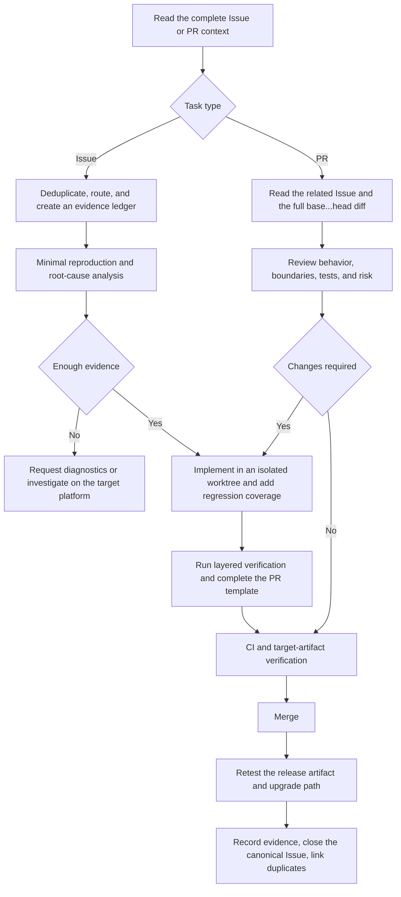

# DSH Desktop End-to-End Issue and Pull Request Workflow

[中文文档](maintainer-issue-pr-workflow.md)

This guide defines a shared maintainer workflow from issue triage, reproduction, and root-cause analysis through implementation, pull request review, merge, release verification, and issue closure. Regular users should continue to use the GitHub issue forms when reporting a problem.

## Contents

1. [Goals and scope](#1-goals-and-scope)
2. [End-to-end flow](#2-end-to-end-flow)
3. [Workspace and branch isolation](#3-workspace-and-branch-isolation)
4. [Issue triage, evidence, and priority](#4-issue-triage-and-evidence)
5. [Reproduction and root-cause analysis](#5-reproduction-and-root-cause-analysis)
6. [Implementation and regression coverage](#6-implementation-and-regression-coverage)
7. [Verification matrix](#7-verification-matrix)
8. [Pull request review](#8-pull-request-review)
9. [PR submission, merge, and Issue closure](#9-pr-description-merge-and-issue-closure)
10. [Queue maintenance and techniques](#10-queue-maintenance-and-recurring-techniques)
11. [Reply and copy templates](#11-reply-and-copy-templates)

## 1. Goals and scope

The workflow prevents four common evidence failures: treating similar symptoms as one root cause, presenting a hypothesis as fact, treating unit tests as release-artifact verification, and treating a merged PR as proof that the user's problem is resolved.

Existing repository rules remain authoritative:

- `deepseek-harness/` is a pinned upstream submodule and must not be edited on a desktop feature branch.
- The outer repository uses Yarn 4.18.0; the submodule retains its own pnpm workspace.
- The complete local gate for product changes is `corepack yarn check`.
- Builds, typechecks, tests, and Loader/Profile smokes must remain headless-safe.
- Production dependency changes must refresh license notices, and documentation changes must remain bilingual.
- A PR may claim only verification that was actually run.

The repository maintains one end-to-end skill: `.agents/skills/dsh-resolve-issue-pr/`. It covers backlog clustering and priority, reproduction and implementation, PR submission and review, verification, replies, release, and closure.

## 2. End-to-end flow



Any stage can move backward. If new logs disprove the current root cause, update the evidence ledger and return to reproduction instead of expanding a patch to defend the old theory.

## 3. Workspace and branch isolation

### 3.1 Preflight

```sh
git status --short --branch --ignore-submodules=all
git remote -v
git worktree list
git submodule status --recursive
```

Record the base branch, `HEAD`, uncommitted files, and submodule state. When the current worktree contains unrelated changes, preserve it and create another worktree.

This maintenance workspace treats `upstream` as fetch-only and `fork` as the contributor push remote. In another clone, verify the URLs instead of relying on those names.

### 3.2 Create an Issue worktree

```sh
git fetch upstream --prune
git worktree add ../dsh-desktop-issue-<number> -b fix/issue-<number>-<slug> upstream/master
```

Initialize the new worktree:

```sh
git submodule update --init --recursive
corepack yarn install --immutable
```

### 3.3 Create a read-only PR review worktree

```sh
git fetch upstream refs/pull/<number>/head:refs/remotes/pull/<number>/head
git worktree add --detach ../dsh-desktop-pr-<number>-review refs/remotes/pull/<number>/head
```

Do not modify the author's branch during a normal review. Commit or push only when the user explicitly requests help updating the PR and the push target and permission are confirmed.

If `git submodule status` fails, record it as an environment failure first. Run `git submodule sync --recursive` and `git submodule update --init --recursive` only in a new or confirmed-clean worktree; do not overwrite existing submodule changes with destructive cleanup.

## 4. Issue triage and evidence

### 4.1 Retrieve the complete context

```sh
gh issue view <number> --repo anywhere-labs/deepseek-harness-desktop \
  --comments --json number,title,body,author,labels,assignees,milestone,createdAt,updatedAt,comments,url
gh issue list --repo anywhere-labs/deepseek-harness-desktop --state all \
  --search '<error or symptom>' --limit 100
gh pr list --repo anywhere-labs/deepseek-harness-desktop --state all \
  --search '<issue number or keyword>' --limit 100
```

Record retrieval time and source. A dated local snapshot is acceptable when live retrieval fails, but label it as a snapshot rather than current state.

### 4.2 Classify before scheduling

Assign one primary class:

| Class | Meaning | Action |
|---|---|---|
| confirmed bug | Tests, code, diagnostics, or target-platform evidence supports the root cause | Fix or verify the release |
| reported bug | Credible report without enough reproduction or diagnostics | Collect evidence before assigning a code fix |
| investigation | Severe symptom with an unknown cause | Investigate immediately without promising a speculative fix |
| feature request | New capability or product decision | Move to a roadmap or RFC |
| information/duplicate | Question, announcement, empty report, or confirmed duplicate | Respond or link the canonical item, then close or move to Discussions |

Evidence confidence is independent of priority: `T` means relevant test or target-artifact verification, `C` means supporting code or diagnostics, `R` means an executable reporter reproduction, `E` means insufficient evidence, and `F` means a feature request. A high-impact `E` item can be a P0 investigation, but it is not a confirmed defect.

Score one independently actionable root-cause cluster, not every duplicate report as a separate engineering task.

### 4.3 Priority scoring and gates

Assign integers from 1 to 5:

- Impact `I`: 5 for launch, core Agent, install/update, workspace, data, or security blockers; 1 for presentation or information-only work.
- Market attention `M`: use independent reporters, duplicates, recent concentration, comments/reactions, ecosystem reach, and maintainer commitments. State when data is missing; never invent popularity.
- Delivery complexity `C`: 5 for cross-platform native work, ambiguous root causes, release artifacts, security design, or multiple owners; 1 for mechanical changes or verified closure.

Default delivery order:

```text
Delivery feasibility F = 6 - C
Priority score S = 0.50 * I + 0.30 * M + 0.20 * F
```

Display one decimal place and apply these gates after the formula:

- `I = 5` with `T`, `C`, or `R` evidence: P0.
- `I = 5` with `E` evidence: P0 investigation; collect diagnostics and a target-platform reproduction before promising a code fix.
- Security, data-loss, and release-install blockers never fall below P0 because of complexity.
- Features compete within the roadmap, not ahead of unresolved P0/P1 bugs.
- Duplicates inherit the canonical Issue priority and receive no second engineering rank.

Default bands are `P0 >= 4.0`, `P1 >= 3.3`, `P2 >= 2.5`, and P3 otherwise. Output the action backlog, evidence lane, roadmap/closure lane, target verification environment, and one next action for each root-cause cluster.

### 4.4 Minimum evidence ledger

For every P0/P1 bug, record:

- Desktop and DSH runtime versions; OS, build, architecture, and installation method.
- Profile, plugin list, and recent upgrades or configuration changes.
- Minimal steps from a normal launch or installation, frequency, and expected result.
- Exact errors, sanitized diagnostics ZIP, logs, screenshots, or recordings.
- Verified facts, open hypotheses, contradictory evidence, and the next discriminating check.
- Required real environment, such as a Windows installer, portable ZIP, or macOS Universal DMG.

Before publishing logs or attachments, remove API keys, tokens, account data, URL credentials/query strings, and unnecessary local paths.

## 5. Reproduction and root-cause analysis

### 5.1 Use the cheapest faithful layer

Escalate only as needed: pure function -> service boundary -> package integration -> Electron process -> packaged target artifact. A lower layer can prove code behavior, but these claims require a real artifact:

- Windows installer, portable package, ACL/pwsh sandbox, native DLL, or child process behavior.
- macOS node-pty, signing/path behavior, lock-screen behavior, or lifecycle.
- ASAR/unpacked resources, dynamic dependency closure, install, upgrade, or uninstall.
- Platform window, tray, file picker, or recovery UI behavior.

A web sandbox or ordinary Node test cannot replace these checks.

### 5.2 Maintain a hypothesis ledger

Keep a small set of falsifiable hypotheses:

| Hypothesis | Supporting evidence | Contradiction/gap | Next check |
|---|---|---|---|
| Example: packaged runtime omitted a dynamic dependency | Development works; artifact reports a missing module | ASAR not yet inspected | Inspect runtime closure and packaged paths |

Run the check with the highest information gain before editing code. Read the implementation, nearby tests, `git log -S/-G`, architecture notes, and public contracts. Do not diagnose from the issue title or final error line alone.

### 5.3 Split failure chains

“Plugins cannot be installed” can mean catalog completeness, network/proxy reachability, package identity, version resolution, native-build approval, process timeout, WAL rollback, restart receipt state, or error presentation. Better diagnostics prove only that the error is more visible, not that a 502, installation failure, or hang is fixed.

Use a minimal fixture to distinguish host regressions from third-party plugin conflicts, proxy failures, and provider-contract defects. Do not restore raw plugin-add behavior, silently approve native builds, weaken origin/SSRF checks, or bypass managed recovery merely to restore compatibility.

## 6. Implementation and regression coverage

1. Identify the owning package and public contract before implementing the smallest complete fix.
2. A regression test should fail before the fix and cover the important failure state.
3. For asynchronous work, cover success, cancellation, timeout, nonzero exit, spawn failure, rollback, restart, and teardown where relevant.
4. For state or persistence, cover partial writes, old-version migration, retries, and rollback.
5. For external data, use structured parsers and schemas; test size limits, pagination/cursors, redirects, provenance, unknown fields, and hostile input.
6. For user-visible errors, use table-driven redaction tests so tokens, credentials, absolute paths, and full commands cannot reach the UI or logs.
7. Keep unrelated refactors, formatting, and dependency upgrades out of the fix. Separate upstream pin changes from desktop behavior changes.

Use conventional commits such as `fix(desktop): ...`, `test(market): ...`, and `docs: ...`.

## 7. Verification matrix

### 7.1 General order

```sh
git diff --check upstream/master...HEAD
git diff --stat upstream/master...HEAD
```

Run directly relevant tests first, then the owning workspace typecheck/test, then the complete product gate:

```sh
corepack yarn check
```

Do not rerun commands that the complete gate already covers without a reason, but list the commands and results accurately in the PR.

### 7.2 Add verification by risk

| Change | Minimum local evidence | Additional gate |
|---|---|---|
| Documentation only | `git diff --check`, bilingual/link review | Update the applicable i18n record when one exists |
| Desktop logic | Focused Vitest, Desktop typecheck/test | Root `corepack yarn check` |
| Market/provider | Contract check, focused tests | Bounds, provenance, timeout, redirect, cancellation, reset, hostile input |
| Production dependency | Root check | Runtime closure, license, `verify:notices` |
| Windows packaging/update/sandbox | `check:win-package` or focused tests | Windows installer and portable smoke on a real machine or VM |
| macOS packaging/node-pty/lifecycle | Focused tests | macOS Universal smoke |
| Upstream pin | `check:layout`, `upstream:version` | Separate pin commit and upstream build |

Common commands:

```sh
corepack yarn workspace dsh-plugin-desktop vitest run <test-file>
corepack yarn workspace dsh-community-market vitest run <test-file>
corepack yarn workspace dsh-plugin-desktop check:win-package
corepack yarn workspace dsh-plugin-desktop verify:notices
corepack yarn dist:win
corepack yarn dist:win-portable
corepack yarn dist:mac-smoke
```

When the current OS cannot run a required platform test, state why it was not run, the substitute evidence, residual risk, and required CI/artifact gate. Do not write that it “should pass.”

## 8. Pull request review

### 8.1 Read the complete PR

```sh
gh pr view <number> --repo anywhere-labs/deepseek-harness-desktop \
  --comments --json number,title,body,author,baseRefName,headRefName,isDraft,mergeable,mergeStateStatus,reviewDecision,statusCheckRollup,commits,files,url
gh pr diff <number> --repo anywhere-labs/deepseek-harness-desktop
```

Review the complete `base...head` diff, not only the latest commit. Check the merge base, current issue state, unrelated changes, generated files, lockfiles, notices, and submodule pins.

### 8.2 Findings-first output

Use this shape for each actionable finding:

```text
[P1] Title — path/to/file.ts:line
Affected behavior: the input or environment that fails.
Evidence: code path, reproduction, missing test, or contract conflict.
Minimum correction: what is required for merge readiness.
```

List blocking bugs, security, data, compatibility, and test gaps before a short summary. Do not block on style preferences. If no blocker is found, say so explicitly and describe remaining platform or test risk.

### 8.3 Risk and approval guidance

GitHub branch protection may change; `gh pr checks` and current repository settings are authoritative. Recommended human review:

| Risk | Examples | Recommended approval and evidence |
|---|---|---|
| High | Installer/update, sandbox/permissions, network trust, credentials, native modules, data migration, install recovery | Two maintainers, including a domain maintainer; target-platform artifact |
| Medium | Host/Client API, Loader composition, persistence format, cross-package behavior | One domain maintainer; migration/rollback and integration tests |
| Low | Local UI, documentation, test strengthening | One maintainer; verification matched to scope |

Use `request changes` or `needs target-artifact verification` when CI is failing, the branch is stale, or the target platform is unverified. Do not approve based on a promise to fix later.

## 9. PR description, merge, and Issue closure

### 9.1 Submit the PR

Before submission, confirm that the branch contains only the related Issue scope and inspect the complete diff:

```sh
git fetch upstream --prune
git diff --check upstream/master...HEAD
git diff --stat upstream/master...HEAD
git log --oneline upstream/master..HEAD
```

Perform external writes only when the user or maintainer explicitly requests submission. Verify the `fork` URL and current branch before pushing:

```sh
git remote -v
git branch --show-current
git push -u fork HEAD
```

Use the GitHub page to complete the repository template:

```sh
gh pr create --repo anywhere-labs/deepseek-harness-desktop --base master --web
```

Create a Draft while target-artifact or other required evidence remains incomplete; mark it ready only when the required evidence exists. For a fully CLI-driven flow, prepare the complete body in a temporary file and use `--body-file <completed-pr-body.md>` rather than submitting an unfilled template.

Immediately read the created PR back and verify base, head, body, related Issue, and CI:

```sh
gh pr view --repo anywhere-labs/deepseek-harness-desktop --json number,title,body,baseRefName,headRefName,isDraft,url
gh pr checks --repo anywhere-labs/deepseek-harness-desktop
```

Implementing code does not automatically authorize pushing, creating a PR, marking it ready, or merging. Each operation must be within the user's request.

### 9.2 PR description

Complete every repository template section: Summary, Related Issues, Type, Platforms, Verification, and Release Notes. A useful verification table is:

| Check | Result | Evidence/notes |
|---|---|---|
| Focused tests | pass/fail/not run | Command and test count |
| `corepack yarn check` | pass/fail/not run | Local result or CI link |
| Platform artifact smoke | pass/fail/not run | OS, artifact, scenario |
| Manual test | pass/fail/not run | Steps and result |

Before merge, confirm that the full diff was reviewed, CI is conclusive, required approvals exist, release notes are usable, and migrations/rollback are documented. The repository permits merge, squash, and rebase; choose for traceability rather than discarding useful authorship or intentional commit separation.

### 9.3 Merge and Issue closure

Before closing a bug, record:

- The root cause, or the exact layer to which the finding is confirmed.
- The fixing PR/commit and the release/artifact version that contains it.
- The original reproduction platform and post-fix verification platform.
- Regression test or manual smoke steps and result.
- Canonical-parent links for duplicates.

When the PR is merged but no affected artifact has been tested, use “merged, awaiting release verification,” not “fixed.” Every `pending release` or `needs retest` item must identify the version, platform, tester, and result.

Ready-to-use Issue triage, evidence request, duplicate, pending release, closure, PR changes-requested, test, rebase, approval, and superseded copy appears in section 11 of this document.

Suggested closure comment:

```text
Root cause / 根因: ...
Fix / 修复: PR #... / commit ...
Regression coverage / 回归覆盖: ...
Release verified / 发布验证: <version>, <OS/artifact>, <steps/result>
Duplicates / 重复项: #...
Residual risk / 剩余风险: ...
```

## 10. Queue maintenance and recurring techniques

- After 7 days without maintainer feedback, mark the item as awaiting review or author response; after 14 days with failing CI or a stale branch, request an update; after 30 days without a response, close with permission to reopen. Maintainers may adjust labels and timing.
- Mark a PR whose behavior is already merged as `superseded`; retain only independently useful tests, documentation, or platform evidence.
- A severe symptom cluster can have a parent tracker, but merge engineering tasks only when they share a root cause.
- Identify invariants before fixing: security boundaries, recovery, data integrity, and platform compatibility are not acceptable temporary tradeoffs.
- For failures that exist only in packaged builds, add runtime-closure or packaged-entry assertions so the next regression fails earlier in CI.
- For ecosystem compatibility, define the public contract and feature detection before adding compatibility logic; do not revive deprecated implicit behavior.
- When a platform cannot be tested locally, produce an executable fixture, required diagnostic fields, and precise smoke steps so “no machine available” becomes a concrete next verification action.

## 11. Reply and copy templates

These templates use the same evidence and status definitions as the workflow above. Before use, replace every `{{placeholder}}`, remove inapplicable sections, and confirm that the message exposes no credentials and claims no unrun verification.

### 11.1 Writing rules

- Default to the reporter's or author's language; add bilingual copy only when cross-language collaboration needs it.
- Lead with current status, then separate confirmed evidence, unknowns, and one concrete next action.
- Thank a specific contribution such as reproduction steps, logs, or tests instead of using generic courtesy text.
- Request only evidence that can distinguish live hypotheses; do not ask the reporter to repeat existing information.
- Do not promise an unconfirmed ETA, merge date, or release version.
- Do not equate “not reproduced locally” with “does not exist,” or “PR merged” with “fixed in a release.”
- When routing third-party work, describe the ownership boundary and evidence without blaming a person or project.
- Remove every unresolved placeholder and internal note before publishing.

Common placeholders:

| Placeholder | Content |
|---|---|
| `{{issue}}` / `{{pr}}` | Issue or PR number |
| `{{version}}` | Desktop or release-candidate version |
| `{{platform}}` | OS, architecture, and artifact type |
| `{{symptom}}` | Exact confirmed symptom |
| `{{evidence}}` | Log, code, test, or artifact evidence |
| `{{next_action}}` | One executable next action |
| `{{owner}}` | Maintainer, author, or external project |

### 11.2 Existing project reply style

This section is based on public replies from other repository maintainers through 2026-08-24. It captures the current project voice rather than generic GitHub boilerplate:

- [#517 fix tracking](https://github.com/anywhere-labs/deepseek-harness-desktop/issues/517#issuecomment-5391939431): thank the exact evidence, name the tracking PR and review focus, then point to the canonical update location.
- [#346 split failure chains](https://github.com/anywhere-labs/deepseek-harness-desktop/issues/346#issuecomment-5351421287): state that two problems are present, number their status, then end with labels and retest steps.
- [#325 separate Host and plugin ownership](https://github.com/anywhere-labs/deepseek-harness-desktop/issues/325#issuecomment-5351424001): keep the Issue open, distinguish Desktop mitigation from plugin root causes, and define the next release verification scope.
- [PR #423 milestone consolidation](https://github.com/anywhere-labs/deepseek-harness-desktop/pull/423#issuecomment-5365548363): pair each English paragraph with Chinese, following specific thanks, current-scope decision, then closure with retained value.

Use three response lengths:

| Scenario | Preferred shape |
|---|---|
| Ordinary Issue status | Primarily Chinese, 2-4 short paragraphs, no heading |
| Multiple root causes, versions, or data sources | Overall decision, numbered/bulleted evidence, then labels and retest action |
| Community PR scope change or closure | Paired English/Chinese paragraphs: specific thanks -> milestone/ownership decision -> closure and retained value |

Select the opening from the actual evidence:

- `感谢反馈。` / `Thank you for the report.`: receipt only, no established evidence.
- `感谢提供完整复现路径。`: the report is executable.
- `已在 {{platform}} 复现。`: a maintainer reproduced it.
- `已定位并提交修复：#{{pr}}。`: root cause and implementation are evidenced.
- `已复核 {{version_or_package}}：...`: a release, dependency, or external-project state was checked.

Do not begin every response with the same thanks and long checklist. Give the status directly when evidence is sufficient; request fields only when information is missing.

### 11.3 Issue replies

#### 11.3.1 Initial acknowledgement and status

```text
Thank you for the report{{specific_evidence_thanks}}.

The behavior currently confirmed is: {{symptom}}. The available evidence is not yet enough to establish a root cause, so we are treating this as a {{reported bug / investigation}} rather than presenting a hypothesis as fact.

Next, we will {{next_action}} and update this Issue when new evidence or a testable build is available.
```

#### 11.3.2 Request missing evidence

```text
Thank you for the report. We still need evidence that distinguishes {{hypothesis_a}} from {{hypothesis_b}}. Please provide:

- DSH Desktop and DSH runtime versions;
- operating system, build, architecture, and installer / portable / DMG / source installation;
- minimal steps starting from a normal launch or installation, plus reproduction frequency;
- {{targeted_evidence}};
- for plugin-related reports: active profile, plugin names and versions, and whether removal changes the result.

Please attach the tray-exported diagnostics ZIP when possible. If the app cannot remain open, run it with `--export-diagnostics`. Before public upload, remove API keys, tokens, account data, and URL credentials/query strings.

With that information, we will run {{next_discriminator}} before assigning ownership or a fix.
```

#### 11.3.3 Reproduced and entering implementation

```text
Reproduced on {{version}} / {{platform}} with: {{minimal_reproduction}}.

Current evidence locates the failure at {{component_or_boundary}}: {{evidence}}. The fix is tracked by {{pr_or_branch}}, with regression coverage for {{regression_scope}}.

This does not yet mean a release is fixed. After merge, we must verify {{release_scenario}} in {{required_artifact}} before updating the closure status.
```

#### 11.3.4 Request target-platform retest

```text
Code-level verification has passed: {{test_evidence}}. This issue depends on {{platform_behavior}}, however, and ordinary Node/Web tests cannot prove the packaged behavior.

Please test {{version_or_artifact}} on {{platform}}:

1. {{step_1}}
2. {{step_2}}
3. Expected: {{expected_result}}

Reply with the observed result, installation method, and any necessary sanitized logs. Keep the Issue in `needs retest` / `pending release` until this verification is complete.
```

#### 11.3.5 Duplicate Issue

```text
Thank you for the additional report. This shares the confirmed root cause in #{{canonical_issue}}: {{shared_root_cause}}. We are tracking the fix and release verification there, so this Issue is closing as a duplicate.

Your {{unique_evidence}} has been added to #{{canonical_issue}}. If you observe {{different_discriminator}}, it may be a separate root cause; reply with the relevant logs or steps and we will triage it again.
```

#### 11.3.6 Similar symptom that must remain separate

```text
This report currently contains two independently testable failure chains:

1. {{problem_a}}, with current evidence: {{evidence_a}};
2. {{problem_b}}, with current evidence: {{evidence_b}}.

The symptoms are similar, but there is not yet evidence of a shared root cause. This Issue will retain {{primary_scope}}, while {{secondary_scope}} moves to #{{other_issue}}. Please keep the reproductions separate so one patch does not incorrectly close both problems.
```

#### 11.3.7 Third-party plugin or provider ownership

```text
Current evidence shows that the DSH Desktop Host does {{host_behavior}} at {{host_boundary}}, while {{plugin_or_provider}} returns or registers {{external_behavior}} at {{external_boundary}}.

Therefore, {{external_part}} needs tracking in {{external_project}}: {{external_link}}. The Desktop side will keep tracking {{host_side_gap_or_compatibility_work}} in this Issue.

This is an evidence-based boundary split, not blame assigned to another project. If a minimal fixture shows the Host failing on valid input, attach it and we will reassess ownership.
```

#### 11.3.8 Feature request acknowledgement

```text
Thank you for the proposal. This requests a new capability rather than reporting a regression in committed behavior, so it is moving to feature request / roadmap evaluation.

Current use case: {{use_case}}
Desired outcome: {{desired_outcome}}
Existing workaround: {{workaround}}
Open product decision: {{product_decision}}

We cannot commit to a version or date before maintainers decide scope, compatibility, and priority. Related proposals or duplicates: {{related_items}}.
```

#### 11.3.9 PR merged, awaiting release verification

```text
The fix was merged in #{{pr}}. Current code status: merged, awaiting release verification.

Covered: {{automated_coverage}}.
Still required: {{artifact_scenario}} on {{version}} / {{platform}}.

Keep this Issue in `pending release` / `needs retest` until the target artifact passes; do not mark it fixed yet.
```

#### 11.3.10 Release artifact verified and closing

```text
The fix and release verification are now confirmed.

Root cause: {{root_cause}}
Fix: #{{pr}} / {{commit}}
Regression coverage: {{regression_coverage}}
Release verification: {{version}}, {{platform}}, {{steps_and_result}}
Duplicates: {{duplicates_or_none}}
Residual risk: {{residual_risk_or_none}}

This Issue is now closing. If the original steps still reproduce on the same version, attach new diagnostics and exact steps so we can reopen it or split a new root cause.
```

#### 11.3.11 Not currently reproduced

```text
We tested {{tested_steps}} in {{tested_environment}} and have not reproduced {{symptom}}. This means the current evidence is incomplete; it does not mean the report is invalid.

We still need {{missing_discriminator}}. Please reply if you can provide it. Until then, mark the Issue as `needs repro`. If no new evidence arrives within {{stale_period}}, we will close it provisionally and reopen it when an executable reproduction becomes available.
```

#### 11.3.12 Closing while waiting for information

```text
We still lack {{missing_evidence}}, so we cannot distinguish {{hypotheses}} or safely assign a code fix.

It has been {{days}} days since the evidence request. We are closing this Issue provisionally to keep the queue actionable. Closure does not reject the report; provide {{reopen_evidence}} later and it can be reopened or linked to a new Issue.
```

### 11.4 Pull Request replies

#### 11.4.1 Review acknowledged

```text
PR #{{pr}} is in the review queue. We will review the complete `base...head` diff against the target behavior in {{related_issue}}, focusing on:

- {{review_focus_1}}
- {{review_focus_2}}
- {{required_verification}}

Current status: {{queued / reviewing / waiting for CI}}. The review will distinguish code defects, missing tests, and risks that only require target-artifact verification.
```

#### 11.4.2 Request changes

```text
Current decision: request changes. Blocking findings:

1. **{{finding_title}}** (`{{path}}:{{line}}`)
   - Affected behavior: {{affected_behavior}}
   - Evidence: {{evidence}}
   - Minimum correction: {{minimum_correction}}

Confirmed scope that can remain: {{accepted_scope}}.
Please resolve the blockers and add {{required_test_or_artifact}}. Reply with the updated commit and we will review the new complete `base...head` diff.
```

#### 11.4.3 Request tests or verification evidence

```text
The implementation direction matches {{contract_or_issue}}, but current verification covers only {{covered_layer}} and not the regression boundary: {{missing_boundary}}.

Before merge, please add:

- a regression test that fails before the fix and passes afterward: {{test_case}};
- {{failure_cancel_rollback_restart_cases}};
- exact commands and results, with a reason and residual risk for every unrun check.

If the issue depends on {{platform_artifact}}, a target-artifact smoke is still required after unit tests pass.
```

#### 11.4.4 Request rebase and scope reduction

```text
This PR is based on {{old_base}}, while current `master` changed behavior in {{conflict_area}}. Please rebase first and remove changes already covered by #{{superseding_pr}}.

Independent value to retain: {{valuable_scope}}.
Overlapping or unrelated scope to remove: {{overlap_scope}}.

After rebase, rerun {{required_checks}} and we will review the new full diff.
```

#### 11.4.5 Target artifact required before approval

```text
Code review found no new blocker, and automated tests cover {{automated_scope}}. The change affects {{installer_update_native_platform_scope}}, however, so current evidence cannot prove packaged behavior.

Decision: needs target-artifact verification. Run {{smoke_matrix}} on {{artifact}} / {{platform}} and record the version, machine or VM, steps, and result. Final approval can follow after it passes.
```

#### 11.4.6 CI failed or is inconclusive

```text
This PR cannot be approved while {{check_name}} is {{failed_or_pending}}.

Relationship to this PR: {{related / unrelated / unknown}}.
Required next action: {{rerun_fix_or_investigate}}.

If this is an infrastructure failure, attach the failed run, a rerun on the same commit, and substitute evidence. “Passes locally” cannot replace a required check by itself.
```

#### 11.4.7 Approve

```text
Current decision: approve.

Confirmed:
- behavior matches the acceptance goal in #{{issue}};
- regression coverage includes {{regression_scope}};
- {{checks}} passed;
- {{platform_artifact_result}}.

Non-blocking residual risk: {{residual_risk_or_none}}.
After merge, verify {{post_merge_verification}} in {{release_version_or_artifact}} before closing the related Issue.
```

#### 11.4.8 Superseded by another implementation

```text
The main behavior in this PR is already present through #{{superseding_pr}} / {{commit}}. Merging the current branch directly would duplicate or overwrite the latest implementation.

Remaining independent value: {{tests_docs_platform_evidence}}.
Recommendation: {{split_and_rebase_or_close}}.

Marking this PR as superseded. Thank you for the specific contribution in {{specific_contribution}}; that evidence will remain linked from the related Issue.
```

#### 11.4.9 Milestone consolidation or current-scope exclusion (project bilingual style)

```text
Thank you for {{specific_contribution_en}}.

感谢你{{specific_contribution_zh}}。

DSH Desktop is entering {{milestone}}. This release is focused on {{current_focus_en}}, so {{proposal_en}} is not included in the current scope.

DSH Desktop 即将进入 {{milestone}}。本次发布集中在{{current_focus_zh}}，因此{{proposal_zh}}不进入当前范围。

We are closing this PR as part of the current {{consolidation_or_ownership_decision_en}}. Its {{retained_value_en}} remains useful reference material. Thank you again for the contribution.

因此，我们会按当前的{{consolidation_or_ownership_decision_zh}}关闭这个 PR，其中的{{retained_value_zh}}仍会作为有价值的参考。再次感谢你的贡献。
```

Use this only for a real scope or ownership decision, not to hide a code defect. If the PR contains a small independently mergeable fix, recommend splitting it before using milestone closure copy.

### 11.5 PR description and handoff copy

#### 11.5.1 Fix PR summary

```text
## Summary / 摘要

- Symptom / 现象: {{symptom}}
- Root cause / 根因: {{root_cause_and_confidence}}
- Fix / 修复: {{implementation}}
- Preserved boundaries / 保持不变的边界: {{security_recovery_compatibility}}

## Related Issues / 关联 Issue

Fixes #{{issue}}
Related: {{duplicates_or_trackers}}

## Verification / 验证

- PASS: `{{command}}` - {{result}}
- PASS: {{manual_or_artifact_check}}
- NOT RUN: {{check}} - {{reason_and_residual_risk}}

## Release Notes / 发布说明

{{user_visible_change_or_na}}
```

#### 11.5.2 Maintainer handoff

```text
Current status: {{triage / diagnosed / patch ready / waiting for CI / pending release}}
Canonical Issue: #{{issue}}
Confirmed: {{confirmed_facts}}
Unconfirmed: {{open_hypotheses}}
Code/PR: {{branch_pr_commit}}
Verification run: {{completed_checks}}
Verification remaining: {{remaining_checks_and_environment}}
Next discriminator: {{next_discriminator}}
Blocker/owner: {{blocker_or_owner}}
```

### 11.6 Pre-publication check

Before sending or posting copy, confirm:

- Every placeholder is replaced, with no internal judgment or credential left behind.
- Issue/PR, commit, version, and platform references are accurate.
- Confirmed, suspected, and unverified statements remain distinct.
- No unrun test is described as passing.
- No unauthorized ETA, merge, or release promise appears.
- The next step names a concrete action, owner, or required evidence.
- A closure message contains release-artifact evidence; otherwise use “merged, awaiting release verification.”
