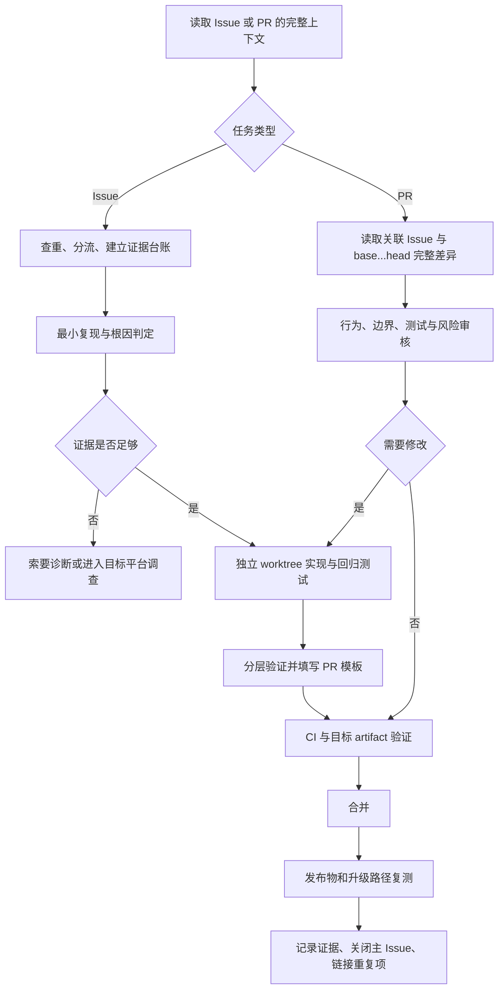

# DSH Desktop Issue 与 Pull Request 端到端处理规范

[English documentation](maintainer-issue-pr-workflow.en.md)

本文面向维护者和参与代码审核的贡献者，定义从 Issue 分流、复现和根因定位，到实现、PR 审核、合并、发布验证和关闭 Issue 的统一流程。普通用户提交问题时仍以 GitHub Issue 模板为准。

## 目录

1. [目标与适用范围](#1-目标与适用范围)
2. [总流程](#2-总流程)
3. [工作区与分支隔离](#3-工作区与分支隔离)
4. [Issue 分流、证据与优先级](#4-issue-分流与证据规范)
5. [复现与根因定位](#5-复现与根因定位)
6. [实现与回归测试](#6-实现与回归测试)
7. [验证矩阵](#7-验证矩阵)
8. [Pull Request 审核](#8-pull-request-审核)
9. [PR 提交、合并与 Issue 关闭](#9-pr-描述合并与-issue-关闭)
10. [队列维护与技巧](#10-队列维护与高频技巧)
11. [回复与文案模板](#11-回复与文案模板)

## 1. 目标与适用范围

本规范解决四个常见失真：把相似症状当成同一根因、把猜测写成根因、把单元测试当成发布物验证、把 PR 合并当成用户问题已经解决。

仓库已有的硬规则继续优先：

- `deepseek-harness/` 是固定上游子模块，桌面功能分支不得修改其中内容。
- 外层仓库使用 Yarn 4.18.0；子模块保留自己的 pnpm workspace。
- 产品改动的完整本地门禁是 `corepack yarn check`。
- 构建、类型检查、测试和 Loader/Profile 冒烟必须保持 headless-safe。
- 生产依赖变更必须刷新许可证清单；文档改动必须中英文同步。
- PR 中只能声明实际执行过的验证，不能把未运行项目写成通过。

仓库只维护一个端到端 Skill：`.agents/skills/dsh-resolve-issue-pr/`。它覆盖全量 Issue 聚类和优先级、单项复现与修复、PR 提交与审核、验证、回复、发布和关闭。

## 2. 总流程



任何阶段都允许回退。新的日志推翻根因时，应更新台账并回到复现阶段，而不是为了保住已有补丁继续扩大改动。

## 3. 工作区与分支隔离

### 3.1 开始前检查

```sh
git status --short --branch --ignore-submodules=all
git remote -v
git worktree list
git submodule status --recursive
```

记录 base branch、`HEAD`、未提交文件和子模块状态。当前工作树有无关改动时，不清理、不覆盖，改用新 worktree。

本维护工作区的约定是 `upstream` 只抓取官方仓库，`fork` 用于推送个人分支。其他克隆中必须先核对 URL，不能只按 remote 名称判断。

### 3.2 为 Issue 创建工作树

```sh
git fetch upstream --prune
git worktree add ../dsh-desktop-issue-<number> -b fix/issue-<number>-<slug> upstream/master
```

在新工作树中初始化依赖：

```sh
git submodule update --init --recursive
corepack yarn install --immutable
```

### 3.3 为第三方 PR 创建只读审查工作树

```sh
git fetch upstream refs/pull/<number>/head:refs/remotes/pull/<number>/head
git worktree add --detach ../dsh-desktop-pr-<number>-review refs/remotes/pull/<number>/head
```

审查工作树默认不改作者分支。只有用户明确要求帮助修复 PR，且推送权限和目标分支已经确认时，才提交或推送变更。

若 `git submodule status` 报错，先把它作为环境故障记录。只在新建或确认干净的工作树中执行 `git submodule sync --recursive` 和 `git submodule update --init --recursive`，不要用破坏性清理覆盖现有子模块改动。

## 4. Issue 分流与证据规范

### 4.1 获取完整上下文

```sh
gh issue view <number> --repo anywhere-labs/deepseek-harness-desktop \
  --comments --json number,title,body,author,labels,assignees,milestone,createdAt,updatedAt,comments,url
gh issue list --repo anywhere-labs/deepseek-harness-desktop --state all \
  --search '<关键错误或症状>' --limit 100
gh pr list --repo anywhere-labs/deepseek-harness-desktop --state all \
  --search '<issue number 或关键字>' --limit 100
```

记录查询时间和数据来源。实时查询失败时可以使用带日期的本地快照，但必须写明“快照”，不能称为当前状态。

### 4.2 先分类，再排期

每个条目只能先落入一种主要类型：

| 类型 | 含义 | 处理方式 |
|---|---|---|
| confirmed bug | 测试、代码、日志或目标平台已支持根因 | 进入修复或发布验证 |
| reported bug | 报告可信，但复现或诊断不足 | 补证后再指定代码修复 |
| investigation | 症状严重、根因未知 | 立即调查，不承诺猜测性修复 |
| feature request | 新能力或产品决策 | 进入 roadmap/RFC |
| information/duplicate | 问答、公告、空报告或重复项 | 回复、链接主条目后关闭或转 Discussion |

证据等级独立于优先级：`T` 表示测试或目标 artifact 验证，`C` 表示代码/诊断支持，`R` 表示可执行复现，`E` 表示证据不足，`F` 表示功能请求。高影响 `E` 条目可以是 P0 调查，但不能写成已确认缺陷。

重复 Issue 按一个可独立行动的根因簇计分，不能把重复数量直接当成多个工程任务。

### 4.3 优先级评分与门槛

按 1-5 整数分别评估：

- 影响 `I`：启动、核心 Agent、安装/更新、工作区、数据或安全阻断为 5；纯展示或信息项为 1。
- 市场关注 `M`：使用独立报告人、重复项、近期集中反馈、评论/reaction、生态影响和维护者承诺；缺少数据时明确写缺少，不能虚构热度。
- 交付复杂度 `C`：跨平台原生、根因不明、发布 artifact、安全设计或多个 owner 为 5；机械变更或已验证关闭为 1。

默认交付顺序使用：

```text
交付可行性 F = 6 - C
综合分 S = 0.50 * I + 0.30 * M + 0.20 * F
```

分数显示到一位小数，门槛在公式之后应用：

- `I = 5` 且证据为 `T`、`C` 或 `R`：P0。
- `I = 5` 且证据为 `E`：P0 调查，先补诊断和目标平台复现，不承诺代码修复。
- 安全、数据丢失和发布安装阻断不得因复杂度降到 P1 以下。
- Feature 只在 roadmap 队列内部竞争，不排在未解决 P0/P1 Bug 之前。
- 重复项继承主 Issue 优先级，不再分配第二份工程排名。

默认区间：`P0 >= 4.0`、`P1 >= 3.3`、`P2 >= 2.5`，其余为 P3。输出必须同时包含行动队列、补证队列、roadmap/关闭队列、目标验证环境和每个根因簇唯一的下一步。

### 4.4 最小证据台账

每个 P0/P1 Bug 至少记录：

- Desktop 与 DSH runtime 版本；OS、build、架构和安装方式。
- profile、插件清单、最近升级或配置变化。
- 从正常启动/安装开始的最小步骤、复现频率和期望结果。
- 准确错误文本、脱敏诊断 ZIP、日志、截图或录屏。
- 已验证事实、待验证假设、反证和下一项判别检查。
- 需要的实际验证环境，例如 Windows installer、portable ZIP 或 macOS Universal DMG。

发布日志或附件前必须清除 API Key、Token、账号、URL credential/query 和无必要的本地路径。

## 5. 复现与根因定位

### 5.1 使用“最便宜但忠实”的复现层级

按需逐层升级：纯函数测试 -> 服务边界 -> package 集成 -> Electron 进程 -> 已打包目标平台 artifact。前一层能够证明代码行为时无需一开始就打包，但以下结论必须使用实际 artifact：

- Windows installer、portable、ACL/pwsh sandbox、原生 DLL/child process。
- macOS node-pty、签名/路径、锁屏与生命周期。
- ASAR/unpacked 资源、动态依赖闭包、安装/升级/卸载。
- 平台窗口、托盘、文件选择器和恢复窗口。

Web 沙盒和普通 Node 测试不能替代这些验证。

### 5.2 维护假设台账

建议每次只保留少量可证伪假设：

| 假设 | 支持证据 | 反证/缺口 | 下一项检查 |
|---|---|---|---|
| 示例：打包遗漏动态依赖 | 开发态正常、artifact 启动时报模块缺失 | 尚未检查 ASAR | 检查 runtime closure 与包内路径 |

先执行信息增益最大的检查，再改代码。查看相关实现、相邻测试、`git log -S/-G`、架构记录和公开契约；不要只根据 Issue 标题或错误末行定位。

### 5.3 必须拆开的故障链

“插件装不上”至少可能包含目录完整性、网络/代理、package identity、版本解析、native build 审批、子进程超时、WAL rollback、重启后 receipt 和错误展示。诊断增强只证明“更容易看见错误”，不证明 502、安装失败或挂起已经修复。

第三方插件/Provider 问题必须用最小 fixture 区分 Host 回归、插件冲突、代理故障和数据源契约错误。不能为了兼容旧调用恢复 raw plugin-add、静默允许 native build、放宽 origin/SSRF 检查或绕过可恢复安装边界。

## 6. 实现与回归测试

1. 先确认 owning package 和公开契约，再做最小完整修复。
2. 回归测试应在修复前失败，并覆盖本次故障的重要失败状态。
3. 涉及异步操作时检查成功、取消、timeout、nonzero exit、spawn failure、rollback、重启和 teardown。
4. 涉及状态或持久化时检查部分写入、旧版本迁移、重复执行和回滚。
5. 涉及外部数据时使用结构化 parser 和 schema；测试大小上限、分页/cursor、redirect、provenance、未知字段和恶意输入。
6. 涉及用户可见错误时做表驱动脱敏测试，防止 Token、credential、绝对路径或完整命令进入 UI/日志。
7. 不把无关重构、格式化或依赖升级塞入同一修复；上游 pin 与桌面行为改动分开提交。

提交使用 conventional commits，例如 `fix(desktop): ...`、`test(market): ...`、`docs: ...`。

## 7. 验证矩阵

### 7.1 通用顺序

```sh
git diff --check upstream/master...HEAD
git diff --stat upstream/master...HEAD
```

先运行与变更直接相关的测试，再运行 owning workspace 的 typecheck/test，最后对产品改动运行：

```sh
corepack yarn check
```

不要为了节省时间重复运行被完整 gate 完全覆盖的命令；但 PR 描述必须准确列出实际命令和结果。

### 7.2 按风险增加验证

| 变更 | 最低本地验证 | 额外门禁 |
|---|---|---|
| 纯文档 | `git diff --check`、双语和链接检查 | 有对应 i18n 记录时更新记录 |
| Desktop 逻辑 | 定向 Vitest、Desktop typecheck/test | 根 `corepack yarn check` |
| Market/Provider | contract check、定向测试 | 限额、provenance、timeout、redirect、取消、reset、恶意输入 |
| 生产依赖 | 根 check | runtime closure、license、`verify:notices` |
| Windows 打包/更新/sandbox | `check:win-package` 或定向测试 | Windows installer 与 portable 实机/VM smoke |
| macOS 打包/node-pty/生命周期 | 定向测试 | macOS Universal smoke |
| 上游 pin | `check:layout`、`upstream:version` | 单独 pin commit、上游 build |

常用命令：

```sh
corepack yarn workspace dsh-plugin-desktop vitest run <test-file>
corepack yarn workspace dsh-community-market vitest run <test-file>
corepack yarn workspace dsh-plugin-desktop check:win-package
corepack yarn workspace dsh-plugin-desktop verify:notices
corepack yarn dist:win
corepack yarn dist:win-portable
corepack yarn dist:mac-smoke
```

无法在当前 OS 执行的平台测试时，应写出未运行原因、替代证据、剩余风险和需要的 CI/artifact gate，不能写“应当通过”。

## 8. Pull Request 审核

### 8.1 读取完整 PR

```sh
gh pr view <number> --repo anywhere-labs/deepseek-harness-desktop \
  --comments --json number,title,body,author,baseRefName,headRefName,isDraft,mergeable,mergeStateStatus,reviewDecision,statusCheckRollup,commits,files,url
gh pr diff <number> --repo anywhere-labs/deepseek-harness-desktop
```

审查 `base...head` 完整差异，而不是只看最新 commit。核对 merge base、新旧 Issue 状态、无关改动、生成文件、lockfile、许可证清单和子模块 pin。

### 8.2 Findings-first 输出

每条可执行问题使用：

```text
[P1] 标题 — path/to/file.ts:line
受影响行为：什么输入或环境会失败。
证据：代码路径、复现、测试缺口或契约冲突。
最小修正：达到可合并状态需要什么。
```

先列阻断性 bug、安全、数据、兼容和测试缺口，再给简短总结。不要用纯风格偏好阻塞 PR；没有发现时明确写“未发现阻断问题”，同时说明剩余平台或测试风险。

### 8.3 风险与批准建议

GitHub 服务端 branch protection 可能变化，最终以 `gh pr checks` 和仓库设置为准。人工审核建议：

| 风险 | 示例 | 建议批准与证据 |
|---|---|---|
| 高 | installer/update、sandbox/权限、网络信任、凭据、原生模块、数据迁移、安装恢复 | 两名维护者，其中一名领域维护者；目标平台 artifact |
| 中 | Host/Client API、Loader composition、持久化格式、跨 package 行为 | 一名领域维护者；迁移/回滚和集成测试 |
| 低 | 局部 UI、文档、测试强化 | 一名维护者；与影响范围匹配的验证 |

CI 失败、分支落后或目标平台未验证时，使用 `request changes` 或 `needs target-artifact verification`，不要依靠口头承诺批准。

## 9. PR 描述、合并与 Issue 关闭

### 9.1 提交 PR

提交前确认分支只包含关联 Issue 的范围，并查看完整差异：

```sh
git fetch upstream --prune
git diff --check upstream/master...HEAD
git diff --stat upstream/master...HEAD
git log --oneline upstream/master..HEAD
```

只有用户或维护者明确要求提交时，才执行外部写操作。先核对 `fork` URL 和当前分支，再推送：

```sh
git remote -v
git branch --show-current
git push -u fork HEAD
```

通过 GitHub 页面填写仓库模板：

```sh
gh pr create --repo anywhere-labs/deepseek-harness-desktop --base master --web
```

目标平台 artifact 或关键验证尚未完成时创建 Draft；所有必需证据齐全时再标记 ready。需要全 CLI 流程时，可将完整 PR 正文写入临时文件并使用 `--body-file <completed-pr-body.md>`，不要用未填写的模板直接提交。

创建后立即读回并检查 base、head、正文、关联 Issue 和 CI：

```sh
gh pr view --repo anywhere-labs/deepseek-harness-desktop --json number,title,body,baseRefName,headRefName,isDraft,url
gh pr checks --repo anywhere-labs/deepseek-harness-desktop
```

实现代码不自动授权 push、创建 PR、标记 ready 或合并；这些操作必须分别处于用户请求范围内。

### 9.2 PR 描述

PR 必须完整填写仓库模板：Summary、Related Issues、Type、Platforms、Verification、Release Notes。验证区建议列出：

| 检查 | 结果 | 证据/说明 |
|---|---|---|
| 定向测试 | pass/fail/not run | 命令和用例数量 |
| `corepack yarn check` | pass/fail/not run | 本地或 CI 链接 |
| 平台 artifact smoke | pass/fail/not run | OS、artifact、场景 |
| 人工测试 | pass/fail/not run | 步骤与结果 |

合并前确认：完整差异已审、CI 结论明确、必需批准存在、release note 可用、迁移/回滚已说明。仓库支持 merge、squash 和 rebase；选择应服务于可追溯性，不为了整洁丢失有价值的作者或拆分信息。

### 9.3 合并与 Issue 关闭

Bug 关闭前必须记录：

- 根因，或明确说明只能确认到哪一层。
- 关联 PR/commit 和包含修复的 release/artifact 版本。
- 原复现平台与修复后验证平台。
- 回归测试或人工 smoke 步骤与结果。
- 重复 Issue 的 canonical parent 链接。

PR 合并但尚未发布验证时，状态应是“merged, awaiting release verification”，不是“fixed”。`pending release`/`needs retest` 条目必须绑定具体版本、平台、测试人和结论。

Issue 分流、补证、重复、待发布、关闭，以及 PR 请求修改、补测试、rebase、批准和 superseded 等可直接使用的文案见本文第 11 章。

推荐关闭评论：

```text
Root cause / 根因：...
Fix / 修复：PR #... / commit ...
Regression coverage / 回归覆盖：...
Release verified / 发布验证：<version>, <OS/artifact>, <steps/result>
Duplicates / 重复项：#...
Residual risk / 剩余风险：...
```

## 10. 队列维护与高频技巧

- 7 天无维护者反馈：标记等待审查或等待作者；14 天 CI 红/分支落后：请求更新；30 天无回应可关闭并允许重开。实际标签和时限以维护者决定为准。
- 与已合入实现重叠的 PR 标记 `superseded`；只保留仍有独立价值的测试、文档或平台验证。
- 一个严重症状簇可以先建父 tracker，但只有共享根因的报告才合并工程任务。
- 修复先锁定不变量：安全边界、恢复能力、数据完整性和平台兼容不能作为临时折中被削弱。
- 对“只在发布包失败”的问题，优先增加 runtime closure 或 packaged-entry 断言，让下次在 CI 中更早失败。
- 对第三方生态兼容问题，先定义公开契约和 feature detection，再讨论兼容层；不要恢复已废弃且不安全的隐式行为。
- 对无法诚实验证的平台，快速产出可执行的 fixture、诊断字段和 smoke 步骤，把“缺机器”转化为明确的下一项验证。

## 11. 回复与文案模板

以下模板与前述流程共用同一证据和状态定义。使用前替换所有 `{{placeholder}}`、删除不适用段落，并确认没有泄露凭据或声称未执行的验证。

### 11.1 文案原则

- 默认使用报告人或作者的语言；跨语言协作时再提供中英双语。
- 第一段先说当前状态，随后区分“已确认”“尚不确定”“下一步”。
- 感谢具体贡献，例如复现步骤、日志或测试，而不是使用空泛客套话。
- 只索要能够区分当前假设的证据，不让报告人重复提交已有信息。
- 不承诺未经确认的 ETA、合并时间或版本号。
- 不把“本地无法复现”写成“问题不存在”，不把“PR 已合并”写成“发布版已修复”。
- 路由第三方问题时描述责任边界和证据，不归咎个人或项目。
- 发布前删除所有未替换的占位符和内部备注。

常用占位符：

| 占位符 | 内容 |
|---|---|
| `{{issue}}` / `{{pr}}` | Issue 或 PR 编号 |
| `{{version}}` | Desktop 或候选发布版本 |
| `{{platform}}` | OS、架构和 artifact 类型 |
| `{{symptom}}` | 已确认的准确现象 |
| `{{evidence}}` | 日志、代码、测试或 artifact 证据 |
| `{{next_action}}` | 唯一、可执行的下一步 |
| `{{owner}}` | 维护者、作者或外部项目 |

### 11.2 项目现有回复格式

本节基于 2026-08-24 前仓库内其他维护者的公开回复整理，代表当前项目语气，而不是通用 GitHub 套话：

- [#517 修复跟踪](https://github.com/anywhere-labs/deepseek-harness-desktop/issues/517#issuecomment-5391939431)：一句感谢具体证据，一句说明 PR 和审核重点，一句给跟踪入口。
- [#346 拆分故障链](https://github.com/anywhere-labs/deepseek-harness-desktop/issues/346#issuecomment-5351421287)：先声明“包含两个不同问题”，编号写进展，最后统一给标签和复测动作。
- [#325 区分 Host 与插件责任](https://github.com/anywhere-labs/deepseek-harness-desktop/issues/325#issuecomment-5351424001)：先说暂不关闭，再区分 Desktop 缓解措施和插件根因，最后明确下一版验证范围。
- [PR #423 里程碑收拢](https://github.com/anywhere-labs/deepseek-harness-desktop/pull/423#issuecomment-5365548363)：英文段落后紧跟中文对应段落，按“感谢具体贡献、解释当前范围、关闭并保留价值”组织。

据此使用三种长度：

| 场景 | 建议格式 |
|---|---|
| 普通 Issue 状态更新 | 中文为主，2-4 个短段落；不加标题 |
| 多根因、多个版本或多个数据源 | 先给总判断，再用编号/项目符号，结尾写标签与复测 |
| 社区 PR 范围调整或关闭 | 中英成对段落；具体感谢 -> 里程碑/归属决定 -> 关闭与保留价值 |

常用开头按证据选择：

- `感谢反馈。`：仅确认收到，尚未建立证据。
- `感谢提供完整复现路径。`：报告已经可执行。
- `已在 {{platform}} 复现。`：维护者亲自复现。
- `已定位并提交修复：#{{pr}}。`：根因和实现均有证据。
- `已复核 {{version_or_package}}：...`：核对了发布物、依赖或外部项目状态。

避免每条回复都套用相同的“感谢 + 长清单”。已有足够证据时直接给结论；只有信息不足时才索要字段。

### 11.3 Issue 回复

#### 11.3.1 首次确认与状态说明

```text
感谢反馈{{specific_evidence_thanks}}。

目前可以确认的现象是：{{symptom}}。现有信息还不足以确认根因，当前先按“{{reported bug / investigation}}”处理，不会把猜测写成结论。

下一步会 {{next_action}}。有新证据或可测试版本后继续在本 Issue 更新。
```

#### 11.3.2 索要缺失证据

```text
感谢反馈。目前还缺少能够区分 {{hypothesis_a}} 和 {{hypothesis_b}} 的信息，请补充：

- DSH Desktop 版本和 DSH runtime 版本；
- 操作系统、build、架构，以及 installer / portable / DMG / 源码运行；
- 从正常启动或安装开始的最小复现步骤和复现频率；
- {{targeted_evidence}}；
- 若涉及插件：活动 profile、插件名称与版本，以及移除插件后是否仍能复现。

请尽量附上托盘导出的 diagnostics ZIP；应用无法保持启动时，可用 `--export-diagnostics` 导出。公开上传前请删除 API Key、Token、账号、URL credential/query 等敏感信息。

拿到这些信息后，我们会先执行 {{next_discriminator}}，再判断归属和修复方案。
```

#### 11.3.3 已复现，进入修复

```text
已在 {{version}} / {{platform}} 复现：{{minimal_reproduction}}。

当前证据将问题定位到 {{component_or_boundary}}：{{evidence}}。修复由 {{pr_or_branch}} 跟踪，回归测试将覆盖 {{regression_scope}}。

这仍不等于发布版已经修复。代码合并后还需要在 {{required_artifact}} 上验证 {{release_scenario}}，通过后再更新关闭状态。
```

#### 11.3.4 需要目标平台复测

```text
代码级检查已经通过：{{test_evidence}}。但这个问题依赖 {{platform_behavior}}，普通 Node/Web 测试不能证明发布物行为。

请使用 {{version_or_artifact}} 在 {{platform}} 验证：

1. {{step_1}}
2. {{step_2}}
3. {{expected_result}}

请回复实际结果、安装方式和必要的脱敏日志。复测完成前状态保持 `needs retest` / `pending release`。
```

#### 11.3.5 重复 Issue

```text
感谢补充。这个报告与 #{{canonical_issue}} 共享同一已确认根因：{{shared_root_cause}}。后续修复和发布验证统一在 #{{canonical_issue}} 跟踪，因此本 Issue 作为重复项关闭。

你的 {{unique_evidence}} 已补充到主 Issue。如果你观察到 {{different_discriminator}}，说明可能是不同根因，请带上对应日志或步骤回复，我们会重新分流。
```

#### 11.3.6 相似症状，但需要拆分

```text
这里包含两个需要独立验证的故障链：

1. {{problem_a}}，当前证据：{{evidence_a}}；
2. {{problem_b}}，当前证据：{{evidence_b}}。

它们的用户表象相似，但尚不能证明根因相同。这个 Issue 保留 {{primary_scope}}，{{secondary_scope}} 转到 #{{other_issue}}。请分别提供对应复现，避免一个修复误关两个问题。
```

#### 11.3.7 第三方插件或 Provider 归属

```text
当前证据显示：DSH Desktop Host 在 {{host_boundary}} 的行为是 {{host_behavior}}；{{plugin_or_provider}} 在 {{external_boundary}} 返回或注册了 {{external_behavior}}。

因此 {{external_part}} 需要由 {{external_project}} 跟踪：{{external_link}}。Desktop 侧仍会在本 Issue 跟踪 {{host_side_gap_or_compatibility_work}}。

这不是对第三方项目的责任判断，而是按可复现边界拆分修复。若有最小 fixture 能证明 Host 在合法输入下仍失败，请附上，我们会重新评估归属。
```

#### 11.3.8 功能请求确认

```text
感谢建议。这个需求描述的是新增能力，而不是已承诺行为的回归，因此转为 feature request / roadmap 评估。

当前使用场景：{{use_case}}
期望结果：{{desired_outcome}}
现有替代方案：{{workaround}}
待决策点：{{product_decision}}

在维护者确认范围、兼容性和优先级前，不承诺具体版本或时间。相关提案/重复需求：{{related_items}}。
```

#### 11.3.9 PR 已合并，等待发布验证

```text
修复已通过 #{{pr}} 合并，代码状态为：merged, awaiting release verification。

已覆盖：{{automated_coverage}}。
仍需验证：{{version}} / {{platform}} 上的 {{artifact_scenario}}。

在目标 artifact 通过前，本 Issue 保持 `pending release` / `needs retest`，暂不标记为 fixed。
```

#### 11.3.10 发布物验证通过并关闭

```text
已确认修复并完成发布验证。

根因：{{root_cause}}
修复：#{{pr}} / {{commit}}
回归覆盖：{{regression_coverage}}
发布验证：{{version}}，{{platform}}，{{steps_and_result}}
重复项：{{duplicates_or_none}}
剩余风险：{{residual_risk_or_none}}

本 Issue 现在关闭。如果同一版本仍可按原步骤复现，请附上新的 diagnostics 和准确步骤，我们会重新打开或拆分新的根因。
```

#### 11.3.11 暂时无法复现

```text
我们在 {{tested_environment}} 按 {{tested_steps}} 测试，暂未复现 {{symptom}}。这只表示当前证据不足，不表示报告无效。

还需要：{{missing_discriminator}}。如果你能提供对应信息，请继续回复；在此之前本 Issue 标记为 `needs repro`。若 {{stale_period}} 内没有新证据，我们会先关闭，之后有可执行复现仍可重新打开。
```

#### 11.3.12 等待信息后关闭

```text
目前仍缺少 {{missing_evidence}}，因此无法区分 {{hypotheses}}，也不能安全指定代码修复。

自上次请求补充信息后已过去 {{days}} 天，本 Issue 先关闭以保持队列可执行。关闭不代表问题被否定；后续补充 {{reopen_evidence}} 后可以重新打开或新建关联 Issue。
```

### 11.4 Pull Request 回复

#### 11.4.1 已进入审核

```text
已收到 #{{pr}}。本次审核按 {{related_issue}} 的目标行为检查完整 `base...head` 差异，重点是：

- {{review_focus_1}}
- {{review_focus_2}}
- {{required_verification}}

当前状态：{{queued / reviewing / waiting for CI}}。审核结论会区分代码问题、测试缺口和仅需目标 artifact 验证的风险。
```

#### 11.4.2 请求修改

```text
当前结论：request changes。阻断项如下：

1. **{{finding_title}}** (`{{path}}:{{line}}`)
   - 受影响行为：{{affected_behavior}}
   - 证据：{{evidence}}
   - 最小修正：{{minimum_correction}}

已确认可保留的部分：{{accepted_scope}}。
请先处理阻断项并补充 {{required_test_or_artifact}}；更新后回复对应 commit，我们会基于新的 `base...head` 复审。
```

#### 11.4.3 请求补测试或验证证据

```text
实现方向与 {{contract_or_issue}} 一致，但目前的验证只覆盖 {{covered_layer}}，尚未覆盖会回归的边界：{{missing_boundary}}。

合并前请补充：

- 修复前失败、修复后通过的回归测试：{{test_case}}；
- {{failure_cancel_rollback_restart_cases}}；
- 实际运行命令和结果；未运行项请写明原因与剩余风险。

若问题依赖 {{platform_artifact}}，单元测试通过后仍需要目标 artifact smoke。
```

#### 11.4.4 请求 rebase 和收敛范围

```text
这个 PR 当前基于 {{old_base}}，与最新 `master` 在 {{conflict_area}} 已发生行为变化。请先 rebase，再删除已经由 #{{superseding_pr}} 覆盖的改动。

建议保留的独立价值：{{valuable_scope}}。
建议移除的重叠或无关范围：{{overlap_scope}}。

rebase 后请重新运行 {{required_checks}}，我们再审查新的完整差异。
```

#### 11.4.5 需要平台 artifact 才能批准

```text
代码审查未发现新的阻断问题，自动测试覆盖 {{automated_scope}}。但该变更影响 {{installer_update_native_platform_scope}}，当前证据不能证明发布物行为。

结论：needs target-artifact verification。请在 {{platform}} 的 {{artifact}} 上完成 {{smoke_matrix}}，记录版本、机器/VM、步骤和结果。通过后可进入最终批准。
```

#### 11.4.6 CI 失败或状态不完整

```text
当前不能批准：{{check_name}} 为 {{failed_or_pending}}。

失败与本 PR 的关系：{{related / unrelated / unknown}}。
需要的下一步：{{rerun_fix_or_investigate}}。

如果判断为基础设施问题，请附失败链接、相同 commit 的重跑结果和替代验证；不能仅以“本地通过”覆盖 required check。
```

#### 11.4.7 批准

```text
当前结论：approve。

已确认：
- 行为与 #{{issue}} 的验收目标一致；
- 回归测试覆盖 {{regression_scope}}；
- 已运行 {{checks}}；
- {{platform_artifact_result}}。

未阻断的剩余风险：{{residual_risk_or_none}}。
合并后仍需在 {{release_version_or_artifact}} 完成 {{post_merge_verification}}，再关闭关联 Issue。
```

#### 11.4.8 已被其他实现覆盖

```text
这个 PR 的主要行为已由 #{{superseding_pr}} / {{commit}} 合入，因此不能再直接合并当前分支，否则会重复或覆盖最新实现。

仍有独立价值的部分：{{tests_docs_platform_evidence}}。
建议：{{split_and_rebase_or_close}}。

当前标记为 superseded。感谢作者提供的 {{specific_contribution}}，这些证据会保留在关联 Issue 中。
```

#### 11.4.9 里程碑收拢或不进入当前范围（项目双语格式）

```text
Thank you for {{specific_contribution_en}}.

感谢你{{specific_contribution_zh}}。

DSH Desktop is entering {{milestone}}. This release is focused on {{current_focus_en}}, so {{proposal_en}} is not included in the current scope.

DSH Desktop 即将进入 {{milestone}}。本次发布集中在{{current_focus_zh}}，因此{{proposal_zh}}不进入当前范围。

We are closing this PR as part of the current {{consolidation_or_ownership_decision_en}}. Its {{retained_value_en}} remains useful reference material. Thank you again for the contribution.

因此，我们会按当前的{{consolidation_or_ownership_decision_zh}}关闭这个 PR，其中的{{retained_value_zh}}仍会作为有价值的参考。再次感谢你的贡献。
```

此格式用于真正规模或归属决策，不用于掩盖代码缺陷。若 PR 存在可独立合入的小范围修复，应先明确建议拆分，而不是直接用里程碑文案关闭。

### 11.5 PR 描述和交接文案

#### 11.5.1 修复型 PR 摘要

```text
## Summary / 摘要

- Symptom / 现象：{{symptom}}
- Root cause / 根因：{{root_cause_and_confidence}}
- Fix / 修复：{{implementation}}
- Preserved boundaries / 保持不变的边界：{{security_recovery_compatibility}}

## Related Issues / 关联 Issue

Fixes #{{issue}}
Related: {{duplicates_or_trackers}}

## Verification / 验证

- PASS: `{{command}}` — {{result}}
- PASS: {{manual_or_artifact_check}}
- NOT RUN: {{check}} — {{reason_and_residual_risk}}

## Release Notes / 发布说明

{{user_visible_change_or_na}}
```

#### 11.5.2 跨维护者交接

```text
当前状态：{{triage / diagnosed / patch ready / waiting for CI / pending release}}
Canonical Issue：#{{issue}}
已确认：{{confirmed_facts}}
尚未确认：{{open_hypotheses}}
代码/PR：{{branch_pr_commit}}
已运行验证：{{completed_checks}}
待运行验证：{{remaining_checks_and_environment}}
下一项判别动作：{{next_discriminator}}
阻断者/负责人：{{blocker_or_owner}}
```

### 11.6 发布前检查

发送或发布文案前确认：

- 所有占位符均已替换，未保留内部判断或凭据。
- Issue/PR、commit、版本和平台链接准确。
- “已确认”“推测”“未验证”没有混写。
- 没有声称未运行的测试通过。
- 没有未经批准的 ETA、合并或发布承诺。
- 下一步只有明确动作、负责人或所需证据。
- 关闭评论包含 release artifact 证据；缺少时使用“merged, awaiting release verification”。
