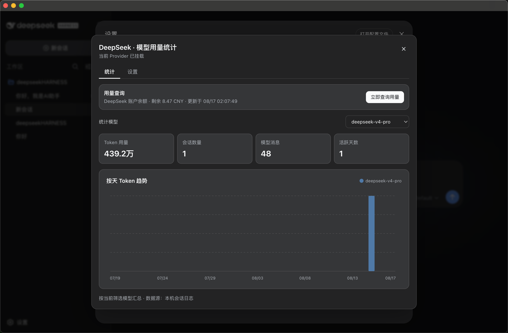
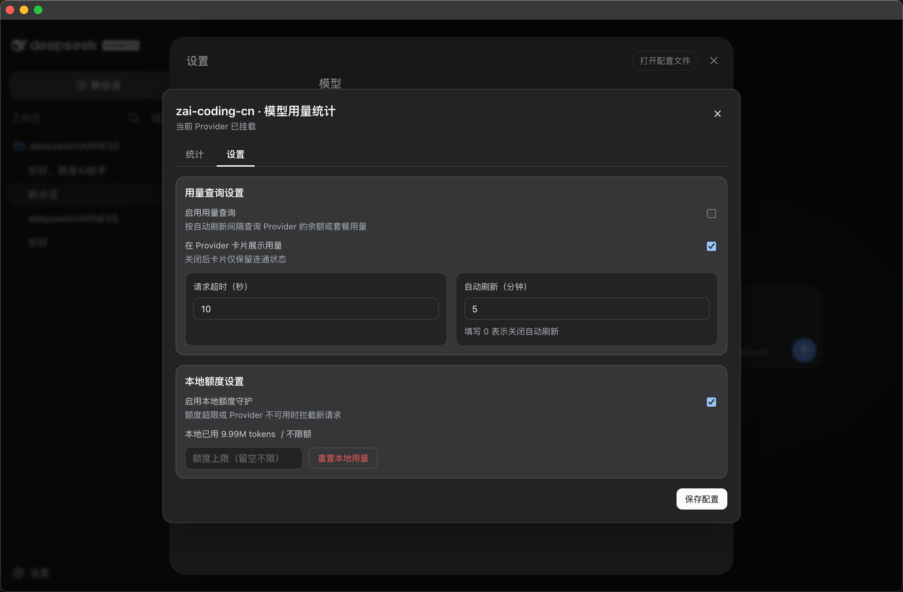

# Provider 健康与模型用量

[English](provider-usage.en.md)

DSH Desktop 组合固定版本的 [`dsh-llm-guardian`](https://github.com/ice-kele/dsh-llm-guardian)，在“设置 → 模型”中补充 Provider 健康检查、API 账户用量、本地单模型统计和额度守护。该插件是普通 DSH Host/Web Client 组合，不读取 Electron 私有接口。

## Provider 卡片

Provider 卡片会显示连通状态、本地累计 Token、支持时的账户余额或套餐余量，以及最近更新时间。套餐接口返回额度窗口时，卡片会分别显示 `5h`、`7d` 等窗口的剩余比例和实时重置倒计时；已用比例达到 70% 和 90% 时依次切换为橙色和红色。心跳按钮会立即测试端点，统计按钮会打开当前 Provider 的详细视图；原有编辑和删除操作保持不变。

## 单模型统计

详细视图的“统计”页支持选择当前 Provider 下的模型，并从本机 DSH 会话日志汇总 Token、会话、模型消息、活跃天数和按天趋势。API 账户查询与本地会话统计相互独立；Provider 不提供余额接口时，本地统计仍可使用。

## 用量与额度设置

“设置”页可分别控制 API 用量查询、Provider 卡片摘要、请求超时、自动刷新周期和本地额度守护。自动刷新填 `0` 表示关闭；额度留空表示不限额。用户可以重置本地计数，达到额度或 Provider 不可用时，守护逻辑会拦截新请求并返回明确原因。

## 数据和网络边界

- API 密钥继续由 DSH credentials 服务解析，不写入插件设置或统计页面。
- 连通测试与账户查询只访问当前 Provider 的端点；自定义查询限制为同源 HTTPS，本机 Provider 可使用回环 HTTP。
- Token、会话、消息和趋势只从本机会话日志计算，不上传会话内容或统计结果。
- 查询成功、失败、配置缺失与超时都会显示状态和更新时间，避免按钮无反馈。

插件固定到经过验证的提交 `cbd5fade93178db82ff6b4b07cd6baaf7fbd509e`，便于安装包复现和依赖审计。
