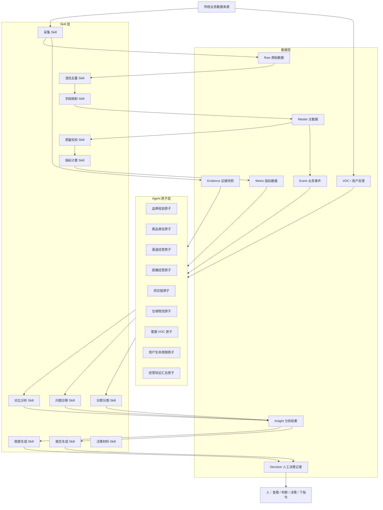

下面把“Agent 原子层”进一步拆成：

```text
Agent 原子
= 数据输入
+ Skill 动作
+ 数据输出
+ 人工责任边界
```

# 一、三层总拓扑



# 二、数据层原子

数据层不做推理，只保存业务事实和加工结果。

## D01 原始数据

```text
来源：平台后台、浏览器页面、Excel、ERP、CRM、WMS、客服系统
字段：source_id、source_type、source_url、captured_at、payload、hash
```

保存：

- 页面原文
- API 原文
- 表格原文
- Excel 文件
- 客服原文
- 评价原文
- 物流轨迹原文
- 直播转写原文

## D02 主数据

```text
Brand
Category
Product
SKU
Channel
Shop
Supplier
Warehouse
Customer
LiveSession
```

主数据必须拥有统一 ID：

```text
brand_id
category_id
product_id
sku_id
channel_id
shop_id
supplier_id
warehouse_id
customer_id
live_session_id
```

## D03 业务事件

```text
商品上架
商品下架
商品改价
采购下单
采购到货
入库
出库
库存变化
订单支付
订单退款
订单发货
物流签收
直播开始
直播结束
客服工单
VOC产生
用户首购
用户复购
用户流失
```

## D04 指标数据

```text
metric_id
entity_type
entity_id
value
unit
period
source_id
calculation_version
evidence_id
```

指标示例：

```text
shop.gmv
shop.paid_orders
shop.conversion_rate
shop.average_order_value
product.gross_margin
inventory.available_days
fulfillment.shipping_delay_rate
customer.repeat_rate
customer.lifecycle_value
```

## D05 VOC 数据

```text
voc_id
customer_id
product_id
order_id
channel_id
source_type
original_text
issue_category
emotion
severity
created_at
verified_status
```

## D06 分析结果

```text
insight_id
domain
problem
conclusion
evidence_ids
metric_ids
confidence
assumptions
data_gaps
created_at
```

## D07 人工决策记录

```text
decision_id
insight_id
decision
decided_by
decision_note
department
created_at
follow_up_task
```

# 三、Skill 层原子

Skill 是固定动作，不是部门，也不是业务 Agent。

## S01 数据采集 Skill

输入：

```text
页面、API、Excel、CSV、ERP/WMS/CRM 数据
```

输出：

```text
Raw 数据 + Evidence
```

包含：

- `browser-page-capture`
- `platform-api-capture`
- `excel-import`
- `crm-import`
- `warehouse-import`
- `live-session-import`

## S02 数据清洗 Skill

输入：

```text
Raw 数据
```

输出：

```text
清洗后的标准数据
```

包含：

- 去重
- 缺失值检查
- 日期格式统一
- 金额格式统一
- 文本清洗
- 编码转换

## S03 字段映射 Skill

输入：

```text
平台字段、企业字段、商品字段、渠道字段
```

输出：

```text
标准字段
```

例如：

```text
平台字段：支付转化率
标准字段：shop.conversion_rate
平台字段：支付金额
标准字段：shop.gmv
平台字段：访客数
标准字段：shop.unique_visitors
```

## S04 数据质量 Skill

输出：

```text
passed
warning
blocked
```

检查：

- 必填字段
- 数据时间范围
- 数据重复
- 数据来源
- 指标单位
- 字段映射完整性
- 业务 ID 完整性

## S05 指标计算 Skill

负责：

```text
GMV
订单量
转化率
客单价
毛利率
退款率
库存周转
复购率
生命周期价值
```

不负责解释原因。

## S06 对比分析 Skill

负责：

- 日同比
- 周同比
- 月同比
- 活动前后对比
- 平台对比
- 商品对比
- 渠道对比
- 用户分群对比

## S07 问题诊断 Skill

负责：

```text
流量诊断
转化诊断
客单价诊断
库存诊断
履约诊断
客服诊断
商品诊断
渠道诊断
```

输出必须带证据。

## S08 分类分群 Skill

负责：

- 商品分层
- 类目分层
- 用户生命周期分层
- VOC 问题分类
- 客服工单分类
- 渠道分组
- 供应商分级

## S09 图表生成 Skill

负责生成：

- 指标卡
- 趋势图
- 漏斗图
- 类目矩阵
- 商品排行榜
- 渠道对比图
- 库存风险表
- VOC 问题分布
- 用户生命周期分布

## S10 报告生成 Skill

负责：

- 日报
- 周报
- 月报
- 活动复盘
- 直播复盘
- 商品分析报告
- 库存报告
- 客服服务报告

## S11 决策材料 Skill

负责将分析结果整理成：

```text
问题
事实
证据
影响
可能原因
可选方案
风险
数据缺口
待人判断事项
```

不负责自动执行。

# 四、Agent 原子映射

## 品牌规划域

| Agent 原子 | 读取数据 | 调用 Skill | 输出数据 |
|---|---|---|---|
| A01 品牌档案 | 品牌主数据、企业资料 | 数据清洗、字段映射 | 品牌标准档案 |
| A02 品牌定位 | 品牌档案、类目、用户、VOC | 分群、VOC分类、对比分析 | 品牌定位结果 |
| A03 品牌价值 | 产品、用户需求、竞品信息 | 商品映射、VOC分类、问题诊断 | 品牌价值主张 |
| A04 品牌一致性 | 品牌规范、商品页面、营销内容 | 字段检查、规则校验 | 一致性问题清单 |

人工出口：

```text
品牌负责人
```

不负责：

```text
直接修改品牌定位、发布内容或调整投放预算
```

## 商品与类目域

| Agent 原子 | 读取数据 | 调用 Skill | 输出数据 |
|---|---|---|---|
| A05 类目结构 | 类目、商品、销售、毛利 | 类目映射、指标计算、类目对比 | 类目结构结果 |
| A06 商品健康 | 商品、SKU、订单、库存、评价 | 商品分层、指标计算、问题诊断 | 商品健康分层 |
| A07 商品生命周期 | 上架时间、销量趋势、复购、库存 | 时间分析、趋势分析、生命周期分类 | 生命周期结果 |
| A08 商品定价 | 成本、售价、毛利、渠道费用 | 毛利计算、价格对比、风险检查 | 定价分析结果 |
| A09 商品组合 | 关联购买、客单价、毛利、库存 | 关联分析、组合计算、库存检查 | 套餐组合建议 |

人工出口：

```text
商品负责人 / 财务负责人
```

不负责：

```text
直接改价、下架、创建套餐
```

## 销售渠道域

| Agent 原子 | 读取数据 | 调用 Skill | 输出数据 |
|---|---|---|---|
| A10 渠道经营 | 渠道销售、订单、成本、利润 | 渠道对比、利润计算 | 渠道经营结果 |
| A11 渠道商品 | 商品、平台商品、平台价格 | 字段映射、价格检查、内容检查 | 渠道适配结果 |
| A12 渠道归因 | 订单来源、广告、活动、用户 | 渠道归一、归因计算、渠道对比 | 渠道贡献结果 |
| A13 渠道扩张 | 渠道表现、用户结构、履约能力 | 渠道评估、风险分析 | 新渠道评估 |

人工出口：

```text
渠道负责人 / 经营负责人
```

## 直播域

| Agent 原子 | 读取数据 | 调用 Skill | 输出数据 |
|---|---|---|---|
| A14 直播场次 | 场次、观看、停留、互动、成交 | 指标计算、趋势分析 | 场次经营结果 |
| A15 直播商品 | 排品、讲解、点击、成交、库存 | 商品关联、转化分析 | 商品讲解效果 |
| A16 直播话术 | 脚本、转写、评论、成交节点 | 文本整理、话术分类、成交关联 | 话术问题清单 |
| A17 直播复盘 | 场次、商品、主播、用户反馈 | 对比分析、问题诊断、报告生成 | 直播复盘报告 |

人工出口：

```text
直播负责人 / 主播 / 商品负责人
```

## 供应链与仓储域

| Agent 原子 | 读取数据 | 调用 Skill | 输出数据 |
|---|---|---|---|
| A18 供应商表现 | 采购、交期、合格率、退货率 | 供应商分级、指标计算、对比分析 | 供应商表现 |
| A19 采购需求 | 销售、库存、活动、交付周期 | 需求计算、库存计算、时间预测 | 采购建议 |
| A20 库存风险 | 可用库存、锁定库存、在途库存、日销 | 库存天数、缺货检查、趋势分析 | 库存风险 |
| A21 活动库存 | 活动计划、库存、预计销量 | 活动模拟、库存检查、风险分析 | 活动履约风险 |
| A22 履约分析 | 订单、拣货、打包、出库、发货 | 状态统计、延迟分析、异常分类 | 履约异常 |
| A23 物流分析 | 物流轨迹、承运商、签收状态 | 轨迹整理、时效计算、异常分类 | 物流异常 |

人工出口：

```text
采购负责人 / 仓储负责人 / 物流负责人
```

不负责：

```text
自动下采购单、直接改库存、直接向用户承诺赔付
```

## 客服、VOC 与用户域

| Agent 原子 | 读取数据 | 调用 Skill | 输出数据 |
|---|---|---|---|
| A24 客服问题 | 客服会话、工单、订单 | 工单分类、问题诊断 | 客服问题 |
| A25 售后原因 | 退款、退货、换货、工单 | 售后分类、商品关联、统计 | 售后原因 |
| A26 VOC 分析 | 评价、客服、直播评论、工单 | VOC分类、情绪分类、频次统计 | VOC问题池 |
| A27 用户生命周期 | 用户、订单、复购、退款、服务 | 用户分群、复购计算、生命周期分类 | 生命周期分层 |
| A28 用户价值 | 订单、毛利、复购、服务成本 | 用户价值计算、用户分群 | 用户价值分层 |

人工出口：

```text
客服主管 / 产品负责人 / 用户运营负责人 / 品牌负责人
```

不负责：

```text
删除评价、自动退款、自动赔付、未经确认触达用户
```

# 五、跨域汇总原子

## A29 经营结论汇总原子

读取：

```text
A01-A28 的分析结果
```

调用：

```text
结果合并 Skill
证据去重 Skill
问题排序 Skill
图表生成 Skill
决策材料 Skill
```

输出：

```json
{
  "insight_id": "ins_001",
  "problem": "销售下降",
  "evidence": [
    "转化率下降",
    "主推商品库存不足",
    "物流延迟增加",
    "复购用户活跃度下降"
  ],
  "affected_domains": [
    "商品",
    "仓储",
    "物流",
    "用户"
  ],
  "options": [
    "补充主推商品库存",
    "调整活动库存",
    "优化发货承诺",
    "制定复购用户召回方案"
  ],
  "status": "ready_for_human_review"
}
```

它不负责：

```text
改价
补货下单
调整广告
修改品牌策略
发送客服消息
修改用户状态
```

# 六、最终连接关系

```text
业务数据
→ 数据层保存事实
→ Skill 层加工数据
→ Agent 原子独立分析
→ 汇总原子形成经营结论
→ 图表 / 仪表盘 / 报告
→ 人查看
→ 人判断
→ 人决策
→ 人下指令
```

最小原子标准可以固定为：

```text
Axx：
读取哪些数据
调用哪些 Skill
生成什么结果
写入哪类数据
交给哪个人
明确不负责什么
```

这样拆完以后：

- 数据层负责事实
- Skill 层负责加工
- Agent 原子负责解释
- 汇总原子负责组合
- 人负责判断和决策

不会再把业务系统、Skill 和 Agent 混成一个不可控的整体。
