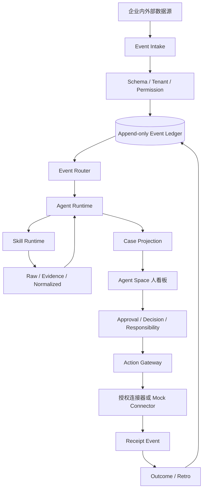

# Commerce Ops 多企业品牌经营 Agent Space

工程 PRD v0.1 · 2026-09-04

## 1. 文档定位

本文是 Commerce Ops 的整体产品与开发工程 PRD，面向产品、架构、前端、后端、数据和运营团队。

当前代码已经具备事件账本、JSONL 持久化、四类 Agent Space 投影、mock 执行回执、审批事件、人工决策事件、责任转派、权限、SLA 和本地通知骨架；尚未达到真实企业生产系统标准。

## 2. 产品定义

Commerce Ops 是面向多个企业、多个品牌和多个组织的事件驱动经营协同系统。

它接收来自电商、内容、供应链、客服和企业内部系统的经营事件，由 Agent 通过 Skill 进行证据收集和分析，再把需要处理的事项组织为 Case，分派给 Agent 和人，经过确认、审批、执行、回执和复盘形成责任链。

```text
Event       发生了什么
Evidence    依据是什么
Case        这件事是否需要协同处理
Task        具体要做什么
Agent       谁来分析和推动下一步
Approval    谁允许采取高风险动作
Responsibility 谁对事项负责
Action      系统实际执行了什么
Receipt     外部系统返回了什么
Outcome     结果如何
```

## 3. 背景与问题

- 竞品价格、内容、产品和评论数据分散在不同渠道。
- 采集结果和经营结论缺少证据链。
- 市场、商品、内容、投放和品牌负责人依靠人工转发协作。
- Agent 能输出报告，但通常不能进入责任、审批和结果闭环。
- 不同企业的品牌数据、权限和经营策略容易混淆。
- 任务完成与业务结果之间缺少可回放、可审计的过程记录。

本产品不把“更多 Agent”作为目标，而是把企业经营事件变成跨 Agent、跨部门、跨企业的协同基础设施。

## 4. 产品目标

### P0：验证经营协同闭环

```text
竞品降价事件
→ 事件校验和路由
→ 竞品 / 产品 / 策略 Agent 协同
→ 创建 Case
→ 同步责任人看板
→ 人工审批
→ mock 执行
→ 回执事件
→ Outcome 事件
→ Case 关闭与复盘
```

### P1：验证多企业运行底座

- 支持多个企业、品牌和 Agent Space。
- 支持事件账本恢复、租户过滤和事件回放。
- 支持审批、人工决策、责任转派全部事件化。
- 支持租户角色权限、SLA 超时和通知升级。
- 支持事件、责任、审批、回执四类人类看板。
- 支持公开或授权数据的证据质量标记。

### P2：生产化

- 接入真实身份与组织系统。
- 接入经过授权的电商、内容、ERP、CRM、WMS 连接器。
- 提供真实通知通道和定时调度。
- 支持失败重试、补偿、双人审批和策略版本化。

## 5. 非目标与安全边界

当前版本明确不做：

- 未授权平台抓取、绕过登录或绕过反爬机制。
- 自动改价、自动上下架、自动投放和自动发布。
- 根据点赞、评论或少量样本推断真实 GMV、利润、ROI 或销量。
- 让 Agent 代替品牌负责人做最终经营决策。
- 让一个企业读取另一个企业的私有数据。
- 以 mock 数据、回放数据冒充真实线上结果。

连接器必须声明能力状态：`REGISTERED`、`ACTIVE`、`PARTIAL`、`NOT_AVAILABLE`。登记不等于真实调用可用。

## 6. 用户角色与责任

| 角色 | 主要职责 |
|---|---|
| 平台管理员 | 租户、成员、连接器和全局策略 |
| 企业负责人 | 全局经营判断、确认、审批和接管责任 |
| 品牌负责人 | 品牌策略、产品测试和内容动作审批 |
| 商品负责人 | 商品、价格、SKU、库存影响评估 |
| 内容负责人 | 社交内容、评论信号和内容测试 |
| 运营协调人 | Case 分派、转派、SLA 和升级 |
| Agent Operator | Agent、Skill、Policy 版本和评测 |
| 审计人员 | 证据、事件、审批、回执和权限审计 |

责任规则：

- 每个 Case 必须有一个当前 Owner，或显式处于未分配状态。
- 每个高风险 Action 必须有关联 Approval。
- Agent 可以提出建议，但不能代替人做最终经营决策。
- 责任转派必须同时校验转出人与接收人的租户权限。
- 确认、驳回、接管和转派必须写入事件账本。

## 7. 总体架构



架构原则：

1. Event 是事实源，投影可以重建。
2. Skill 是单一动作，不负责业务决策。
3. Agent 通过事件订阅和 Skill 合同协同。
4. Policy、Permission、Approval 是确定性控制层。
5. 人类责任是业务对象，不能只存在于 UI 文案。
6. 外部动作必须带幂等键、审批引用和执行回执。

## 8. 核心业务对象

```text
Tenant / Enterprise / Brand / Workspace
Event / Evidence / Case / Task
Agent / Skill / Policy
Approval / Decision / Responsibility
Action / Receipt / Outcome
Notification / SLA
```

### Event 合同

```yaml
event_id: evt_001
event_type: competitor.price.changed
tenant_id: tenant_a
enterprise_id: enterprise_a
brand_id: brand_a
subject: { type: product, id: competitor_product_001 }
payload: {}
source: { type: connector, ref: source_001 }
evidence_refs: [evidence_001]
confidence: 0.86
occurred_at: 2026-09-04T10:00:00+08:00
observed_at: 2026-09-04T10:01:00+08:00
correlation_id: case_001
causation_id: null
schema_version: event.v1
```

事件类型：

```text
signal.*              外部或内部信号
case.*                Case 生命周期
approval.*            审批请求与结果
human.decision.*      人工判断
responsibility.*      责任分派与转移
action.*              动作开始、成功、失败
notification.*        通知请求与状态
sla.*                 SLA 开始、提醒、升级
outcome.*             结果与复盘
```

## 9. Skill 原子

Skill 定义必须包含：`skill_id`、版本、输入、输出、权限、风险级别、Owner Agent、失败状态、验收条件和幂等键。

```text
事件类：receive / validate / normalize / deduplicate / classify
证据类：collect / save_raw / extract / score / detect_gap
分析类：compare / calculate / diagnose / cluster / hypothesize
协同类：create_case / assign_owner / create_task / request_approval
执行类：prepare_action / execute_approved / verify_receipt / compensate
复盘类：record_outcome / evaluate / retro / update_pattern
治理类：check_permission / start_sla / escalate / notify
```

Skill 验收：相同输入和幂等键不重复产生动作；不可用连接器显式返回能力状态；没有证据的判断必须带数据缺口；高风险 Skill 只能生成提案。

## 10. Agent 原子

```text
Agent = subscriptions
      + allowed_skills
      + policy_scope
      + memory_scope
      + output_contract
      + human_owner_role
      + not_responsible_for
```

P0 Agent：

| Agent | 订阅/职责 | 人类责任 |
|---|---|---|
| Event Coordinator | 事件校验、路由、Case 创建 | 运营协调人 |
| Competitor Intelligence | 竞品关系和外部信号 | 市场研究负责人 |
| Product Intelligence | 商品、价格和 SKU 影响 | 商品负责人 |
| Brand Strategy | 假设和响应方案 | 品牌负责人 |
| Coordination | 分派、转派、SLA、审批 | 项目负责人 |
| Action Executor | 已批准动作和回执 | 执行负责人 |
| Receipt Verifier | 回执校验和状态推进 | 运营协调人 |
| Retro | 结果记录和复盘 | 经营分析负责人 |

## 11. 状态与协同

Event：

```text
RECEIVED → VALIDATED → CORRELATED → PROCESSED → ARCHIVED
```

Case：

```text
OPEN → INVESTIGATING → PROPOSED → WAITING_HUMAN
→ APPROVED → EXECUTING → VERIFYING → CLOSED
```

异常路径：

```text
任何状态 → BLOCKED
EXECUTING → FAILED → COMPENSATING
WAITING_HUMAN → CHANGES_REQUESTED / REJECTED
```

Responsibility：

```text
UNASSIGNED → CLAIMED → IN_PROGRESS → WAITING_INPUT
→ ESCALATED → ACCEPTED → RELEASED
```

## 12. Agent Space 人看板

### 事件视图

显示事件类型、品牌、来源、时间、证据强度、影响范围和关联 Case。

### 责任视图

显示 Case、当前 Owner、责任状态、SLA、阻塞原因、转派记录和下一动作。

### 审批视图

显示动作提案、风险等级、证据、申请人、审批人、审批状态和审批时间。

### 回执视图

显示 Action、Connector、执行模式、外部写入标志、Receipt、失败原因和 Outcome。

看板必须能回答：

```text
发生了什么？谁在负责？谁批准了？实际做了什么？结果是什么？
```

## 13. 权限、SLA 与通知

权限粒度：

```text
tenant.read / brand.read / evidence.read
case.assign / case.takeover / transfer_responsibility
accept_responsibility / approve_action / execute_action
manage_connector / manage_agent / manage_policy / audit.read
```

默认拒绝。权限检查必须发生在 Host、Agent Runtime 和 Action Gateway，不能只依赖前端按钮隐藏。

SLA 记录：`case_id`、`owner_id`、`started_at`、`due_at`、`status`、`policy_version`、`escalation_level`。

通知流程：

```text
SLA 到期 → notification.requested → 通知连接器 → delivered / failed
```

当前本地版本只有角色内存表、手动 SLA evaluate 和 queued 通知；生产版需要真实身份、常驻调度器、通知渠道和升级链。

## 14. 数据采集与证据

```text
Skill       定义采集流程、边界和状态机
Connector   负责访问、缓存、分页、原始响应和请求账本
Agent       根据能力状态决定下一步，不猜测不可用数据
```

必须保存原始 payload、来源、授权范围、采集时间、请求 ID、分页游标、标准化记录、映射版本、证据质量和数据缺口。

数据状态：

```text
ACTIVE / PARTIAL / FETCH_INCOMPLETE / SMALL_SAMPLE_WARNING
REGISTERED_RUNTIME_FAILED / NOT_AVAILABLE
```

没有可信来源时，GMV、订单、利润、ROI、复购和销量必须标记为 `NOT_AVAILABLE`。

## 15. API 规划

```text
GET  /api/commerce-ops/agent-space
GET  /api/commerce-ops/agent-space/board?actorId=
POST /api/commerce-ops/agent-space/demo
POST /api/commerce-ops/agent-space/responsibilities/:caseId/claim
POST /api/commerce-ops/agent-space/responsibilities/:caseId/accept
POST /api/commerce-ops/agent-space/responsibilities/:caseId/release
POST /api/commerce-ops/agent-space/responsibilities/:caseId/transfer
GET  /api/commerce-ops/approvals
POST /api/commerce-ops/approvals/:id/approve
POST /api/commerce-ops/approvals/:id/reject
POST /api/commerce-ops/decisions
POST /api/commerce-ops/responsibilities/transfer
POST /api/commerce-ops/sla/start
POST /api/commerce-ops/sla/evaluate
GET  /api/commerce-ops/notifications
```

所有写接口要求同源校验、租户上下文、权限检查、幂等键、结构校验和审计事件。

## 16. 当前代码映射

```text
src/event-core/contracts.ts      Event / Case / Responsibility 契约
src/event-core/ledger.ts         事件账本、订阅和幂等
src/event-core/persistence.ts    JSONL 持久化和恢复（含租户分区、schema 版本校验）
src/event-core/router.ts         Event → Agent 路由
src/event-core/cases.ts          Case 投影
src/event-core/space.ts          四类看板投影 + 五人看板视图（getHumanBoard）
src/event-core/simulation.ts     竞品降价演示链路
src/skills/registry.ts           Skill 原子注册
src/agents/registry.ts           Agent 原子注册
src/approvals/service.ts         审批事件与回放
src/decision/service.ts          人工决策事件
src/governance/service.ts        权限、责任（claim/accept/release/transfer）、SLA、通知
src/actions/mock-executor.ts     mock 执行和回执
src/client/AgentSpace.tsx        可交互人看板（五入口 + 审批/接管/转派写回）
src/client/main.tsx + vite.config.ts  浏览器客户端打包（/commerce-ops-workbench/）
src/host/routes.ts               静态 workbench 页 + Host API
```

## 17. 分阶段研发计划

### Phase 0：事件核心骨架（已完成）

Event Schema、EventLedger、Event Router、Skill Registry、Agent Registry、Case 状态和竞品降价模拟。

### Phase 1：治理闭环（已完成骨架）

JSONL 持久化、审批/决策/转派事件、mock Executor、Receipt/Outcome、本地权限、SLA、通知队列和四类看板。

### Phase 2：状态与存储生产化

SQLite 或 PostgreSQL 事件账本、事务追加、read model、版本迁移、重放、并发版本号、幂等键和唯一约束。

### Phase 3：真实身份与协同通道

OIDC、组织和角色同步、飞书/企业微信/邮件/站内通知、SLA 常驻调度和多人责任接管。

### Phase 4：授权连接器与领域扩展

电商、内容、ERP、CRM、WMS、客服 VOC 连接器，以及竞品、商品、内容、库存和客服 Agent。

### Phase 5：受控外部执行

Action Gateway、风险分级、双人审批、执行前后快照、Receipt 校验、重试、补偿、灰度和紧急停止。

## 18. 测试计划

单元测试：事件契约、账本幂等、JSONL 恢复、Skill/Agent 注册、权限、审批、SLA、通知和连接器能力。

集成测试：

```text
事件接入 → 路由 → Agent → Case → 人工审批
→ mock 执行 → Receipt → Outcome → 投影恢复
```

安全测试：跨租户读取拒绝、跨品牌不可见、非授权用户不能审批/执行、非 mock 目标拒绝、敏感凭证不进入事件和日志。

## 19. 非功能需求

### 一致性

- Event ID 全局唯一。
- correlation ID 能追踪完整 Case。
- 审批、执行、回执和结果可重放。
- 投影失败后可从事件账本重建。

### 可观测性

每次 Agent/Skill 运行记录 `run_id`、租户、Agent、Skill、Event、输入输出 hash、耗时、状态、失败码和证据引用。

### 可恢复性

连接器失败不能丢失事件；Action 失败必须产生失败 Receipt 或补偿事件；服务重启后可恢复事件、审批和看板投影。

### P0 性能目标

单事件路由 P95 < 500ms，不含 LLM 和外部平台调用；单租户 10,000 条事件读取 P95 < 1s；看板首次加载 P95 < 1s。生产指标需在真实规模确定后压测。

## 20. ADR 与发布标准

### ADR-001：事件账本作为事实源

采用 append-only Event Ledger + read model，以支持协同、审计、幂等、重放和租户隔离。

### ADR-002：Agent 不拥有最终经营决策

Agent 输出结构化建议；Policy 和 Human Gate 决定高风险动作是否可执行。

### ADR-003：先模块化单体，再拆服务

当前保持一个 Commerce Ops 包，待吞吐、租户规模和连接器边界明确后，再拆事件、连接器和通知服务。

发布前必须满足：

- 事件合同版本化，每个业务对象有 Owner。
- 外部动作具备权限、审批和 Receipt。
- 数据缺口和连接器状态可见。
- 租户隔离、失败恢复和重试路径有测试。
- Agent Space 与后端投影一致。
- 类型检查、单元测试、集成测试和构建全部通过。
- 文档明确区分 mock、partial、active 和 production-ready。

## 21. 当前验收证据与下一步

当前包已验证：TypeScript 通过；25 个测试文件、38 个测试用例通过；事件 JSONL 恢复（含租户分区、schema 版本校验、demo 幂等）、四类投影恢复、审批事件恢复、责任 claim/accept/release/transfer 写回、五人看板视图、SLA 超时通知和 mock 外部写入门禁均通过。浏览器客户端已打包并通过 workbench 路由验收。

下一步优先级：

1. 将权限成员表持久化为租户成员和角色投影。
2. 将 SLA 接入常驻调度器，增加提醒、升级和超时事件。
3. 增加审批事件与当前状态的一致性校验。
4. 将人工决策和责任转派接入真实身份，丰富 Case 详情面板（当前已具备写回与四类投影）。
5. 增加失败 Receipt、重试上限和补偿事件。
6. 选择一个经过授权的真实只读连接器建立首个能力验证数据集。
7. 在真实连接器验证前，不开放真实外部写操作。
