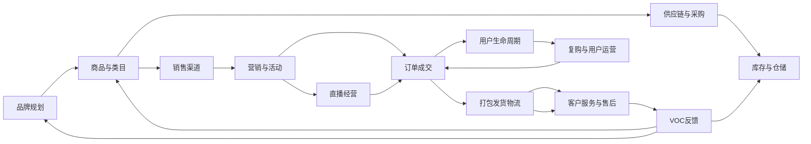

# 传统电商品牌经营底座与业务协同建设蓝图

> 文档状态：评审稿 v0.1  
> 编写日期：2026-09-04  
> 适用范围：品牌规划、商品类目、销售渠道、直播、供应链、仓储物流、客服 VOC、用户生命周期  
> 重要边界：本文先定义业务底座、数据、Skill、Agent、权限和人工决策，不把当前代码骨架描述成生产系统。

---

## 一、建设目标

建立一套传统电商品牌业务底座，把各部门的业务对象、数据字段、业务状态、协同交接和人工责任统一起来。

系统的基本运行关系是：

```text
业务系统产生事实
→ 数据层保存和标准化
→ Skill 层执行固定加工动作
→ Agent 原子分析一个业务问题
→ 协同中心合并跨部门结论
→ 仪表盘 / 图表 / 报告
→ 人查看、判断、决策、下指令
→ 部门执行并回写结果
```

不允许出现以下替代关系：

```text
Agent 结论 = 人的决策
Agent 建议 = 生产执行
Skill = 部门职责
平台字段 = 企业标准字段
```

---

## 二、传统业务主链路



这张图是传统企业业务流程，和 Agent 拓扑分开维护。

---

## 三、系统总体分层

### 3.1 数据层

数据层只负责保存业务事实、业务对象、业务事件、指标、证据和人工决策。

```text
Raw 原始数据
Master 主数据
Event 业务事件
Metric 指标数据
Feedback VOC和用户反馈
Evidence 证据快照
Insight 分析结果
Decision 人工决策记录
```

数据层不负责：

- 推理原因
- 生成经营判断
- 决定部门动作
- 自动执行平台写操作

### 3.2 Skill 层

Skill 是一个固定、可测试、可重复的业务动作。

```text
采集
清洗
去重
字段映射
质量校验
指标计算
时间对比
问题诊断
分类分群
图表生成
报告生成
决策材料整理
```

Skill 不拥有最终业务决策权，也不直接修改业务主数据。

### 3.3 Agent 原子层

Agent 原子只解决一个业务问题。

```text
一个业务问题
+ 固定输入数据
+ 一组 Skill 动作
+ 一个结构化输出
+ 一个接收部门
+ 一个人工责任人
+ 明确的禁止动作
```

### 3.4 协同层

协同层负责把多个 Agent 原子的结果组织为跨部门交接。

```text
Agent 原子结果
→ 统一问题
→ 统一证据
→ 统一影响范围
→ 统一接收部门
→ 统一人工责任人
→ 形成部门任务草稿
```

### 3.5 人工决策层

最终结果交给人：

```text
查看
→ 判断
→ 采纳 / 修改 / 驳回
→ 下达指令
→ 部门执行
→ 结果回写
```

---

## 四、数据层对象与字段

### 4.1 主数据对象

```text
Brand
Category
Product
SKU
Channel
Shop
Supplier
Warehouse
Customer
LiveSession
Employee
LogisticsProvider
```

所有业务对象必须使用企业内部统一 ID：

```text
brand_id
category_id
product_id
sku_id
channel_id
shop_id
supplier_id
warehouse_id
customer_id
live_session_id
```

### 4.2 交易与履约对象

```text
PurchaseOrder
InboundOrder
OutboundOrder
Order
OrderItem
Refund
AfterSaleTicket
Shipment
Package
Campaign
AdSpend
CustomerServiceTicket
VOCRecord
LifecycleRecord
```

### 4.3 指标对象

```json
{
  "metric_id": "shop.conversion_rate",
  "entity_type": "shop",
  "entity_id": "shop_001",
  "value": 0.047,
  "unit": "ratio",
  "period": {
    "from": "2026-09-01",
    "to": "2026-09-01"
  },
  "source_id": "source_001",
  "evidence_id": "evidence_001",
  "calculation_version": "1.0.0"
}
```

### 4.4 分析结果对象

```json
{
  "insight_id": "insight_001",
  "domain": "fulfillment",
  "problem": "部分地区发货延迟",
  "conclusion": "华东地区平均发货时间超过目标",
  "evidence_ids": ["evidence_001", "evidence_002"],
  "metric_ids": ["fulfillment.shipping_delay_rate"],
  "confidence": 0.82,
  "assumptions": [],
  "data_gaps": [],
  "status": "ready_for_human_review"
}
```

---

## 五、Skill 层目录

### S01 采集 Skill

```text
browser-page-capture
platform-api-capture
excel-import
csv-import
erp-import
wms-import
crm-import
live-session-import
```

输出：`Raw + Evidence`

### S02 清洗与标准化 Skill

```text
data-clean
data-deduplicate
date-normalize
amount-normalize
text-normalize
product-id-match
sku-id-match
customer-id-match
channel-map
category-map
```

输出：`Master 候选数据`

### S03 数据质量 Skill

```text
required-field-check
source-check
period-check
duplicate-check
unit-check
mapping-gap-check
business-id-check
```

输出状态：

```text
passed
warning
blocked
```

### S04 指标 Skill

```text
gmv-calculate
order-count-calculate
conversion-rate-calculate
aov-calculate
gross-margin-calculate
refund-rate-calculate
inventory-days-calculate
shipping-delay-rate-calculate
repeat-rate-calculate
lifecycle-value-calculate
```

### S05 分析 Skill

```text
period-compare
funnel-breakdown
category-compare
product-ranking
channel-compare
campaign-review
live-session-review
inventory-risk-check
fulfillment-delay-check
voc-cluster
lifecycle-segment
```

### S06 输出 Skill

```text
dashboard-card
trend-chart
funnel-chart
category-matrix
product-ranking-table
channel-comparison
inventory-risk-board
voc-topic-board
lifecycle-cohort
daily-report
weekly-report
decision-material-compose
```

---

## 六、Agent 原子层

### 6.1 品牌规划原子

| 原子 | 业务问题 | 读取数据 | Skill | 输出 | 人工责任 |
|---|---|---|---|---|---|
| A-BRAND-01 | 品牌当前定位是什么 | 品牌、类目、用户、VOC | 品牌档案、用户分群 | 品牌定位档案 | 品牌负责人 |
| A-BRAND-02 | 品牌服务谁 | 用户、订单、评价、VOC | 场景分类、VOC分类 | 人群与场景模型 | 品牌负责人 |
| A-BRAND-03 | 品牌差异是什么 | 产品、竞品、价格 | 对比分析、卖点整理 | 差异化价值主张 | 品牌负责人 |
| A-BRAND-04 | 内容是否符合品牌规范 | 品牌规范、商品页、活动页 | 一致性检查 | 问题清单 | 品牌/内容负责人 |

禁止动作：修改品牌战略、自动发布品牌内容。

### 6.2 商品类目原子

| 原子 | 业务问题 | 读取数据 | Skill | 输出 | 人工责任 |
|---|---|---|---|---|---|
| A-PRODUCT-01 | 哪些类目值得发展 | 类目销售、毛利、增长 | 类目对比、趋势计算 | 类目机会清单 | 商品负责人 |
| A-PRODUCT-02 | 哪些商品正在变差 | 商品、SKU、订单、评价 | 健康评分、商品排名 | 商品分层 | 商品负责人 |
| A-PRODUCT-03 | 商品处于哪个生命周期 | 上架时间、销量、库存 | 生命周期分类 | 生命周期结果 | 商品负责人 |
| A-PRODUCT-04 | 价格是否合理 | 成本、售价、毛利 | 毛利计算、价格对比 | 定价建议 | 商品/财务负责人 |
| A-PRODUCT-05 | 哪些商品适合组合 | 关联购买、客单价、库存 | 关联分析、组合计算 | 套餐建议 | 商品/运营负责人 |

禁止动作：直接改价、下架、创建促销。

### 6.3 渠道与直播原子

| 原子 | 业务问题 | 读取数据 | Skill | 输出 | 人工责任 |
|---|---|---|---|---|---|
| A-CHANNEL-01 | 哪个渠道贡献最大 | 渠道订单、GMV、利润 | 渠道对比、利润计算 | 渠道经营结果 | 渠道负责人 |
| A-CHANNEL-02 | 哪个渠道更赚钱 | 平台费用、履约成本、毛利 | 成本归集、利润分析 | 渠道利润表 | 财务/渠道负责人 |
| A-CHANNEL-03 | 渠道商品是否一致 | 商品、SKU、价格、库存 | 字段映射、一致性检查 | 渠道差异清单 | 渠道运营 |
| A-LIVE-01 | 直播场次表现如何 | 场次、观看、停留、成交 | 指标计算、场次复盘 | 场次结果 | 直播负责人 |
| A-LIVE-02 | 哪些商品讲解有效 | 排品、讲解、点击、成交 | 商品关联、转化分析 | 讲解效果 | 直播/商品负责人 |
| A-LIVE-03 | 哪些话术带来成交 | 脚本、转写、评论 | 话术分类、成交关联 | 话术问题清单 | 主播/直播负责人 |

禁止动作：自动开播、自动发布内容、自动调整广告预算。

### 6.4 供应链、仓储物流原子

| 原子 | 业务问题 | 读取数据 | Skill | 输出 | 人工责任 |
|---|---|---|---|---|---|
| A-SUPPLY-01 | 供应商是否稳定 | 采购、交期、质检 | 供应商分级、对比 | 供应商表现 | 采购负责人 |
| A-SUPPLY-02 | 需要采购什么 | 销售、库存、活动、交期 | 需求计算、库存计算 | 采购建议 | 采购负责人 |
| A-WAREHOUSE-01 | 哪些商品要缺货 | 可用、锁定、在途库存 | 库存天数、缺货预测 | 缺货预警 | 商品/仓储负责人 |
| A-WAREHOUSE-02 | 活动库存是否足够 | 活动计划、库存、预计销量 | 活动模拟、风险检查 | 活动库存风险 | 运营/仓储负责人 |
| A-FULFILLMENT-01 | 为什么发货变慢 | 订单、拣货、打包、出库 | 状态统计、延迟分析 | 履约异常 | 仓储负责人 |
| A-FULFILLMENT-02 | 哪些物流异常 | 物流轨迹、承运商、签收 | 轨迹分析、异常分类 | 物流异常 | 物流/客服负责人 |

禁止动作：自动采购、自动改库存、自动赔付。

### 6.5 客服、VOC 与生命周期原子

| 原子 | 业务问题 | 读取数据 | Skill | 输出 | 人工责任 |
|---|---|---|---|---|---|
| A-CS-01 | 客服主要处理什么问题 | 会话、工单、订单 | 工单分类、频次统计 | 客服问题分布 | 客服主管 |
| A-CS-02 | 售后为何发生 | 退款、退货、换货 | 售后分类、商品关联 | 售后原因 | 客服/商品负责人 |
| A-VOC-01 | 用户最不满意什么 | 评价、客服、直播评论 | VOC分类、情绪分类 | VOC问题池 | 品牌/商品/客服 |
| A-VOC-02 | 用户有什么新需求 | 评价、咨询、调研 | 需求归纳、场景分类 | 新需求清单 | 品牌/商品负责人 |
| A-LIFECYCLE-01 | 用户处于什么阶段 | 用户、订单、复购、退款 | 用户分群、生命周期分类 | 生命周期分层 | 用户运营负责人 |
| A-LIFECYCLE-02 | 哪些用户可能流失 | 最近购买、频次、服务 | 流失判断、价值计算 | 流失风险 | 用户运营负责人 |
| A-LIFECYCLE-03 | 哪些用户值得重点经营 | 订单、毛利、复购、成本 | 用户价值计算 | 用户价值分层 | 用户运营/财务 |

禁止动作：自动退款、自动赔付、删除评价、未经确认触达用户。

---

## 七、跨部门协同合同

Agent 原子之间不直接互相修改数据，通过协同合同交接：

```json
{
  "handoff_id": "handoff_001",
  "from_domain": "fulfillment",
  "to_domain": "customer_service",
  "business_object": "shipping_delay",
  "trigger": "发货及时率低于目标",
  "evidence_ids": ["evidence_001", "evidence_002"],
  "finding": "华东部分订单平均延迟36小时",
  "suggested_options": [
    "调整发货承诺",
    "切换承运商",
    "增加仓库波次"
  ],
  "human_owner": "logistics_manager",
  "status": "waiting_for_human_decision"
}
```

协同合同必须包含：

- 发起部门
- 接收部门
- 业务对象
- 触发条件
- 指标和证据
- 问题结论
- 建议选项
- 人工责任人
- 截止时间
- 结果回写事件

---

## 八、后端运行与状态机

### 8.1 运行链路

```text
请求 / 定时任务
→ 创建 Run
→ 读取数据源
→ 写 Raw 和 Evidence
→ 执行清洗与映射
→ 数据质量检查
→ 计算 Metric
→ 并行调用 Agent 原子
→ 形成 Insight
→ 生成 Dashboard / Report
→ 等待人工查看
→ 记录 Decision
→ 生成部门任务
→ 回写 Event
```

### 8.2 Run 状态

```text
created
→ collecting
→ quality_checking
→ analyzing
→ rendering
→ ready_for_human_review
→ decision_recorded
→ task_created
→ completed
```

阻断状态：

```text
unauthorized
data_incomplete
mapping_failed
quality_blocked
analysis_failed
human_required
```

### 8.3 失败原则

- 数据来源不可用：停止并显示数据缺口
- 字段未映射：进入人工映射队列
- 指标口径冲突：阻断分析
- Agent 超时：保留已完成结果，标记部分完成
- 证据缺失：不得生成确定性结论
- 人工未决策：不得生成生产执行动作

---

## 九、权限模型

### 9.1 角色

```text
经营负责人
品牌负责人
商品负责人
渠道负责人
直播负责人
采购负责人
仓储负责人
物流负责人
客服主管
用户运营负责人
财务负责人
系统管理员
```

### 9.2 权限矩阵

| 动作 | Agent | 普通员工 | 部门负责人 | 经营负责人 |
|---|---:|---:|---:|---:|
| 读取业务数据 | 允许 | 允许 | 允许 | 允许 |
| 整理和计算指标 | 允许 | 允许 | 允许 | 允许 |
| 生成分析报告 | 允许 | 允许 | 允许 | 允许 |
| 生成建议 | 允许 | 允许 | 允许 | 允许 |
| 创建内部任务草稿 | 允许 | 允许 | 允许 | 允许 |
| 确认品牌规划 | 禁止 | 禁止 | 允许 | 允许 |
| 确认商品策略 | 禁止 | 禁止 | 允许 | 允许 |
| 确认采购建议 | 禁止 | 禁止 | 允许 | 允许 |
| 确认活动方案 | 禁止 | 禁止 | 允许 | 允许 |
| 修改价格 | 禁止 | 禁止 | 审批后执行 | 审批后执行 |
| 修改库存 | 禁止 | 禁止 | 审批后执行 | 审批后执行 |
| 发起退款/赔付 | 禁止 | 禁止 | 依制度人工处理 | 依制度人工处理 |
| 记录最终经营决策 | 禁止 | 可提交 | 可提交 | 允许 |

### 9.3 权限原则

```text
Agent 权限 < Skill 权限 < 部门人员权限 < 部门负责人权限 < 经营负责人权限
```

但 Skill 也不能绕过人工审批直接获得生产写权限。

---

## 十、前端按钮与后端动作

### 10.1 数据采集页

| 前端按钮 | 后端动作 | 状态 | 是否写外部系统 |
|---|---|---|---:|
| 接管当前浏览器页面 | 创建 BrowserSession | ready | 否 |
| 开始采集 | 创建 AcquisitionRun | collecting | 否 |
| 暂停采集 | 更新 Run 状态 | paused | 否 |
| 停止采集 | 取消 Run | cancelled | 否 |
| 查看页面证据 | 查询 Evidence | visible | 否 |
| 查看字段映射 | 查询 MappingResult | mapped/blocked | 否 |
| 重新采集 | 创建新 Run | created | 否 |
| 发送到分析 | 发布 AcquisitionBundle | queued | 否 |
| 保存为回放样例 | 保存脱敏 Fixture | replayable | 否 |

### 10.2 数据分析页

| 前端按钮 | 后端动作 | 结果 |
|---|---|---|
| 生成分析 | 创建 AnalysisRun | Insight |
| 刷新数据 | 触发只读采集 | Raw/Metric |
| 查看原始证据 | 查询 Evidence | 原始来源 |
| 展开分析过程 | 查询 Skill/Trace | 过程记录 |
| 查看图表 | 查询 DashboardModel | 图表数据 |
| 保存报告 | 保存 Report | 报告版本 |
| 转为经营任务 | 创建 Handoff | 部门任务草稿 |
| 要求补充数据 | 创建 DataGap | 待补充状态 |

### 10.3 人工决策页

| 前端按钮 | 后端动作 | 结果 |
|---|---|---|
| 采纳建议 | 创建 Decision | accepted |
| 修改建议 | 保存人工修订 | modified |
| 驳回建议 | 创建 Decision | rejected |
| 创建部门任务 | 创建 FollowUpTask | task_created |
| 要求补充数据 | 更新 Insight | data_required |
| 加入下次复盘 | 创建 ReviewItem | scheduled |
| 记录决策 | 写 DecisionRecord | recorded |

### 10.4 Agent Studio

| 前端按钮 | 后端动作 | 约束 |
|---|---|---|
| 保存草稿 | 保存 Skill/Agent Draft | 不发布 |
| 校验流程 | Schema + 权限校验 | 失败不可发布 |
| Dry Run | 使用 Fixture 执行 | 不写外部系统 |
| 查看 Trace | 查询运行记录 | 只读 |
| 提交审核 | 创建 ReviewRequest | 等待负责人 |
| 发布版本 | 激活版本 | 必须通过审核 |
| 停用 | 禁用版本 | 影响后续运行 |
| 回滚版本 | 恢复上一个版本 | 保留审计记录 |

---

## 十一、代码模块对应关系

```text
dsh-plugin-commerce-ops/
├── src/
│   ├── contracts/              # 数据、Skill、Agent、协同、决策合同
│   ├── data/                   # Raw/Master/Event/Metric/Evidence
│   ├── skills/                 # 固定业务动作和 Skill Registry
│   ├── agents/                 # A01-A29 Agent 原子
│   ├── collaboration/          # Handoff、并行发布、部门协同
│   ├── policies/               # 风险、权限、人工审核
│   ├── approvals/              # 审批状态和审批记录
│   ├── execution/              # 后续受控执行网关
│   ├── analysis/               # Insight、Dashboard、Chart
│   ├── decision/               # Decision、FollowUpTask
│   ├── connectors/             # API、浏览器、文件和系统数据源
│   ├── host/                   # DSH Host service、路由、运行生命周期
│   └── client/                 # 工作台、分析、协同、决策、Studio
└── tests/
    ├── contracts/
    ├── skills/
    ├── agents/
    ├── collaboration/
    ├── permissions/
    ├── routes/
    └── e2e/
```

当前仓库中 `deepseek-harness/` 仍然是不可修改的上游子模块；业务代码放在桌面自有插件和独立 workspace 中。

---

## 十二、建设顺序

### Phase 0：业务合同

- 固定主数据和统一 ID
- 固定 Raw/Master/Event/Metric/Evidence
- 固定指标口径
- 固定 Handoff 和 Decision

### Phase 1：数据底座

- Raw 数据保存
- Master 标准化
- 字段映射
- 数据质量三态
- Evidence 快照

### Phase 2：Skill Registry

- Skill 元数据
- 输入输出 Schema
- Skill 版本
- Skill 运行状态
- Skill Trace

### Phase 3：Agent 原子

- 先实现商品健康、渠道经营、库存风险、VOC分析四个原子
- 每个原子绑定固定输入、Skill、输出和人工责任人
- 再扩展品牌、直播、供应链和用户生命周期

### Phase 4：跨部门协同

- ParallelBus
- Handoff 合同
- 多 Agent 结果汇总
- 部门任务草稿
- 结果回写 Event

### Phase 5：可视化和人工决策

- 仪表盘
- 趋势图
- 异常卡片
- 证据抽屉
- 人工决策中心
- FollowUpTask

### Phase 6：受控执行

第一阶段只做：

- 内部任务创建
- 报告导出
- 回放
- Dry Run

后续在真实授权、权限、回滚和人工审批完成后，再评估平台写操作。

---

## 十三、验收标准

### 数据底座验收

- 每个指标可追溯到 Source 和 Evidence
- 未映射字段不能静默进入标准数据
- Raw 数据不可覆盖
- 指标有时间范围和口径版本
- 业务对象都有统一 ID

### Skill 验收

- 每个 Skill 有独立输入输出合同
- Skill 运行有 Run ID 和 Trace
- Skill 失败状态可见
- Skill 不能直接越过权限层

### Agent 原子验收

- 每个 Agent 原子只解决一个业务问题
- 输入数据固定
- 输出结构化
- 输出包含证据和数据缺口
- 明确人工责任人
- 明确禁止动作

### 协同验收

- 至少两个部门可以通过 Handoff 交接
- 接收部门、责任人和截止时间明确
- 结论不会自动变成生产动作
- 人工决策可以被查询和回放

### 人工决策验收

- 人可以采纳、修改、驳回建议
- 每次决策保存操作人和时间
- 决策可以生成部门任务
- 未决策结论不能进入执行网关

---

## 十四、当前代码现状与目标差距

当前已有：

- Mock Connector
- HTTP 只读 Connector
- 浏览器可见 DOM 采集骨架
- 基础 Skill Runtime
- 基础 Rule Engine
- 基础 Approval Service
- 基础 Dashboard/Analysis 输出
- 基础 Human Decision Service

当前仍缺：

- 完整数据层持久化
- 完整 Skill Registry
- A01-A29 独立 Agent 原子实现
- Handoff 持久化
- Insight 和 Decision 持久化
- 完整前端真实数据绑定
- 真实平台页面适配
- 生产级权限和审计
- 真实执行网关

因此当前代码应标记为：

```text
Architecture Skeleton
Contract Prototype
Mock / Replay Verified
Not Production Ready
```

后续建设应严格以本文档为基线，先完成数据合同和人工边界，再扩展 Agent 原子和平台接入。
