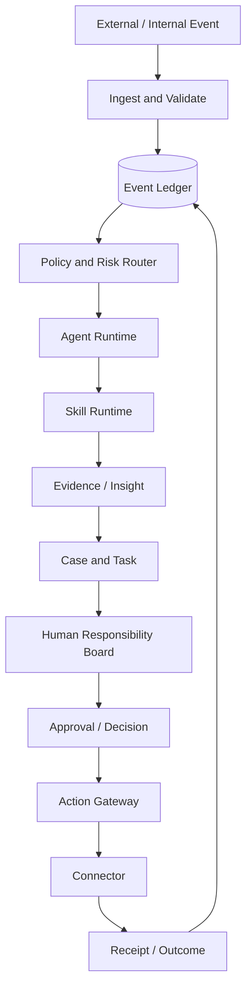

# Enterprise Agent Runtime 企业级需求基线与领域拆分 PRD

需求基线 v0.1 · 2026-09-04

## 1. 文档结论

本项目应拆成两层：

```text
Enterprise Agent Runtime   通用企业 Agent 运行底座
Commerce Ops                电商品牌经营领域应用
```

Runtime 负责企业级的事件、身份、权限、Case、Agent、Skill、Policy、审批、责任、SLA、通知、执行、审计和评测；Commerce Ops 负责竞品、商品、内容、活动、库存和客服 VOC 等领域能力。

当前 `dsh-plugin-commerce-ops` 已验证事件账本、JSONL 持久化、Agent Space、mock 执行、审批、人工决策、责任、SLA 和通知骨架。它是第一个领域样板，不应直接被视为完整企业平台。

## 2. 产品目标

建设一个可服务多个企业、组织、品牌和业务域的事件驱动 Agent 运行底座：

```text
企业事件
→ 证据与策略校验
→ Agent / Skill 协同
→ Case 和任务
→ 人类确认、审批与责任
→ 授权动作执行
→ Receipt / Outcome
→ 审计、评测和复盘
```

系统必须支持同一套底层能力服务不同企业，同时保证数据、身份、策略、Agent 配置和外部连接器隔离。

## 3. 业务问题边界

企业目前面临：

- 经营事实分散在电商、内容、ERP、CRM、WMS 和人工表格中。
- 数据采集与结论之间没有稳定的证据链。
- 多部门协作依靠转发和口头沟通，责任不清晰。
- Agent 能分析，却无法进入审批、执行、回执和结果复盘。
- 不同企业和品牌缺少隔离的策略、权限和 Agent Space。
- 生产动作缺少幂等、回执、补偿和紧急停止机制。

本平台解决的是“企业如何基于事件协同运行 Agent 和人”，不是单纯的聊天、报表或爬虫工具。

## 4. 目标用户

| 用户 | 主要目标 |
|---|---|
| 平台管理员 | 管理租户、组织、连接器和系统策略 |
| 企业负责人 | 查看经营全局、做高风险决策、承担责任 |
| 业务负责人 | 管理品牌、商品、内容或供应链事项 |
| 运营协调人 | 推动 Case、分派、转派和升级 |
| Agent Operator | 配置 Agent、Skill、Policy 和评测 |
| 审计人员 | 查看事件、证据、决策、审批和执行链 |
| 外部服务商 | 在授权范围内处理企业任务 |

## 5. 产品范围

### 5.1 Runtime 必须提供

```text
Tenant / Enterprise / Organization
Identity / Role / Permission
Event Ledger / Router / Replay
Evidence / Data Contract
Case / Task / Workflow State
Agent / Skill / Tool Binding
Policy / Risk / Approval
Responsibility / SLA / Escalation
Action Gateway / Receipt / Compensation
Notification / Audit / Evaluation
Agent Space / Human Board
```

### 5.2 Commerce Ops 提供

```text
竞品品牌与商品识别
公开或授权内容数据采集
商品、价格、SKU 和评价分析
内容主题、钩子和卖点分析
品牌策略与产品机会假设
电商经营异常
客户 VOC 与用户生命周期分析
```

### 5.3 不属于当前版本

- 未授权平台访问或绕过平台限制。
- 没有审批的自动价格、投放、发布和上下架。
- 用互动数据推断真实 GMV、利润或 ROI。
- 把多个企业的私有数据混合训练或混合展示。
- 没有回执的“已执行”状态。

## 6. 企业运行模型



### 6.1 事实、判断和动作的分离

```text
Event       事实
Evidence    依据
Insight     Agent 判断
Decision    人的判断
Action      已批准动作
Receipt     执行结果
Outcome     经营结果
```

任何一层都不能冒充另一层：Agent 判断不能冒充事实，审批不能冒充执行成功，mock 回执不能冒充真实平台结果。

## 7. 多租户需求

每个对象必须能够追溯到：

```text
tenant_id
enterprise_id
organization_id
brand_id
workspace_id
visibility_scope
```

要求：

- 企业 A 的事件、证据、Case、审批和连接器不能被企业 B 读取。
- 同一企业不同品牌可配置不同 Policy、Agent 和责任人。
- 外部服务商只能读取被授权的企业和品牌范围。
- 租户删除、导出和审计需要有明确的生命周期策略。
- 所有 Host、Agent、Connector 和 Action Gateway 都要执行租户校验。

## 8. 核心领域对象

### 8.1 组织对象

```text
Tenant
Enterprise
Organization
Department
Brand
Shop
Member
Role
Permission
Workspace
```

### 8.2 运行对象

```text
Event
Evidence
Case
Task
Workflow
AgentDefinition
AgentRun
SkillDefinition
SkillRun
Policy
Approval
Decision
Responsibility
SLA
Notification
Action
Receipt
Outcome
AuditRecord
```

### 8.3 业务域对象

```text
Product / SKU / Category
Competitor / CompetitorProduct
ContentItem / Campaign / LiveSession
Order / Refund / AfterSale
Supplier / Warehouse / Shipment
Customer / VOCRecord / LifecycleRecord
```

## 9. 事件需求

### 9.1 事件类别

```text
signal.*              外部或内部业务信号
case.*                Case 生命周期
task.*                任务状态
approval.*            审批请求与结果
human.decision.*      人工判断
responsibility.*      责任变化
action.*              动作执行过程
receipt.*             外部回执
sla.*                 SLA 生命周期
notification.*        通知生命周期
outcome.*             结果与复盘
```

### 9.2 事件要求

- 事件不可变，修正通过新事件表达。
- `event_id` 幂等，重复写入不能重复产生动作。
- `correlation_id` 关联完整 Case。
- `causation_id` 指向触发本事件的上游事件。
- 事件带来源、观察时间、证据引用和 schema 版本。
- 支持按租户分区、重放、归档和迁移。
- 事件追加成功但投影失败时可以重建投影。

## 10. Agent 与 Skill 需求

### 10.1 Agent 定义

```text
subscriptions
allowed_skills
policy_scope
data_scope
memory_scope
output_contract
human_owner_role
not_responsible_for
version
```

### 10.2 Skill 定义

```text
skill_id
version
input_schema
output_schema
permission_scope
risk_level
owner_agent_id
idempotency_key
failure_codes
acceptance_criteria
```

### 10.3 Agent 运行要求

- Agent 只能订阅自己授权的事件。
- Agent 只能调用注册过的 Skill。
- Skill 输入输出必须结构化并可校验。
- Agent 失败、超时和人工接管必须可观测。
- Agent 不得绕过 Policy、Approval 或 Action Gateway。
- Agent 结论必须包含证据引用、置信度、假设和数据缺口。

## 11. Case、任务与状态

### Case 状态

```text
OPEN → INVESTIGATING → PROPOSED → WAITING_HUMAN
→ APPROVED → EXECUTING → VERIFYING → CLOSED
```

异常状态：

```text
BLOCKED
FAILED
COMPENSATING
CHANGES_REQUESTED
```

### Responsibility 状态

```text
UNASSIGNED → CLAIMED → IN_PROGRESS → WAITING_INPUT
→ ESCALATED → ACCEPTED → RELEASED
```

### Task 要求

- Task 必须属于 Case。
- Task 必须有 Owner、验收条件和截止时间。
- Agent 可以创建任务草稿，人可以修改、接管和关闭任务。
- 任务关闭必须有结果或明确的关闭原因。
- 任务状态不能代替 Case 状态。

## 12. 人类责任与审批

高风险动作必须走：

```text
Action Proposal
→ Permission Check
→ Policy Check
→ Approval Requested
→ Human Decision
→ Approval Approved
→ Action Gateway
→ Receipt
```

必须记录：

```text
requester_id
approver_id
decided_by
decision_note
action_hash
policy_version
approval_time
receipt_id
```

Approval 必须校验动作参数一致性，不能只校验 `action_id` 或 `approval_id`。

## 13. 权限需求

权限至少分为：

```text
tenant.read
brand.read
evidence.read
case.assign
case.takeover
transfer_responsibility
accept_responsibility
approve_action
execute_action
manage_connector
manage_agent
manage_skill
manage_policy
audit.read
```

权限策略：

- 默认拒绝。
- Host、Agent Runtime、Connector 和 Action Gateway 重复校验。
- 权限判断必须包含租户和数据范围。
- 角色变更产生事件并可审计。
- 权限撤销要有缓存失效机制。

## 14. SLA 与通知需求

SLA 需要支持：

```text
开始
提醒
到期
升级
暂停
恢复
完成
```

通知需要支持：

```text
站内通知
飞书 / 企业微信
邮件
批量摘要
免打扰时间
通知确认
多级升级
发送失败重试
```

P0 使用手动评估和本地 queued 通知；生产版必须有常驻调度器、通知连接器、失败重试和升级策略。

## 15. 数据与连接器需求

连接器必须声明：

```text
connector_id
tenant_scope
read_capabilities
write_capabilities
auth_method
rate_limit
pagination
cost
data_freshness
failure_codes
```

连接器运行状态：

```text
REGISTERED
ACTIVE
PARTIAL
NOT_AVAILABLE
REGISTERED_RUNTIME_FAILED
```

数据管道：

```text
Raw → Normalized → Evidence → Metric → Insight → Decision
```

每个结论必须能够反查原始数据和采集时间。

## 16. Agent Space 需求

Agent Space 是企业、品牌或 Case 的协同容器，提供：

```text
事件时间线
证据面板
Case 状态
Agent 运行记录
责任看板
待我确认
待我审核
我负责
阻塞与超时
审批记录
执行回执
通知与评论
```

四类核心视图：

1. 事件：发生了什么。
2. 责任：谁负责、是否超时、是否转派。
3. 审批：谁申请、谁批准、批准了什么。
4. 回执：系统做了什么、外部返回什么。

## 17. API 需求

```text
GET  /api/runtime/health
GET  /api/tenants/:tenantId
GET  /api/events
POST /api/events
POST /api/events/replay
GET  /api/cases
POST /api/cases/:id/assign
POST /api/cases/:id/takeover
GET  /api/agent-spaces/:id
GET  /api/approvals
POST /api/approvals/:id/approve
POST /api/approvals/:id/reject
POST /api/responsibilities/transfer
POST /api/decisions
POST /api/sla/evaluate
GET  /api/notifications
GET  /api/audit/events
```

所有写 API 要求同源或身份认证、租户上下文、权限校验、幂等键、Schema 校验、审计事件和错误码。

## 18. 存储与运行时方案

### P0

```text
本地 JSONL Event Ledger
内存 Read Model
Mock Connector
本地角色权限
手动 SLA Evaluate
```

### P1

```text
SQLite / PostgreSQL Event Ledger
事务性追加
持久化 Projection
Outbox / Inbox
常驻调度器
通知适配器
身份和权限数据库
```

### P2

```text
事件总线
分布式 Worker
多实例 Agent Runtime
连接器隔离执行池
高可用数据库
备份、归档和灾备
```

当前不预设微服务拆分。先用模块化单体验证对象、事件、租户、权限和运行边界，再根据吞吐和组织边界拆服务。

## 19. 可观测性与审计

每次 Event、Agent、Skill、Action 和 Connector 运行都应记录：

```text
trace_id
run_id
tenant_id
event_id
agent_id
skill_id
input_hash
output_hash
duration_ms
status
failure_code
evidence_refs
actor_id
```

审计事件不能被业务用户删除；敏感凭证、完整 Token 和不必要的个人信息不能进入普通日志。

## 20. 失败与恢复

必须处理：

- Schema 校验失败。
- 连接器不可用。
- 分页中断。
- 数据样本不足。
- Agent 超时。
- Skill 执行失败。
- 审批超时。
- Action 重复提交。
- Receipt 缺失或不一致。
- 投影落后或损坏。
- 通知发送失败。

每种失败要有：

```text
failure_code
retryable
max_attempts
backoff
fallback
compensation
human_route
```

## 21. 评测与验收

### 结构验收

- 业务对象、事件、Skill、Agent、Case 和责任边界清晰。
- Runtime 和 Commerce Ops 领域依赖方向正确。
- 新增一个领域 Agent 不需要重写事件核心。

### 运行验收

```text
竞品降价事件
→ 路由
→ 证据
→ 分析
→ Case
→ 人工责任
→ 审批
→ mock 执行
→ Receipt
→ Outcome
→ 重启恢复
```

### 企业验收

- 两个租户数据不可互读。
- 两个品牌可以使用不同 Policy 和 Owner。
- 非授权用户无法查看、审批、转派和执行。
- 事件重复投递不产生重复动作。
- 审批动作修改后无法执行。
- SLA 超时产生升级通知。
- 所有人工动作能回放和审计。

### 生产验收

只有完成真实身份、持久化权限、连接器验证、常驻调度、失败补偿、监控告警、备份恢复和安全评审后，才可标记为生产就绪。

## 22. 研发阶段

### Phase A：企业需求基线

交付企业组织模型、角色矩阵、对象字典、事件目录、Case 状态机、审批矩阵、SLA 矩阵和连接器清单。

### Phase B：Runtime 核心

交付 Tenant、Event、Case、Task、Agent、Skill、Policy、Approval、Responsibility、Receipt、Outcome 和 Audit 合同。

### Phase C：Commerce Ops 首个领域

交付竞品情报、商品情报、内容情报和品牌策略四个 Agent 闭环。

### Phase D：企业治理

交付真实身份、组织同步、持久化权限、SLA 调度、通知通道和审计查询。

### Phase E：授权连接器

先接一个真实只读连接器，建立能力验证数据集、请求账本、数据质量和失败恢复。

### Phase F：受控外部执行

在审批、幂等、回执、补偿、灰度和紧急停止全部通过后，逐步开放低风险写操作。

## 23. 当前项目迁移建议

保留在 Commerce Ops：

```text
竞品识别
商品与价格分析
内容结构分析
品牌策略
电商领域指标
```

逐步沉淀为 Runtime：

```text
EventLedger
EventRouter
SkillRegistry
AgentRegistry
Case / Task State
Approval
Decision
Responsibility
Permission
SLA
Notification
Action Gateway
Receipt
Audit
```

迁移原则：先抽象契约，再抽取实现；先保持单体内模块边界，再根据实际运行规模决定包拆分和服务拆分。

## 24. 架构决策记录

### ADR-001：事件是事实源

采用 append-only Event Ledger 和可重建 Projection，支持多 Agent 协同、审计、重放和恢复。

### ADR-002：Runtime 与领域应用分离

通用企业治理能力不能依赖 Commerce Ops 的业务字段；Commerce Ops 只能依赖 Runtime 合同。

### ADR-003：先模块化单体

当前不为假设规模引入微服务、消息集群或复杂分布式锁；先验证业务边界和事件一致性。

### ADR-004：高风险动作必须有人负责

Agent 可以提出和准备动作，但高风险动作必须通过权限、Policy 和人工审批。

### ADR-005：真实连接器按能力验证接入

连接器登记、真实可用、可读、可写和生产可用必须分别验证，不能以配置存在代替运行证据。

## 25. 当前状态判断

```text
结构正确：是
P1 骨架可运行：是
多企业抽象：部分完成
企业级身份权限：未完成
生产级调度和通知：未完成
真实连接器：未完成
生产级灾备和监控：未完成
生产就绪：否
```

这份需求基线通过评审后，下一份工程文档应是《Phase B Runtime 核心详细设计与任务拆解》，再进入代码包边界、接口合同和迁移实现。
