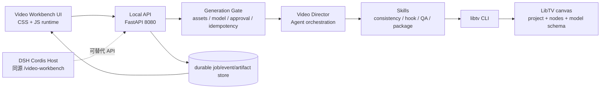

# DSH Video Workbench 架构与枚举设计

> 版本：v0.1 / 2026-09-05  
> 范围：`dsh-video-workbench` 独立前端、Python 后端、桌面端同源桥接、LibTV CLI、视频生产 Skills。  
> 状态标签：`CURRENT` 为仓库已存在并经代码核验；`TARGET` 为下一阶段设计；`BLOCKED` 为缺少环境、权限或真实运行证据。

## 1. 结论

本项目采用“静态前端 + 本地同源后端 + LibTV CLI Provider”的分层结构：



真实生成入口必须是 `libtv node <node> --project <canvasUuid> --run`。网页、猜测 HTTP 接口、旧任务 ID、FFmpeg fallback 都不能代替 LibTV 生成入口。

## 2. 当前边界核验

| 层 | CURRENT | 证据 | 结论 |
|---|---|---|---|
| 前端 | React + TypeScript + Vite；源码 `src/App.tsx`、`src/main.tsx`、`src/styles.css` | `package.json`、源码 | 不是纯 JS 源码；构建后为 JS/CSS |
| Demo | 浏览器本地 `URL.createObjectURL()`，状态机为 MOCK | `README.md`、`App.tsx` | 不上传素材、不产真实视频 |
| Python API | FastAPI 单进程，端口 8080，后台任务调用 CLI | `server/app.py` | 可做本地桥接，不是生产任务系统 |
| LibTV | CLI 调用 `node ... --run`，同步等待命令退出 | `server/app.py`、CLI 文档 | 不应二次轮询 CLI；API 层可以轮询自己的 job |
| 桌面端 | Cordis Host 已有 `/video-workbench`、生成和 job status 路由 | `dsh-plugin-desktop/src/video-workbench-route.ts` | 与 Python API 存在并行实现，需要统一合同 |
| 状态 | Python 内存字典；桌面端 `Map`；重启丢失 | 两份实现 | `TARGET` 必须持久化 |
| QA/归档 | 前端显示 QA；后端仅抽取 URL，不做媒体 QA/归档 | `server/app.py` | 不能宣称生产闭环 |

## 3. 业务对象与生命周期枚举

### 3.1 核心对象

| 对象 | 必填字段 | 责任 |
|---|---|---|
| `CanvasRef` | `provider=libtv-cli`, `projectUuid` | 指向 LibTV 画布，不把 workspace 与 canvas 混淆 |
| `NodeRef` | `nodeKey` 或精确展示名、`nodeType=video` | 指向已配置生成节点 |
| `AssetManifest` | `assetId`, `kind`, `uri`, `mimeType`, `authorized` | 事实层；浏览器本地 URL 不能直接冒充 Provider 资产 |
| `GenerationRequest` | `taskId`, `idempotencyKey`, `canvas`, `node`, `prompt`, `model`, `assets`, `authorization` | 一次可审计生成意图 |
| `Approval` | `approvalId`, `approved`, `confirmedBy`, `confirmedAt`, `scope` | 人工确认；无确认时 fail closed |
| `VideoJob` | `runId`, `state`, `providerJobId?`, timestamps | API 任务记录 |
| `Artifact` | `artifactId`, `source`, `url`, `mime`, `sha256?`, `qaStatus` | 结果事实；LibTV 结果与网页归档分开 |
| `Receipt` | `runId`, CLI exit code, stdout/stderr digest, finishedAt | Provider 调用凭据 |
| `Event` | `eventId`, `type`, `aggregateId`, `occurredAt`, payload | 过程审计与重建 |

### 3.2 任务状态

统一采用桌面端已有状态机：

`DRAFT → ANALYZING → READY → AWAITING_APPROVAL → QUEUED → GENERATING → POST_PROCESSING → QA_RUNNING → COMPLETED`

异常分支：

- `ANALYZING → FAILED`
- `READY → FAILED`
- `AWAITING_APPROVAL → READY | FAILED`
- `QUEUED → FAILED`
- `GENERATING → PARTIAL | FAILED`
- `POST_PROCESSING → PARTIAL | FAILED`
- `QA_RUNNING → PARTIAL | FAILED`
- `PARTIAL → AWAITING_APPROVAL | QUEUED | FAILED`
- `FAILED → DRAFT`

Python 服务当前只有 `QUEUED / GENERATING / COMPLETED / FAILED`，应作为兼容简化态，不能覆盖桌面端完整生命周期。

## 4. LibTV CLI 命令枚举

以下是工作台后端允许封装的 CLI 能力。每个动作都要保留原始 stdout/stderr 与退出码；生成命令必须等待进程终态。

| 能力 | CLI | 读写 | 用途 |
|---|---|---:|---|
| 账户 | `libtv account info` / `list` / `use` | 读/写选择 | 当前账号和团队 scope |
| 工作区 | `libtv workspace list` / `use <id>` | 读/写绑定 | workspace 容器 |
| 画布 | `libtv project list` / `libtv project <uuid>` | 读 | 画布、节点、边枚举 |
| 画布绑定 | `libtv project use <uuid>` | 写本地状态 | 绑定默认 canvas |
| 分组 | `libtv group list` / `group <name>` | 读 | 普通 group 与节点范围 |
| 节点 | `libtv node list -p <uuid>` / `libtv node <id-or-name>` | 读 | 节点、参数、nodeKey |
| 节点创建 | `libtv node create <name> -t <type>` | 写 | 仅在显式设计变更时使用 |
| 素材上传 | `libtv upload <node>` | 写/上传 | 将本地素材送入画布；必须有授权 |
| 模型枚举 | `libtv model search --type video` | 读 | 当前可用视频模型 |
| 模型 schema | `libtv model <modelKey-or-name>` | 读 | 提交前获取真实字段和规则 |
| 运行 | `libtv node <node> --project <uuid> --run` | 计费写 | 唯一真实生成入口；只提交一次 |
| 下载 | `libtv download -n <node>` | 读/下载 | 结果落地后媒体验收 |

### 4.1 2026-09-05 实时枚举快照

本机 CLI 已验证：账号 `F先生`，2 个 workspace，3 张画布。当前视频模型列表以 `libtv model search --type video` 返回为准，关键候选包括：

- `star-video2.5` / Seedance 2.5：全能参考、音画同步、按秒计价。
- `star-video2` / Seedance 2.0 VIP：15 秒音画同步。
- `MiniMax-Hailuo-H3` / Minimax H3：全模态、多参数、多场景。
- `kling-v3-omni` / Kling O3：编辑、参考一致性、音画同出、多镜头。
- `kling-v3-motion-control` / Kling3.0 动作迁移：需要 1 张图片和 1 条视频。
- 另有 Wan、Vidu、Pixverse、OmniHuman 等候选。

这只是当前账号与服务端配置的时间快照；后端不得硬编码“展示名 = modelKey”，必须先 search，再用唯一 `modelKey` 拉 schema，并按 schema 生成参数。

## 5. Skills 与 Agent 枚举

### 5.1 UI 当前展示的 Skills

| Skill | UI 状态 | 目标责任 | 当前真实性 |
|---|---|---|---|
| `video-scene-consistency` | `ACTIVE` | 人物、产品、场景、动作、原音频一致性约束 | UI 标识；需接真实执行器和 QA 证据 |
| `hook-analyzer` | `READY` | 平台信号、前 3 秒 Hook 分析 | 当前为本地 UI 状态 |
| `export-packager` | `STANDBY` | 结果、poster、metadata、QA 报告打包 | 当前未实现真实打包 |

### 5.2 TARGET Skill 契约

1. `asset-ingest.v1`：登记素材、类型、尺寸、时长、hash、授权。
2. `asset-consistency.v1`：检查人物/产品/场景引用是否齐全和可映射。
3. `hook-analyzer.v1`：读取平台信号，产出证据化 Hook 建议。
4. `prompt-normalizer.v1`：把导演意图映射到已验证模型 schema，不猜字段。
5. `libtv-preflight.v1`：枚举模型/schema、检查输入组合、权限、成本和幂等键。
6. `libtv-run.v1`：调用一次 `libtv node ... --run`，收集 receipt。
7. `media-qa.v1`：`ffprobe`、解码、音视频流、时长、画幅、关键帧检查。
8. `export-packager.v1`：生成 artifact manifest、QA report、下载包；不自动发布。

Agent 只负责选择范围、组合 Skills、解释结果和提出下一步；Skill 负责可验证动作；业务变化与发布仍需人工责任和 Approval。

## 6. 后端服务枚举与技术框架

### 6.1 v0.1 本地单体

```text
FastAPI app
├── health router
├── generation router
├── job status router
├── GenerationGate
├── VideoDirectorOrchestrator
├── LibTvCliAdapter (subprocess, shell=false)
├── MediaQaService
├── Artifact/Receipt repository
└── Event ledger
```

运行方式：Python 3.12、`uvicorn app:app --host 0.0.0.0 --port 8080`；Docker 使用 `python:3.12-slim`，只读挂载 LibTV runtime、binary 和工作目录。

### 6.2 TARGET 服务职责

| 服务 | 技术建议 | v0.1 实现 |
|---|---|---|
| API | FastAPI + Pydantic | 部分：已有 2 个 endpoint |
| 调度 | asyncio task；后续 Redis/RQ 或 Celery | 部分：`BackgroundTasks` |
| 状态 | SQLite WAL + JSON receipt；后续 Postgres | 缺失，当前内存字典 |
| 文件 | 本地 artifact 目录，按 `taskId/runId` 分层 | 缺失，`storage` 未使用 |
| Provider | `LibTvCliAdapter` | 已有最小 subprocess 封装 |
| QA | ffprobe + 解码 + key frames | 缺失 |
| 事件 | JSONL append-only | 缺失 |
| 认证 | local same-origin / operator approval | Python 当前 CORS `*`，需收紧 |
| 观测 | structured logs、receipt、耗时、exit code | 仅错误字符串 |

不建议当前拆微服务：本地单用户、单 Provider、重 CLI 进程的负载尚不足以抵消部署复杂度；先把契约、持久化、幂等和验收做实。

## 7. API 枚举

### 7.1 当前兼容接口

`GET /health`

```json
{"status":"ok","provider":"libtv-cli"}
```

`POST /api/video-workbench/generate`（当前 202）

```json
{
  "projectId": "<canvasUuid>",
  "node": "<nodeKey-or-exact-name>",
  "confirmed": true,
  "approvalId": "approval-...",
  "idempotencyKey": "canvasUuid:nodeKey:revision"
}
```

当前 Python Pydantic 模型尚未声明 `approvalId`，虽然前端会发送；必须补齐并校验，不能静默丢字段。

`GET /api/video-workbench/jobs/{run_id}`：不存在任务应返回 HTTP 404（当前返回 200 + error JSON，需修正）。

### 7.2 TARGET 扩展接口

| 方法 | 路径 | 用途 |
|---|---|---|
| `GET` | `/health` | 进程与 LibTV CLI 可执行性 |
| `GET` | `/ready` | runtime、凭据、workspace、CLI 版本检查 |
| `GET` | `/api/video-workbench/capabilities` | Skills、Provider、模型 schema 快照 |
| `POST` | `/api/video-workbench/preflight` | 不计费的输入/权限/schema/成本预检 |
| `POST` | `/api/video-workbench/generate` | 通过 approval 后创建幂等任务 |
| `GET` | `/api/video-workbench/jobs/{runId}` | 任务状态与 receipt 摘要 |
| `GET` | `/api/video-workbench/jobs/{runId}/events` | SSE 进度；断线可用 `Last-Event-ID` 恢复 |
| `GET` | `/api/video-workbench/jobs/{runId}/artifacts` | LibTV 结果、QA、归档的分离记录 |
| `POST` | `/api/video-workbench/jobs/{runId}/confirm-export` | 人工确认导出/归档，不自动发布 |

## 8. 前端文件与技术枚举

### 8.1 CURRENT 文件

| 文件 | 类型 | 职责 |
|---|---|---|
| `index.html` | HTML | Vite 入口、中文 meta、页面标题 |
| `src/main.tsx` | TSX | React 挂载入口 |
| `src/App.tsx` | TSX | 单页工作台、Demo/LibTV 路由分支、素材、状态、预览 |
| `src/styles.css` | CSS | 暗色工业 UI、三栏布局、时间轴、响应式断点 |
| `src/vite-env.d.ts` | TypeScript declaration | Vite 类型环境 |
| `dist/assets/*.js` | 编译 JS | Pages/桌面端加载产物 |
| `dist/assets/*.css` | 编译 CSS | Pages/桌面端加载产物 |
| `publishedDemoContract.test.mjs` | JS test | 已发布 Demo URL 合同 |
| `resultPreviewContract.test.mjs` | JS test | 后端结果绑定视频预览合同 |

### 8.2 TARGET 前端模块边界

如继续遵守仓库 Node/TypeScript 规范，保留 `.tsx/.ts` 源码、输出 `.js/.css`；不建议为“CSS + JS”字面要求强行丢失类型。模块应拆为：

`api/client`、`api/contracts`、`state/task-machine`、`components/AssetSlots`、`components/PreviewCanvas`、`components/Timeline`、`components/AgentConsole`、`components/SkillRegistry`、`components/ResultPanel`、`styles/tokens.css`、`styles/layout.css`、`styles/components.css`。

若产品强制源文件必须为 JS，则将 `App.tsx → App.jsx`、`main.tsx → main.jsx`，并把共享合同留在桌面端 TypeScript 包；这是一次明确的技术决策，不应在当前小迭代中隐式发生。

## 9. 启动、验证与发布门槛

### 本地启动

```bash
cd "/Volumes/SSK SSD/deepseek harness 桌面端/dsh-video-workbench"
npm ci
npm run dev
python3.12 -m venv .venv
.venv/bin/pip install -r server/requirements.txt
PYTHONPATH=server LIBTV_BIN="$HOME/.libtv/libtv" LIBTV_CWD="$PWD" \
  .venv/bin/uvicorn app:app --host 127.0.0.1 --port 8080
```

### 验收门槛

1. `npm run build` 通过，页面能在 `127.0.0.1:5173` 打开。
2. `GET /health` 和 `GET /ready` 通过，并显示真实 CLI 路径/版本，不只显示 HTTP 200。
3. 只读枚举通过：account、workspace、canvas、node、`model search`、唯一 model schema。
4. 预检失败时不产生 `--run`；缺 approval、资产授权、模型 schema 或输入组合不提交。
5. 生成仅提交一次；等待 CLI 进程退出并保存 stdout/stderr/exit code。
6. 结果必须分别记录“LibTV 画布结果”“本地下载/媒体 QA”“网页归档”；不得混称。
7. `ffprobe`、解码、关键帧、音视频时长/画幅验收通过后才显示 `QA PASS`。
8. 重启服务后 job、receipt、artifact 可查询；否则只能标记为 Demo/partial。
9. 导出需要人工确认；自动发布保持关闭。

## 10. ADR

### ADR-001：先用本地模块化单体

选择 FastAPI + 本地持久化 + CLI adapter。优点是贴近桌面、调试清晰、没有无必要的分布式依赖；代价是吞吐和高可用有限。达到多用户、长队列、跨机器调度前不拆服务。

### ADR-002：LibTV CLI 是唯一 Provider 边界

选择 CLI 而不是自行请求 LibTV HTTP。CLI 已封装登录、画布、schema、提交、轮询和结果写回；代价是后端需要管理 subprocess、环境和凭据。凭据留在本机 CLI，不进入浏览器或聊天。

### ADR-003：事实、判断、批准、动作、回执、结果分离

选择独立对象和事件记录。这样可以证明“调用了什么”和“结果是什么”，避免把 UI 状态、旧 URL 或模型输出误报为商业归档或生产完成。

## 11. 当前阻塞与下一步

- `server/requirements.txt` 含 `httpx2`，需确认这是项目有意依赖还是拼写错误；当前代码导入的是 FastAPI/TestClient，安装前应验证依赖可解析。
- Python 后端还未完成 durable store、approvalId 校验、404 语义、媒体 QA、SSE 和真实 artifact 归档。
- 前端真实模式仍把 `confirmed: true` 与固定 `approvalId` 写死，必须改成人工确认状态，不可作为生产授权。
- `dsh-plugin-desktop` 与 Python API 目前是两套 job 实现；下一步应选一个 Host 入口，并让两者共享同一合同和验收测试。
- 真实 LibTV 生成只有在确认当前画布、节点、模型 schema、资产授权和成本后才能提交；本文件不把实时枚举快照当作已生成新视频的证据。

## 12. skill2loop 持续优化层

`skill2loop` 放在 `Provider/媒体 QA/Artifact` 之后，负责把一次生产任务变成可追踪的 Skill episode：

```text
VideoJob + Receipt + QA + 人工反馈
  ↓
skill2loop episode / trace
  ↓
metrics
  ↓
reviewable proposal
  ↓
人工 approve / reject
  ↓
下一版本 Skill、Prompt、Provider 路由或 Eval
```

本项目已加入本地 `Skill2LoopBridge`，产物保存在 `.video-workbench/skill2loop/`，并提供：

- `GET /api/video-workbench/loops/{skill_name}/metrics`
- `POST /api/video-workbench/loops/{skill_name}/propose`

它目前是基于 `skill2loop` 核心模型的项目内适配层，不会自动修改源码、自动换模型、自动重试计费任务或自动同步 Feishu。后续如需接入官方完整 CLI，可把 episode/review 存储适配到其 `registry.sqlite`，但必须继续保留本项目的人工审核门禁和隐私隔离。
